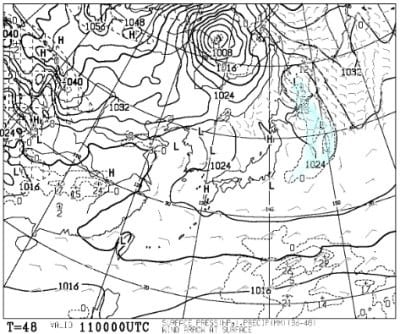

# 3月11，12日の週末の志賀高原スキー場の天気は…土日とも晴れだけど，気温がめちゃくちゃ上がる春のザブザブ雪を覚悟

📅 投稿日時: 2023-03-10 01:43:58

えー．

3月と言えば，私にとってはまだ真冬

なのに，←春が来るのを拒否している

早くも例年より大量の花粉が飛んで

いるように感じられる今日この頃．

皆様いかがお過ごしでしょうか…

花粉が…花粉が憎い…

しかし．

気温が高すぎる．

とても3月上旬とは思えないんですが（涙）

で．

今日の志賀高原特派員からの写真によると…

なんと，朝からプラス気温っ！！！

ありえない…

3月上旬の志賀で，朝からプラスは

ありえない…

さらに天気が良かったので，朝から雪は

ユルユルだったみたいで…

一見シマシマのこのバーンも．

朝からこんな感じで，足が潜って

深い足跡になるような，融けて緩んだ

雪だったようです…(泣)

焼額も，朝から雪はユルユルだった

みたいで…

昼間の気温は+5℃ですか…（激涙）

それでも，朝日が当たらない西斜面の

一の瀬・寺小屋方面は，午前中は締まり気味の

雪だったみたいですが…

残念ながら，超高温とすごい日差しで．

雪は結構な勢いで解けているみたいです（泣）

あぁ…まだ志賀高原ならトップシーズンの

冷え冷え雪が降る3月上旬というのに…

なんでこんなに気温が高いの？（涙）

で．

この週末は果たして気温が下がって，

雪が降るのか…？

と．

どうせダメだと分かっていながらも，

かすかな望みをもって今週末の

天気図を見てみるわけですが…

まずは明日，10日(金)の850hpa気温図を

見てみると．

うーーーーーーーん．

赤い0℃線，北海道よりも北まで上がっ

てるよ…(涙)

とても3月上旬と思えない…

で，地上天気図を見ると…

…降りますね．

これは，降る．

…この気温で降れば，当然液体です(泣)

ただ，降るのは午前中の早い時間だけかな～…

そして，週末の11日(土)の850hpa気温図は．

…これもダメだ（泣）

赤い0℃線は津軽海峡付近…

そして，志賀高原にかかっている

水色の線は，+6℃．

GW並みの気温ですね…(止まらぬ涙)

地上天気図では，水色の降水域が

かかってないので…

晴れですね．

いや．

気温が異常に高いから，晴れないで

曇ってくれるくらいが雪が融けずに

いいんですけど…

晴れますね．

無意味に晴れて，雪が融けますね（涙）

で．

日曜の12日の850hpa図を見ると．

ダメだーーーー！！

この日も赤い0℃線は北海道の北．

この日も志賀には水色の+6℃線が

かかっているので…

この日も5月並みの気温（泣）

そして地上天気図は高気圧に

覆われて晴れそう…

ってなことで，

まとめると

10日(金)：朝から気温が高く，

　無慈悲に液体が降り注ぐ．

　一瞬強く降るが，それほど長く

　降らず，9時過ぎには止んで，

　昼くらいから晴れそう．

　最高気温は+5℃を越えて

　朝から雪はザブザブ春雪

11日(土)：朝から終日晴れ．

　あさイチの気温は+2℃くらい

　昼間の最高は+7～8℃くらいまで

　上がり，日差しもあるので

　暑いくらいの一日．

　西斜面の一の瀬方面は朝は締まって

　そうだけど，焼額や標高の低い

　ブナ・ジャイアント・丸池方面の

　雪は朝から緩く，

　昼には荒れてユルユルな春雪になる．

　一部妖怪板掴みが現れるかも…

12日(日)：この日も朝から終日晴れ．

　午後は雲が増えていくか…

　あさイチの気温は+3℃くらい．

　朝からプラスで雪は緩い．

　焼額方面の雪はあっという間に

　ザブザブした感じに．

　春スキーと割り切れば，日も射して

　寒くなくて楽しめるかも

ということで．

残念ながら，この週末は緩んだザブザブ

雪になりそう…

まぁ，晴れてくれるので，春スキーだと

諦めればこんなものか，という感じの

天気ですかね～…

しかし．

この1週間，平年比4℃以上くらいの

日が続くし…

そして．

1か月の気温傾向を見ると．

矢印で示した，今から4月の3日

ごろまでは，全く気温が下がらなさ

そう（泣）

うーん…

これ，今シーズンの志賀高原，

GWの営業ヤバいかも？？

…あ，だから今，GW並みの気温で，

GWスキーの気分を味わせてくれてる

のか！！←ちょっと違う

## 💬 コメント一覧

### 💬 コメント by (レインボー75)
**タイトル**: Unknown
**投稿日**: 2023-03-10 15:01:09

金曜日の志賀高原情報

いやあ、人生最悪のストップ雪。標高の低いところでは、妖怪板掴みが無限に増殖していました。ダイヤで昼食のあとは、山の神もサウスも、まさに拷問。怖くて怖くてすぐに終了しました。

朝の湯田中は笠が必要なレベルの雨。1号トンネル(ジャイアント)辺りからベタ雪に。蓮池は+1℃。

白樺ファーストゲット

するも、圧雪の後に５センチのべったべた雪。走らない。満足感不足。2高乗り場では必死漕ぎ。

唐松の右側は途中からヤバい雪。そして下は必死漕ぎ。

オリンピックはすでに柔らかぼこぼこ。まあ普通に滑れるんだけど、下はまた必死漕ぎ。

GSは下の壁(しんちゃんバーン)が緩くなる所で急に板を掴まれる。怖すぎます。仕事に追われている人が羨ましくさえ感じます。

こんな時は標高の高い奥志賀第三か、寺子屋がいいとは思うけど、快感を得るためにスキーしてるんであって、拷問に耐えるためにしているのではないので(人はそれを根性なしスキーヤーと呼びます)、心が折れた若者はすぐにリタイアです。

明日はこの雪が圧雪されて、快感よ再び！

### 💬 コメント by (Skier_S)
**タイトル**: ＞レインボー75さま
**投稿日**: 2023-03-11 01:13:22

明日はもっと気温が上がりそうですが…

夜に冷えたザラメが緩む感じなので，今日よりはマシでしょうか．

しかし，とても3月と思えない高温が続き，残念な感じです…

