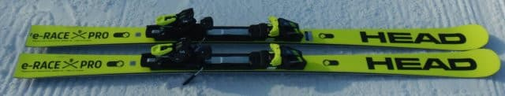
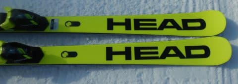
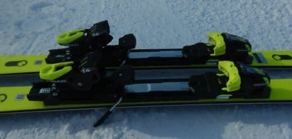
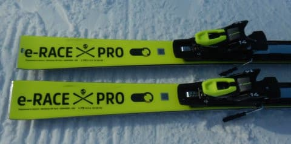
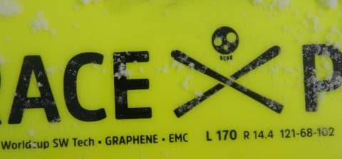

# 2023シーズンモデルのスキー板，試乗レポートその1…HEAD e-RACE PRO

📅 投稿日時: 2022-05-20 00:02:29

えー．

かぐらファイナルとなる今週末ですが．

昨日の段階では，土曜は朝は晴れで午後から

雨…と予想しましたが．

低気圧の接近と発達が当初予想より早まり，

土曜は朝から雨がぱらつきそうな予想に…（涙）

朝から降ったり止んだりを繰り返しそうな

天気です．

日曜は午前中は雨が残りそう．

昼に向かって止んでいき，午後は

天気が回復しそうな予想．

…一体いつ降り止むのかは，まだ

予想が難しいです…

うーん．

しかし，今週末，22日でかぐらも終わりか…

シーズンとは短いものよ…（泣）

ってなことで，本題へ．

昨日，予告記事を書きましたが．

今回から，2022/2023シーズンモデルの

スキー板の試乗インプレッション開始です！

試乗したコンディションは[昨日の記事](edcd895d6007ae257c88214c494d88165.md)を

参考に…

第1回目は，ヘッドの板です．

では，どうぞ～！！

○HEAD Worldcup REBELS e-RACE PRO 170cm

基礎オールラウンド

170cmでR=14.4という，小回りベースの

サイドカーブをもつオールラウンド板．

普通のe-RACEとサイドカーブは同じですが，

プレートにe-SL RDやe-GS RDと同じ強めの

RP WCR14プレートを乗っけた板です．

かなり板が硬めに感じられ，簡単には

たわまない板ですが，ちょっとでも角づけを

すると小さめのサイドカーブに乗って，

クルクルと回り始める回転性の高い板．

板のグリップはかなり強めで，

ガッツリグリップしてサイドカーブなりに

板がグイグイまわって行こうとする，

レールターン的ターンが得意な板です．

ただ板なりに曲がっていってしまうと

いうより，角づけの強さや谷回りのトップの

抑え方である程度回転半径がコントロール

できるので，ガッツリグリップした中でも，

回転弧は比較的乗り手の意図で変えられます．

谷回りでトップ目を抑えてたわませると

半径が小さく，トップを抑えずセンター～

テール目荷重で谷回りに入ると，

比較的まっすぐ走っていきます．

ずらしてもあんまり楽しくない板．

サイドカーブに乗っていけば

板なりにまわってきてくれて，

かなりのスピードを出して行っても

グリップが抜ける・ずれるといったことなく

どこまでもカービングで曲がって行って

くれます．

グリップは強いけど，ガンガンの小回り板

みたいにリバウンドがそんなに強くなく，

かつ早くもないため，回転弧はそこまで

小さくなりません．

板のフレックスもかなり強いので，

スピードを出して行くとたわみきって

鬼のような小回りになっていくという

ことは無く，ハイスピードでもそこそこの

大きめの回転弧で回れます．

なので，R=14.4と小さめのサイドカーブですが，

170cmの長さなら普通のスキーヤーは

十分大回りまで使えますね～．

ただ，ホントのトップスピードを出すと，

やはり大回りをするにはちょっと回りすぎ

ますが…

とりあえず，わずかな角づけでグイグイ回るし，

かといって小回り強制マシンでもなく，

かなりのスピードを出してもガッツリグリップ

する強さがあるので．

ある程度の体力がある人．スピード好きで，

カービングでガンガン切っていくのが好きな

人に向く板かな．

## 💬 コメント一覧

### 💬 コメント by (Goku)
**タイトル**: Unknown
**投稿日**: 2022-05-20 20:29:07

この板好きです。

私は１６５ｃｍしか乗っていませんが、１７０ならオールラウンドに使えるなと思っています。

i-raceからe-raceになってバネ感が強くなって私好みになりました(^^♪

### 💬 コメント by (Skier_S)
**タイトル**: ＞Gokuさま
**投稿日**: 2022-05-21 01:47:49

久しぶりのコメントですね～！

私は逆に165cmは履かなかったのですが，165だと小回りスペシャルに

なりそうで，e-SL RDと被りそうですね．

170cmは小回りベースのオールラウンドとして良さそうな感じでした！

