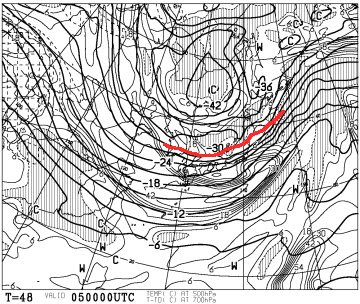
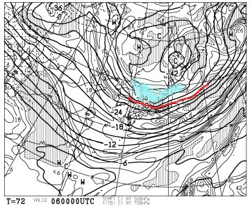
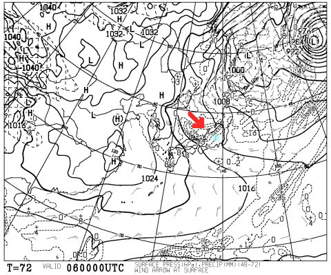
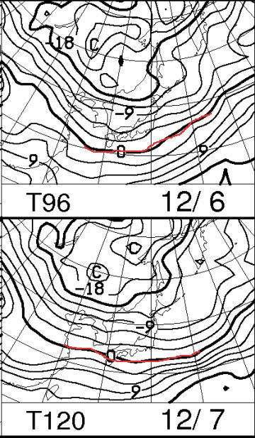
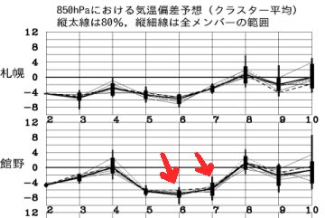
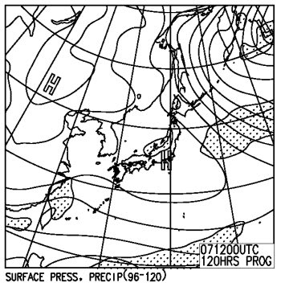

# 今シーズン初！この週末の志賀高原の天気は？？

📅 投稿日時: 2014-12-04 01:31:44

あー．

やはり．

残念ながら．

志賀はほとんど，雪が降ってないようで…（涙）．

この2日間，晴れが続いて，ほとんど積雪がないようですね…

でも．人工降雪機はガンガン動いており．

焼額山も，[コースの雪つけは順調に進んでいる](http://blog.princehotels.co.jp/yakebi/2014/12/03/)みたいで．

＃ペアリフトのサウスコースだけみたいですが…

と，言うことなので．

今週末から，我がホームグラウンド．

焼額がオープンするわけですが．

…すなわち．

私の志賀高原通いも，この週末から始まるわけで．

…だもんで．

今週から，定番の「週末の志賀高原の天気＆ゲレンデコンディション予想」が

始まるのだ！

では，

さっそく．

今週末の志賀高原の天気．

行ってみましょうか～！

…ふむ．

ふむ．

（天気図を読み込み中）

…

えー．

この木，金もまずまず冷えますね～．

金曜はこんな感じで，500hpaの-30度の寒気が降りてきてます！

で．

積雪がなかった志賀高原も．

木曜4日の夕方くらいから，

うっすらと雪が積もり始めますね…

5日は，運が良ければ北風になりそうなので．

そこそこ降ってくれるかも…！

＃運が悪ければ，雪は降るもののそんなに積もらない（涙）．

そして．

土曜ですが．

なんだ，これは！

500hpa，-30度の寒気が太平洋側に近いところまで

南下してるどころか．

青く塗った-36度の寒気．

これが，北陸地方にかかってます…

これは，真冬の激烈な歓喜寒気です！

そして．

土曜の地上天気図を見ると…

ふむ．

信州近辺の風は，赤い矢印に描いたように，

結構北向きに回りそうで．

水色にマークした志賀高原あたりにも，降水域がかかってますね．

これは…

土曜は，雪になってくれそう！

土曜は，さーーーむいよ！

そして．

雪になりますよ！

で．

土曜も，日曜も，こんな感じで．

850hpaの0度線は，日本のはるか南だし．

気温は平年比8度くらい低そうだし．

日曜も，寒いよ！

日曜午後9時の地上天気図は，こんな感じで．

一見冬型が緩んでそうに見えるけど．

でも，昼間はおそらく冬型をキープして．

おそらく，午前中は雪が降る感じかな．

午後も，時折晴れ間が見えるかもしれないけど．

基本的に曇りだな～．

ってことで．

まとめると．

土曜：前日からの自然降雪は20cmほどあるかな？

　志賀高原の登り坂は，完全本格的な雪道なので，

　覚悟しましょう．

　冷え冷え，雪が降ったりやんだり．時折強く降る一日．

　太陽は拝めなさそう．

　ゲレンデは，人工降雪以外のコースはまだオープン無理かな～．

　でも，人工降雪の上に，柔らかい冷え冷えパウダーの天然雪が

　積もったいいコンディション．

　夕方は，積もった雪が蹴散らされて荒れた感じになるかも

　しれないけど…

　とりあえず，寒いよ！！！

　

日曜：前日の夜から，10cmほど積雪があるかな？

　この日の朝は，雪降りで始まります．

　昼に向かって雪は弱まり，午後は晴れ間がちらつくかも．

　この日も寒いよ！　

という感じで．

たっぷりの天然雪で，ゴンドラオープン…とかいうのは

まだまだ望めない感じですが．

先週に比べれば，劇的改善．

滑れるコースは少なくとも，滑れるところは

パウダーが積もった，いいコンディションでしょう！

## 💬 コメント一覧

### 💬 コメント by (フナ)
**タイトル**: 白馬オープン
**投稿日**: 2014-12-04 18:35:31

お疲れ様です(^^)

今日は雨雲が根性見せてる感じですかね！(笑

土日は相当冷えますね！！Σ（￣□￣;）

遂に明日金曜に、白馬の栂池高原&八方尾根がオープン決定致しました！！！

五竜は土曜オープンが濃厚との事です。

今年は栂池のシーズン券を友達に誘われ買ったので！静岡から参戦予定です(^^)(笑)遠い(涙)

### 💬 コメント by (Goku)
**タイトル**: Unknown
**投稿日**: 2014-12-04 20:37:42

え～今日も地元信州から実況を・・・

今日の長野は昼前から雨でしたが、標高1000ｍ位から上は雪になったようでした。

夕方湯田中まで行きましたが、夜間瀬もスキー場の上半分は白くなっていたので志賀はかなりいい感じで積もってくれたのでは。

私は日曜日が焼額山デビューになる予定です。

### 💬 コメント by (aqura)
**タイトル**: Unknown
**投稿日**: 2014-12-04 22:05:21

いよいよ、ホームゲレンデデビューですね、レポート楽しみにしています。

わたしのシーズンインは、まだまだ先ですねぇ…

### 💬 コメント by (Skier_S)
**タイトル**: 土日は子連れ志賀です…
**投稿日**: 2014-12-05 00:58:40

>フナさま

志賀高原は，今日の午後は雪でしたよ～！

明日は一日，雪がちらつきそうです！

しかし，静岡から栂池ですか…

遠いですね～．

うちも毎週往復650km以上走っているので，

車の走行距離がすごいことに…

>Gokuさま

現地レポートのGokuさ～ん．

日曜焼額ですか！

4ロマしか動かない可能性が高いですが…

2高が動くことを祈るばかり…

うちは家族スキーなので，もしかしたら

一の瀬滑ってるかもしれません．

今シーズンから子供リフト券代かかるので，

小学生ただの焼額に行きたいのですが，

宿が一の瀬なので…

>aquraさま

いやー．

やっと来ましたよ．

本当のシーズンが！

（これまでは仮のシーズンインだった）

でも．

すでに滑走日数7日なので．

シーズン60日ちょいと考えると，

もうシーズン1割おわってるじゃないか！

…ということに気づいた私でした（笑）．

ぜひ，早いうちのシーズンインを！

