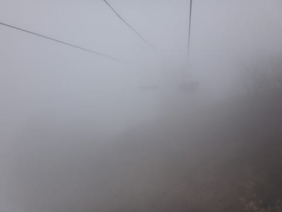

# まだ続く！GW5連休4日目，5月6日の志賀高原一の瀬スキー場は…朝から雨．そして夕方までガス（涙）呪われた天気の一日

📅 投稿日時: 2017-05-06 22:25:52

🏷️ カテゴリ: [2017スキー滑走日記](c7d777cecfc91bdf0fa464ad62c6d49ab.md)

えー．

読者の皆さんも．

毎日同じようなゲレンデレポートが続くので

飽きてきたころだと思いますが．

でも．

読者の都合では終わらない．

私が志賀高原にいる限り，

まだまだ続くゲレンデレポート．

…今日のゲレンデは．

悲惨

でした…

ということで．

本日の悲惨なゲレンデレポートをば…

まず．

朝ですが．

薄日が差すものの，雲が多い

微妙な天気でスタートしましたが…

なんだか．

にわかに雲が増え．

朝8時半というのに．

気のせいでなければ．

この，空に浮かぶ黒い雲から．

…何か，液体がぽつり，ぽつりと

落ちてきている気がするんですが…？

おかしい…

おかしいぞ．

今日は雨は午後からじゃなかったのか！？？

誰だ～！？？今日は午後から雨だとか言ったやつは！！←自分でしょ

…そうか．本日午前に降水が予想されてなかった，

気象庁発表の数値予想天気図が悪いんだな！？？←責任転嫁している

とりあえず．

朝イチの一の瀬スキー場の正面バーンは，

圧雪がかかっていたものの…

放射冷却が入っていない本日．

朝から気温は+10℃…（涙）

すでに朝イチから雪は緩く．

そして，ピステンもかなり荒い感じ（泣）

正面バーン下半分も，朝からもう深いシュプールが

着いちゃうような，緩い雪です（涙）

ただ，朝イチパーフェクターはフラットで

良かったかなぁ…

…と．

朝から緩めのゲレンデを滑っていたところ．

それまでもぽつ，ぽつと落ちていた雨粒が．

10時ごろから，ちょいと本格的になって

来たんですが…！？？（激涙）

だもんで．

ゲレンデの雪は．

ズッシリと重い，かなりの水分を吸った雪に…（泣）

ただ．

雨もずっと降り続いたわけではなく．

時折こんな風に止んで，日が差したり…

かと思えば．

またにわかに掻き曇り，激しく降り始めたり…

とりあえず．

12時近くまで，こんな風に雲がモクモクと

湧き上がってくるような空模様で…

雨が時折激しく降ったり，やんだりを

繰り返す天気（悲）．

ゲレンデは，水を吸った雪が

思う存分荒れていくという，

かなり楽しくないコンディションに

なっていきます…

とりあえず，高天ヶ原の様子でも見に行こうかな？

…と．

タンネの森から高天ヶ原へ抜ける，

連絡通路を通ってみますが．

いつもならこの場所．

雪出しして，GWラストぎりぎりまで

もつかどうか…というところなのに．

いやー．

明日で営業終了というのに．

まだたっぷり雪があるので．

今年はやっぱり雪には恵まれてたんだなぁ…

で．

高天ヶ原のクワッドに乗ると…

ぐはぁ（屍）．

いきなりのガス…

ゲレンデが全く見えません（涙）

だもんで，高天ヶ原を滑るのはあきらめて．

速攻で一の瀬へ戻りますが…

ぐはぁ．

一の瀬もガス…

12時過ぎには，せっかく雨もほぼ止んだ

というのに．

今度はガス攻撃か…（涙）．

ただ，ガスの来訪とともに，

気温はちょっと冷え込んで…

+8℃と，10℃を余裕で超えていた午前中に

比べると，結構肌寒くなってきました．

…が．

雪質には影響なしで．

大変残念ながら，

午後もどっしりと重い雪のまま…（泣）．

せめてもの救いは．

午後には雨もほとんど止んでくれて．

さらに人が少なくて，ゲレンデが昨日ほど

ひどく荒れなかったということくらいか…

もう，こんな天気ですから．

誰も滑ってません（笑）

滑っているのは，やっぱり．

自然淘汰に生き残るいつものメンバーです．

午後は，こんな感じで．

ガスが上がったり…

一瞬日が差したり．

また，ゲレンデ上部がガスに覆われたり…

という，はっきりしない天気が続き．

さらに，ゲレンデの雪も，粘つく感じで

だんだん滑りが悪くなっていき…（涙）．

そして．

パーフェクターコースの取りつき部分．

土のエリアが広がっていくのを，

悲しく見守り…

夕方ラストのころには，かなりざぶざぶで荒れた上に，

滑りが悪いという，かなり悲しいコンディションの

ゲレンデを．

数日前の最高コンディションを思い出しながら．

悲しみに暮れつつ，

16:30のラストリフトまで滑り続けたの

でした…←やっぱりそれでもラストまで滑るのね

PS1.今日は，一の瀬正面バーン下部に圧雪車が壊れて

　止まってましたね～…

　おとといは奥志賀，今日は一の瀬で，

　ゲレンデで修理している圧雪車を見かけるとは…

　この時期，圧雪車が壊れやすいのかな…？

PS2．先日，スキーパンツに穴が開いたという話を

　しましたが．

　本日は…

　ぐ，グローブに穴が…（涙）

　いろんなスキー用具が，次々息絶えていく…（泣）．

## 💬 コメント一覧

### 💬 コメント by (Goku)
**タイトル**: お世話になりました～
**投稿日**: 2017-05-07 07:54:23

ＧＷ、お世話になりました。

と言うより、今シーズンも大変お世話になりました。

私は昨日で一区切り、残りは渋・横手に行ってラストになるかと。

その頃Ｓさんはかぐらですかね。

あっと言う間のシーズンでしたが、今年はＳさん始め多くの方々と一緒に滑る機会が多く、最後までとっても楽しいシーズンでした♪

来シーズンも最高の志賀高原でお会いできることを楽しみにしています。

あっ、その前に根曲がりだけ狩りですかね。

では、ＧＷラストスキー楽しんでください！

### 💬 コメント by (Skier_S)
**タイトル**: Gokuさま
**投稿日**: 2017-05-08 01:20:43

今シーズン，ホントにおせわになりました～！

私は来週は日曜奥志賀日帰り予定です…

しかし．今シーズンはいろんな人と

一緒に滑ったシーズンでしたね～．

また，根曲がり竹狩り，よろしくお願いします～！

