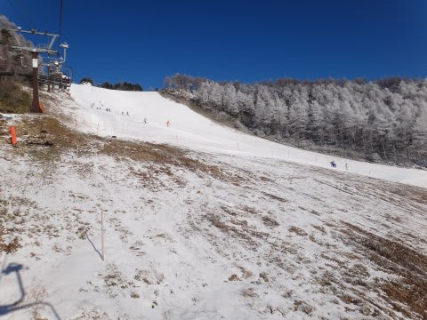
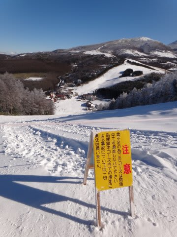
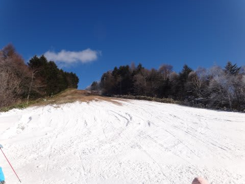
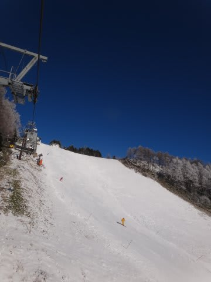
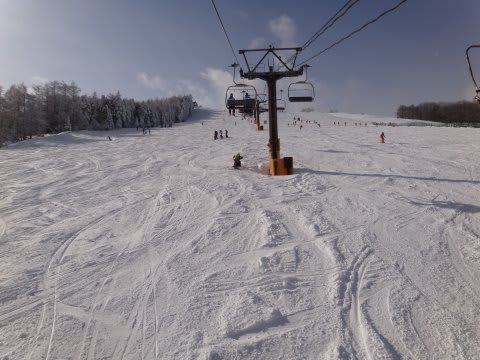

# 12月24，25日は菅平に行ってきた

📅 投稿日時: 2011-12-26 00:27:04

ということで．

昨日はNet Unreachableだったので，状況報告ができませんでしたが．

志賀高原日帰りの次の日から1泊2日で菅平に行ってきました．

いやーー．

冷えましたね．この3連休は．

…しかし．

しかし．

菅平はほとんど積雪がなかった…(涙)．

とりあえず．

土曜は晴れ時々曇り．

土曜夜から日曜朝にかけて，夜の間に10cmほど積雪はあったものの．

昼間はやっぱり晴れ時々曇り．

…志賀高原より北はそこそこ降ったらしいんですが．

白馬山麓なんかも，ゲレンデ状況は改善してきたらしいんですが．

菅平はわずか10cm．

もう一降り足りない…

菅平の太郎山で滑れるのは，

天狗メイン(幅半分以下)＆迂回コース

…この写真だと，滑れる幅がすごく狭く感じますね．

あとは，ファミリー全面，

白金，日の出が滑れます．

だけど．

表太郎，裏太郎はぜんぜん滑れるレベルに達していません…

要するに．

菅平で滑れるのは，人工雪をつけてあるコースのみ．

どうしたことだ…

まぁ，25日の朝は10cmの新雪が積もり，

人工雪がつけてあるコースは結構いい感じに

なってましたが…

この積雪で，滑れるようになったコースは全く増えなかった

というのがちょっと寂しい．

とりあえず．

明日以降，詳細を報告します…
