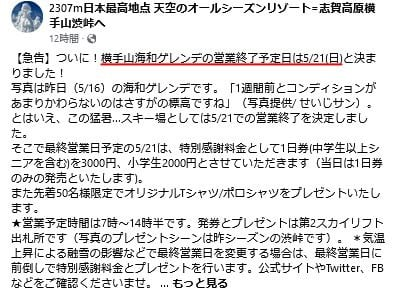
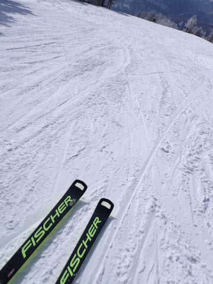
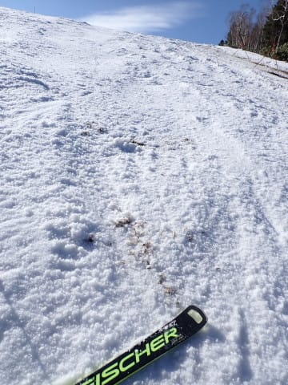
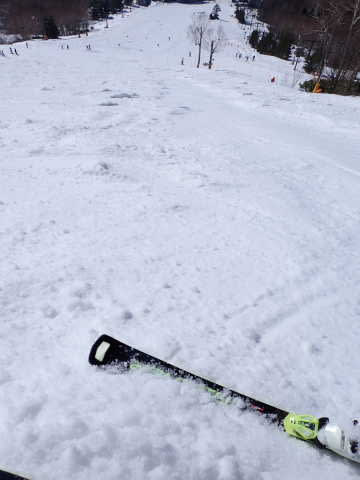

# GWの汚れた雪で，エキップさんチューンの板はめちゃくちゃ滑るんだけど…Wax Futureの効果かと思ったらそうじゃないみたい…

📅 投稿日時: 2023-05-19 02:17:00

🏷️ カテゴリ: [スキー雑談](c1f9d2cb7478308da16419928ea3945e9.md)

えー．

昨日は眠い中，夜中にこの記事を書きあげて．

そして投稿ボタンを押したあと，

即座に寝てしまったのですが…

どうやら，投稿ボタンを押したつもりだったのが

実は押されてなかったみたいで．

記事が投稿されてないことに，夜に

気づきました…（涙）

ってなことで．

いつものように，

記事を書く前に倒れたように寝てしまった

わけではないのに，Blog更新できません

でした…

ということで，昨日書いた記事を

今日改めて投稿！！

ってなわけなので．

一日古い情報になってしまいましたが…

ついに．

横手山の営業が5月21日で終了

と，公式アナウンスが出てしまいました…（泣）

（[横手山Facebook](https://www.facebook.com/yokoteyama2307/posts/pfbid08YKYPHA5XAQ1ss1ZuxaitB6TJUBPuAqTJY8DhbHxJjptrnLAZGWGsUou5C9raVovl?__cft__[0]=AZXoYr9jjh8MtNYVsBE4ItD-q3Vw-zzjoIp2JHy7Z-0nNciqwN8yMTzLbsciy0yaScNKtxwZkvhMFALQkInWKP4wV5L5D2_VolZeRTBKSdmj82tiiQG-WMaNCl7LQzB_s4H0CSjtdSSYaOZwJrZaaxCNKI0I7Exj7_o8lsf4s1J0rwWs_7wmAGtbl8kh_-UyzFbUPO3iqfxTz0OTEiCs9DEt&__tn__=%2CO%2CP-R)より）

横手山，今シーズンは6月までもたなかったか…（涙）

これで，かぐら・横手ともに21日がファイナル．

それ以降，残るは月山のみとなりますね…

…また，月まで行かねばならぬのか…←いや，そこ義務じゃないから

とりあえず．

今週末のかぐら・志賀高原の天気ですが．

20日（土）：曇り，一瞬雨がわずかに

　ポツポツ来るタイミングもあるかも．

　前日夜中に雨が降るので雪は朝から緩い

21日（日）：曇り時々晴れ．

　気温は平年並み．

　運が悪ければ，にわか雨っぽい

　のが午後にパラパラ降るかも…

って感じでしょうか．

まぁ，今週末は土日とも，先週日曜の

ような荒れ荒れ暴風にはなることは

なさそうです．

…ってなことで，本題へ．

スキーシーズンも終わりに近づき，

春になってくると，雪がストップ雪に

なってしまい，板が滑らなくなることも

多いのですが…

ただ，今シーズン．

あまりにも忙しすぎて，板のワクシングを

ほとんどできなかったにもかかわらず．

私の板は結構滑りが良かったんですよね．

…そう．

今シーズンは仕事のご無体のおかげで

のんびり板にワックスをかける時間が取れず．

12月以降，シーズン中に2-3回しか

ホットワックスをかける暇がなかったのに…

それでも，なぜかこのGWの雪でも，かなり

板が滑ったのだ…

特に，これまで何度も話題にした

[長岡のエキップさん](http://www.equipe.jp/)でチューンナップを

してもらいたての板を履いてみると．

4月下旬の汚れた滑りの悪い雪でも，

めちゃくちゃ滑って，

焼額のメンバーに履いてもらっても，

全員が口をそろえて

「良く滑る」

と驚くほど．

そのうえ，このGWに横手山を滑っていた時．

全く見ず知らずの人が追いかけてきて，

「めっちゃその板滑ってますけど，

　ワックス何塗ってるんですか？？」

と尋ねられたくらいに，傍からみてても

板が滑ってたみたいです…

いや．

でもその時の板，4月に入ってからは

ホットワックスを塗る暇がなく．

さらにペーストワックスのたぐいも

一切塗ってなくて．

汚れを落とすのに，数時間に一回スクレイパーを

かけてただけの板なんですが…

それだけで，GWの汚れが浮いた雪でも

結構滑ってくれてました．

で．

板が滑る原因ですが．

今シーズン履いてる板は，ほとんどが

エキップさんでチューンした板で，

セットでWax Futureをしてもらっていたので．

「Wax Future，むちゃくちゃ効いてる！」

と，思ってました…

だって，これまでは毎週のようにホット

ワックスかけていたのに，

エキップさんチューンの板はめちゃくちゃ

滑るので，

「滑りが悪くなったらワクシングしよう…」

と，12月末ごろから履いた板が，滑走日数

20日近く経った2月になっても，ワクシング無しで

問題なく滑ったんだもん…

これは，Wax Futureがむちゃくちゃ滑るんだ！

Wax Future，素晴らしい…

と思っていたら．

エキップの鈴木社長曰く．

「Wax Futureも効いてるかもしれないけど…

　板が滑るかどうかはアーチベンドで決まる．

　ワックスやら何やらを変えるより，

　アーチベンドがあった板に変えるのが

　一番滑った」

…は？

アーチベンドで滑りが決まる？？

「アーチベンドがその人の体重にあっていて，

　圧が板全体にうまく分散されるとき

　一番滑る」

…なるほど…

でも，エキップさんでチューンしたどの板でも

他の人の板より滑ってるんで，私の体重と

板のアーチベンドが合っているというのが

滑る理由じゃないと思うんですが…

「だとすると，ストラクチャー」

…なるほど．ストラクチャーですか．

ストラクチャーを深くすると春雪で滑るって

言いますもんね…

「メーカー仕上げのストラクチャーは

　深すぎるので潰す」

は？

…潰す！？？

「普通のメーカー仕上げのストラクチャーは

　深すぎるし，角が立ってて引っかかる．

　毛羽も多い．新品の板，触ってみてよ」

…確かに，新品の板のストラクチャー，

かなり角が立ってて，手で触ると

引っかかりますね…

「そのストラクチャーを浅くする．

　そして，角や毛羽をボアやファイバー

　テックスで時間をかけて丁寧に

　取り除く」

なるほど…

チューン後の板は，確かになめらかで

ツルツルに感じる…

…でも，春の雪ではストラクチャーが

深い方が滑るって言いますよね？？

「そう言われるけど…

　それにしてもメーカー仕上げは

　深すぎるストラクチャーが多い．

　これだけ深いと，板の操作性にも

　影響が出る」

確かに，ストラクチャーが深すぎると

板が動かしにくい時もありますよね…

「実際，浅いストラクチャーの方が滑ってるでしょ？」

…確かに…

見ず知らずの人に声をかけられるくらいは

滑ってます…

…ってなことで．

どうやら，エキップさんチューンが滑る秘密は，

Wax Futureよりも，

かなり浅めのストラクチャーと，

ストラクチャーの角や毛羽を徹底的に落とす

丁寧な作業にあったようです…

うーん．

春の雪は，深いストラクチャーの方が

滑ると思い込んでいたけど…

でも，確かにストラクチャーが浅い

エキップさんチューンの板の方が，

明らかに滑ってるんだよな…

で．

エキップさんチューンだと，春の汚れた雪を

滑るときでも，余計なワックスを塗るよりは

時々スクレイパーで汚れを落としてやる方が，

滑走性が長持ちしていい感じです．

ということで．

私は今シーズン，ホットワクシングもそれほど

やっていなければ，ペーストワックスの類も

一回も使っていませんが．

それでいて，他の人の板と比べて，

春の汚れた雪でも結構滑ってくれる滑走性を

誇っています…

アイスバーンでのエッジの効きと安心感も

すごいし．

ブーツだけじゃなく，板もエキップさん

チューン以外のものを履けなくなってきている…

…ということで．

また，鈴木社長に見事にツボを突かれてしまい．

今シーズンがほぼ終わったこの時期に，

板をまた複数本チューンナップに出してしまった，

Skier_Sだったのでした…

PS．

エキップさんは板のチューンナップに時間を

かけるのであまり数をこなせない上に，

最近は依頼が多すぎるようなので…

忙しい時期はエキップさんで買った板じゃ

ないと，チューンナップを断られることも

あるかもです．

## 💬 コメント一覧

### 💬 コメント by (エキップ)
**タイトル**: 滑走性について
**投稿日**: 2023-05-19 17:58:40

滑走性について、補足させて下さい。

スキーの構造、滑走面素材、乗り手に合ったアーチベンド、ワキシング＋ワックスフィーチャー処理方法（国内で使用されてる100v仕様の1灯式はワックス浸透率が低く、エキップでは200Vの２灯式のレースワクサーでワールドカップシーンや各メーカーのサービスセンター棟で使用している機種を使用）、ワックス種類（滑走する季節や雪質、スキー場の条件等）シーズン中は、ファーストレイヤーににマプラスFISスペシャルでワックスフィーチャー加工、更にホルメンコールベーターミックスでワックスフィーチャー加工します。春の時期はファーストレイヤー後、ガリウウムブルー又は、ホルメンコールコールドミックスを処理してます。

### 💬 コメント by (かず)
**タイトル**: Unknown
**投稿日**: 2023-05-19 20:51:18

僕も2シーズンワックスフューチャーです 安いマプラスワックスですが…充分！真夏にベースかけしてたのがアホらしくなります 笑

### 💬 コメント by (Skier_S)
**タイトル**: 本家からコメントが…
**投稿日**: 2023-05-20 00:55:53

＞エキップさま

詳細な補足説明ありがとうございます！

ワックスフューチャーの装置も，100V1灯版と200V2灯版があるんですね．

そしてMAPLUS FISスペシャルって…かなりいい選手用ワックスなんですね．

とりあえず，春先の汚れた雪での滑りの違いは驚くレベルですし，

ワックスのもちも全然違って，手間いらずの板になりました…ありがとうございます．

＞かずさま

私も，ちゃんとアイロン当ててればWax Futureは要らないよね…

と思っていましたが．

Wax Future入れてからは，アイロンを当てる回数が激減して，

シーズン中むちゃくちゃ楽ができました．

まさか，こんなに効くとは…！！

