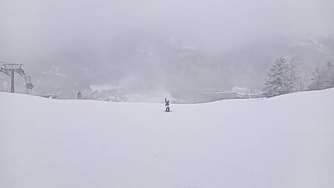
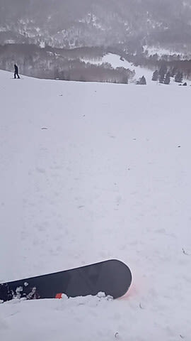
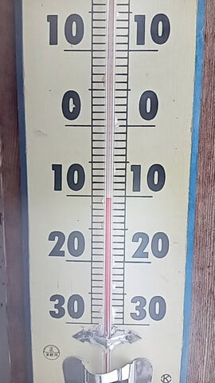
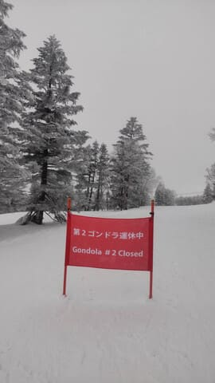
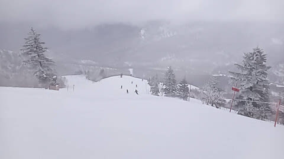
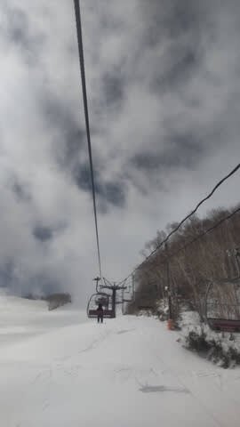
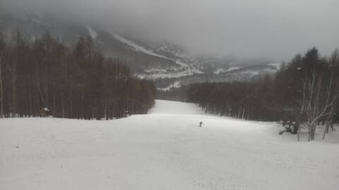
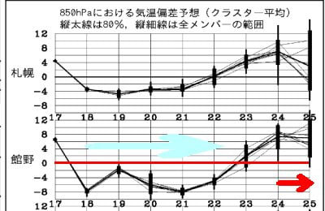

# 3月18日の志賀高原スキー場の特派員情報！積雪は10～20cm，強風でかなりのリフト・ゴンドラが止まったらしいけど冷え冷え雪が積もったよ！

📅 投稿日時: 2024-03-19 00:49:44

えー．

昨日はBlogを書く暇がなく，

倒れたように寝てしまったので．

今日は変則的に昼前に手短に更新！

昨日も特派員から写真が送られてきましたが…

雪は10～20cmほど積もったらしいけど，

昨晩からかなり風が強く，

吹き溜まるところは20～30㎝の雪の

深さだったらしいけど，

風が通るところは雪が飛ばされて

ほとんど積もってない感じで．

積雪何cmかよくわからない

状態だったみたいです…

あさイチの気温は-10℃と冷え冷えの

いい感じだったみたいだけど．

強風で朝から奥志賀の高速ペアリフトや

一ノ瀬ファミリークワッド，寺子屋，

高天ヶ原クワッド，東舘ゴンドラ，

西舘フーディークワッド，

熊の湯は第1リフト以外，

横手全山，

焼額第2ゴンドラなどは運休になり．

午後は奥志賀ゴンドラも停止．

…この中で，減速運転ながらも

焼額第1ゴンドラは終日運転だったのが

すごい…

ただ．

天気は午後には風は強いながらも，

時折青空がのぞくようになり．

人も少なく，冷え冷えのいい雪質で

滑れたようです～！

ちなみに今日は，朝から晴れて冷え冷えの

いい雪みたいです…

で．

明日は朝から雪が降り始め，

午後はかなり強い雪．

夜はかなり本格的にドサドサ降り．

木曜にかけて降り続け，かなり

積もりますよ！！

今シーズン一番の降りになるかも…？？

金曜は最高だと思います！！

パウダーねらい目！

…でも．

週末は…

気温が上がりそう（涙）．

22日までは平年比-8℃近い

冷え冷えだったのに，23日以降

気温が上がり，24日は平年比+8℃って…

極端なんだよ（泣）

まぁ．

でも，今のところ土日とも曇り，

もしかしたら一瞬パラパラ降るくらいで．

土曜はまだいい感じの雪で滑れるんじゃ

ないかな～…

明日も午前中はそこまで雪の降りは

強くないので，午前中は楽しめそう！！

果たして私は明日，無事仕事を休めるのか？？

乞うご期待！！←何を？

## 💬 コメント一覧

### 💬 コメント by (油漏＠あちこち)
**タイトル**: Unknown
**投稿日**: 2024-03-19 11:30:59

焼額山第一ゴンドラから失礼します。

昨日はマイナス１０度の低温と風に痛めつけられましたが、ゴンドラで回せたので、辛いというよりは楽しい１日でした。

今朝は薄日から青空が広がり、ご褒美ゲレンデと化しております。

仕事中の方には、大変失礼いたしました。

### 💬 コメント by (副院長)
**タイトル**: Unknown
**投稿日**: 2024-03-19 12:54:56

なんか、積雪予想が70センチだったり、100センチだったり、花粉や、黄砂で雪が汚れてなくて、焼け擬態は人工雪打ってるし、雪は汚れてないし、妖怪板つかみも　ザブザブ雪にもならずに　めちゃくちゃ心揺れるのですが。一応今シーズン最後の予定で　はきつぶす気でまだ冬タイヤはいてるし。

いやいやもうロードバイク季節で、琵琶湖、しまなみ、和歌山だろ。

私の心の中の葛藤でした。

### 💬 コメント by (レインボー76)
**タイトル**: Unknown
**投稿日**: 2024-03-19 16:18:07

火曜日の志賀高原情報

朝の湯田中はうっすら積雪。上林-2℃　蓮池-7℃。ニゴンPは10cm未圧雪。

昨日は強風、明日から大雪予報なので、今日は谷間で最高の天気。

パノラマから唐松はベストに近い。パノラマからサウスも完璧。GSは小さいコロコロがあったものの、軽快にとばせる。

今日は寺子屋と決めていたので、9時26分のバスでダイヤから寺子屋へ。全てが清々しくコースも完璧。おまけに、太陽の回りにぐるりと虹が円を描いているのを発見。回りの人に言うと、みんな写真を撮っていたけど、うまく写ったかは疑問。私はもちろん、だめでした。

寺子屋昼食のあと、また寺子屋３コースを満喫して、ファミリー4コース。正面バーンはまっ平らの上に柔らかいぼこぼこ雪が乗って、抵抗なく滑れる感じ。パーフェクタはまっ平らの上に、沢山のぼこぼこ雪が乗って、さらに手応えのある感じ。パノラマは誰もいなくて軽快に楽しめました。天狗も１人抜いただけで、のーんびり景色を見ながら楽しめました。そのあとは、今日が最後となるスキー仲間のいるダイヤのレストランで歓談。レインボー(２時)過ぎまでウキウキワクワクの日を過ごせました。スキーって、、、楽しすぎる！

### 💬 コメント by (富山県民)
**タイトル**: Unknown
**投稿日**: 2024-03-19 16:32:30

こんにちは。

3月18日の志賀高原はかなり雪が降ったのですね。

この降雪でコンディションは回復しましたね。

3月20日は寒気を伴った低気圧が通過するのでかなりの降雪が期待できそうですね。

### 💬 コメント by (だい)
**タイトル**: Unknown
**投稿日**: 2024-03-19 19:45:12

今日は最高の1日でした。私は普段ちょっと荒れてくるとすぐGSコースから逃げ出してしまうのですが、今日は12時になっても全然余裕…そして無人のゴーストタウンなので飛ばし放題！

人工雪のコロコロは少し出てましたが、その分バーンが緩まず荒れづらいので逆にいい感じでした。

その後奥志賀に行きましたが、ダウンヒルは盛り土ならぬ盛り雪をしていなかったので春営業はホテル側のみ頑張るのでしょうか…

最後は一ノ瀬ファミリーをグルグルして終わったのですが、明日の分もと思いリフトストップまで滑っても標高差は12000m弱でした。（そもそもお昼をたっぷり1時間も取ってる時点でアレですが…）

真のレジャースキーヤーにとっては、20000mはやはり別世界の話です。

### 💬 コメント by (Skier_S)
**タイトル**: 明日滑りに行けず(泣)
**投稿日**: 2024-03-20 03:31:48

＞油漏れ＠あちこちさま

今日も滑ってるなんて，うらやましすぎます…！！

いいなぁ…大当たりですよ！！

＞副院長さま

まだシーズン終わるには早いですよ～！！

今シーズン，奇跡の3月だったので意外とまだ行けますよ～！！！

＞レインボー76さま

今日も良かったみたいですね…

昨日休んだ分，体力も復活して楽しめたのでは？？

明日，明後日はまたふぶきそうですが，22日も最高ご褒美デーになると思います．

＞富山県民さま

18日は結構積もったみたいですね…

20，21日も強烈に積もるので，結構いい感じになると思います！！

＞だいさま

今日滑れたなんて，うらやましすぎる…

GSコースも夕方まで楽しめたみたいですね．

今シーズンの奥志賀，ダウンヒルは雪が薄すぎるのでたぶん雪寄せをやめたんだと思います…

平日のヤケビはゴンドラのスピードも落としてるし，それでお昼食べて12000mなら

かなり滑ったほうだと思いますよ…

コンディションよかったのがうかがえます．

うらやましい…

