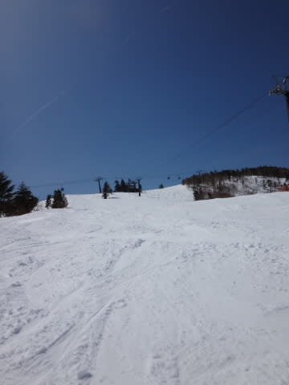

# 3月29日の志賀高原のゲレンデ状況詳細…暑い春の一日

📅 投稿日時: 2014-03-31 00:50:36

🏷️ カテゴリ: [2014スキー滑走日記](c992167609b6415052179ee69ea1ea7d8.md)

ってことで．

昨日，速報をお送りした土曜の志賀高原のコンディション．

本日は詳細版を…

えー．

土曜日は朝から晴天で．

気温は高いですね～

スキー場までの路面も完全ドライに

なっちゃってます．

…春，ですねぇ…

で．山頂に出ると…

ががーーーーん．

朝の山頂で．気温，プラス5度ですか…（涙）．

…春，ですねぇ…

朝イチは快適シマシマバーンがお出迎えですが…

見た目は最高だけど．

だけど．

なんだか，朝の1本目からすでに柔らかく…

強烈な日差しと高温で緩んだ雪は．

2-3本滑ると，あっという間に掘れて行っちゃいます…

…春，ですねぇ…

とはいえ，天気もいいし．

まぁ，春スキーとしてはこんなもんかな…

…と，思っていたら．

なんだか．

予想以上に人が増えて来たんですが…（涙）．

春休みということもあり，午前中のゲレンデは，

人口密度が結構高く…（泣）

それでいて，雪はこんなザブザブ雪だから…

当然の結果として．

うーん．ゲレンデが荒れ始めてくるんですね～（涙）．

さらに．強烈な日差しが降り注ぎ続け…

昼間の気温はプラス10℃．

これは．

はっきり言って．

暖かいなんてもんじゃありません．

暑いです．

激烈に暑いです（涙）．

ゴンドラの中なんて，蒸し風呂状態です．

…春，ですねぇ…（悲）．

そのおかげで，雪は完全に春の雪になり．

まぁ，汚れや水が浮いてくるほどではないですが．

ちょいと滑りが悪い雪になってきちゃって…（涙）

荒れて雪の重い，ちょいと滑るのに体力を消耗するバーンに…

そのせいか，午後は人が減って，ゲレンデががらがらになったのが

救いでしょうか…

夕方になり，日が陰ると…

今度は．

昼間に溶けた雪が固まってきちゃいます…（激泣）

しかし．

日帰りの私は．

このような雪だろうが何だろうが

くじけない！

しっかりリフトストップまで滑ったうえで．

さらにナイターです←アホ

ナイター斜面，見た目は良さそうなシマシマバーンで．

さすが志賀高原！

と，喜んで飛び出したところ．

…アイスバーンとまではいかないけど，表面がカリカリした感じの

硬い斜面で．

超がっかり…（涙）

ってことで．

この日は．

朝からナイターまで，体力を消耗する，ちょっと厳しめの

ゲレンデコンディションが続く一日だったのでした…．

＃日帰りなのに，そんな状況でナイターまで滑るか？？

…うーむ．

先週までが良すぎたのかな～．

もう，あんないい雪質で滑れないのかな～．

ああ．

春，ですねぇ…（ため息）
