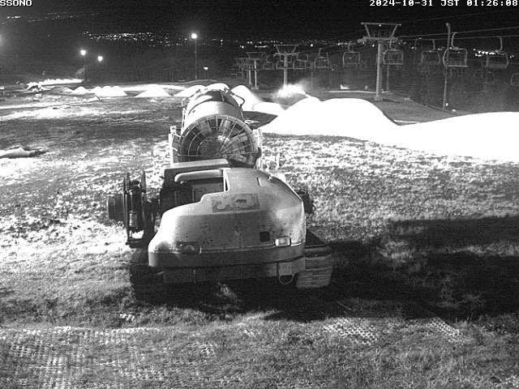
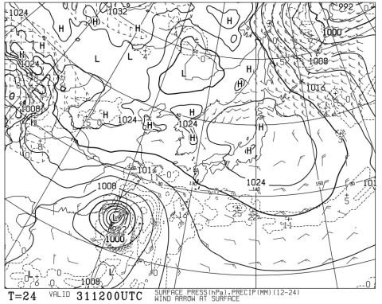

# 焼額山スキー場の新コースは旧第1高速リフト跡地！…そして3連休のイエティの天気は，初日は大雨．2日目曇り，3日目晴れだけど，初日の雨で雪がやられそう

📅 投稿日時: 2024-10-31 03:28:11

えー．

昨日の記事で，焼額山に今シーズン新設される

新コースは旧3ロマBコースか…？

と推測しましたが．

どうやら見事外れたようです（泣）

毎日読者Kさんから，正解は第1高速リフト跡地

だというコメントを頂きました～！

タカさんも，C４というナンバリングから1高の

跡地じゃないか…と推測していましたが，正解

でしたね…！

ってなことで．

今シーズンに焼額山にオープンする新コースはここ．

スキー場マップで言えば，この赤くマークした部分に

なります…！

新コースにするには，放棄されてから

時間が経ちすぎているので，立木がいっぱい

出てきてもうコース化は難しいかな～…

下の方は人工植林の林の中でコース幅も

狭いしな～…と思って候補から外したけど．

第1高速跡地が新コースだったか…！！

幅が狭いので，コースオープンして

数人滑ったら，あっという間にパウダーが

食い尽くされて終わりそうな気が…

（小さな声で独り言）

ってなことで，本題へ．

今週末はまた3連休．

この3連休はイエティや軽井沢がオープン

しますね～！

3連休の天気が気になる方が多いと思うので，

この3連休の天気予想です！

…の前に．

肝心のイエティですが．

おおむね予想通り，31日(木)も営業休止が

アナウンスされましたね…(涙)

（[イエティFacebook](https://www.facebook.com/YetiSnowtown/posts/pfbid036x1QH2xqNwsZHoPuMmtY9u3TR9LusRXv45B73kKdSXJ3QoTSAkQdhx2HxYXUz8o5l)より）

ライブカメラを見ても，もう営業開始時の

コースの雪は跡形もなく．

完全にシーズン初めにコースを作り始めるのと

同じ，草むらの上に雪山が乗ってる状態に

なってます…

昨日から今朝にかけての雨もあり，造雪も

思うように進んでない感じですね…

（[WNIライブカメラ](http://webcam.wni.co.jp/KAC24326/loop.html)より）

うーん．

明日1日で造雪しきって，金曜に

オープンできるのかな…？？

とりあえず．

31日(木)の地上天気図を見ると．

高気圧に覆われてこの日は晴れ．

…晴れて高温になり，雪には厳しい天気…

晴れなくてもいいんだけど…

イエティの造雪は大丈夫か？？

そして翌11/1(金)の地上天気図は…

台風崩れの低気圧の接近により西から

徐々に降水域が伸びてきているので．

昼間は曇り空ですが，夜遅くになって

雨が降りそうな予感…(涙)

で．

肝心の3連休初日の11/2(土)の地上天気図は…

うがーーーー！！

これは何かの嫌がらせか！！！

いや，絶対嫌がらせだろ！？？

そうとしか思えん…

何が悲しくて，ぴったり3連休の初日に，

こんな見事に日本全域土砂降りに

なるんだ？？？

ゲレンデの雪，かなりやられるよ，これ！(激涙)

3連休2日目，11/3(日)の地上天気図は．

まだ本州全域に降水域がかかってますが…

ただ，低気圧は遠く東に去っているので．

おそらく朝には雨が止むと思います．

で．3連休最終日，11/4(月)の地上天気図は．

西高東低の冬型なので…

軽井沢・イエティは晴れそう．

気温もまぁまぁ冷えそうなので…

2日の雨に耐えてゲレンデが生き残ってれば，

比較的いい状態で滑れるかも…？？

ってなことで．

まとめると．

10/31(木)：晴れ．気温は上がる

11/1(金)：曇り，気温は高め．

　夜9時ごろから雨が降り始めるか？

11/2(土)：前日夜からの雨がひたすら

　降り続ける．かなり強い雨．本降り．

　イエティは営業しないかも？

　滑る意欲を失う雨．

　ゲレンデはかなりやられる．

11/3(日)：1日夜からの雨はこの日の

　朝まで降り続ける．

　イエティは雪が残ってるかどうか…

　軽井沢もかなりゲレンデ状況はヤバく

　なりそう．

　降り止む時間は正確に読めないけど，

　朝9時には止んでるかな…

　その後曇り．

　イエティ・軽井沢ともに営業できたと

　しても，雪はかなり薄くなってる．

　雪が解けて営業できない可能性も…

11/4(月)：晴れ．気温は低め．

　気温が低いので，晴れてもバーンは

　そこまで荒れない．

　この日まで雪が残っていれば，

　気温も低く冷えていい日なんだけど…

って感じでしょうか．

せっかく復活に向けて頑張ったイエティ，

1日から3日の朝にかけて降り続ける雨に

耐えるのか？？？

3日間営業しただけで，その後4日間

営業休止して造雪したにもかかわらず．

そのゲレンデが営業再開翌日の3連休初日で

また全滅という，語るも涙の悲惨な目に

あうのか？？

ゲレンデをもたせるためには，11/2は

3連休にも関わらず営業を見送って，

雪をブルーシートで覆って雪解けを防ぐ

とかしないといけないかも…

しかし，3連休初日に土砂降りでゲレンデが

壊滅し，3連休全滅…というシナリオが現実味を

帯びてます…（泣）

なんとか，3連休にゲレンデがもってくれます

ように…！！（祈）

ってな感じの，3連休全滅を狙った嫌がらせと

しか思えない，3連休初日の土砂降りという

悲しい予想ですが．

そのあと，11月5日，6日と冷えますよ～！！

久しぶりの850hpaの0℃線が，志賀高原

近辺にまでかかってます！！

この秋の初の，本格的な冷え込みです！

志賀高原は，6日あたり天然雪が降りそうだし．

軽井沢，イエティも人工降雪機が使えるんじゃ

ないかな～…

3連休はダメだけど，その次の週末は

コンディションが改善しそうな予感…！！

でも．

また11/9以降は気温が上がりそうなんだよな…（涙）

とりあえず．

まだ今はそこまで冷えなくていい．

今，冷えてないのは，まだ許す．

今は12月に入ったら激冷えになるための

準備をしているんですよね？？

…と．

天気を操作している神様に念をおしておきたい，

Skier_Sだったのでした…

## 💬 コメント一覧

### 💬 コメント by (ゆう)
**タイトル**: Unknown
**投稿日**: 2024-10-31 09:57:27

新コース場所間違ってますよ？

ブナコースの右側になります。

電話で確認済みです。

### 💬 コメント by (Skier_S)
**タイトル**: ＞ゆうさま
**投稿日**: 2024-11-01 02:20:02

お電話して確認されたんですか…！！

ブナコースの右側とは，上から見て右側でしょうか？

うーん．コース案内の標高差，長さおよびスタート標高を見ても，

白樺の（上から見て）右側だと思ってたのですが…

でも，電話で確認されたというならその可能性も…

果たして何が正解なのか．

焼額の発表を楽しみに待ちたいところです．

### 💬 コメント by (ゆう)
**タイトル**: Unknown
**投稿日**: 2024-11-03 06:39:53

お返事ありがとうございます！

はい！焼額山に電話して担当の方に聞きました。

ホームページでﾔｹﾋﾞｺｰｽﾄって新しいパウダーコースのC4があるのですが、ブナの辺りですかって聞いたらブナコースC3の右側になりますとの返事でした。

第2高速リフトとC2の間の所になります。

また解放条件は、去年開いていたﾔｹﾋﾞｳｫｰﾙと同じ感じです。天候と積雪量と安全確認行って問題なければ開くみたいなので、解放されるのも雪が降って当日行って運次第って感じですね！

### 💬 コメント by (Skier_S)
**タイトル**: ＞ゆうさま
**投稿日**: 2024-11-04 01:33:07

情報ありがとうございます！

ただ，このような情報もあるので，やはり第1高速跡地なのかも…と思っています．とりあえず公式発表を待ちます…

https://x.com/dancho1311/status/1852514032621875483

で，オープン条件はヤケビウォールと同じであれば，スキー場オープン後も安全確認が

終わるまでオープンしないので，新雪が降った翌日はヤケビウォール，ヤケビバレー，

ヤケビコーストのどこでオープン待ちをするか，楽しみ（というか悩み？）が増える感じですね．

ちょっとずつ時間をずらしてオープンしてくれれば，3本ともいい感じのパウダーが行けるんですが…

とりあえず，パウダーの日の楽しみが増える感じ…！

昨シーズンはあまり新雪が積もらず期待外れだったけど，今シーズンはパウダーどかどか積もってほしいですね…！！

