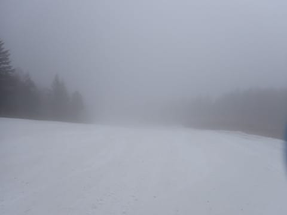
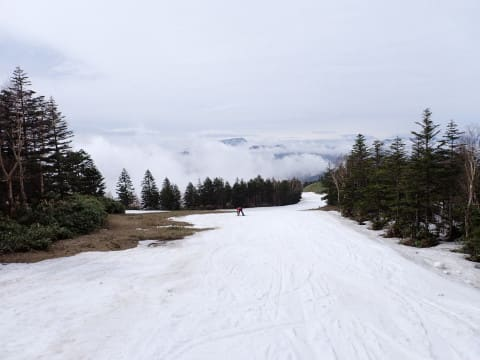
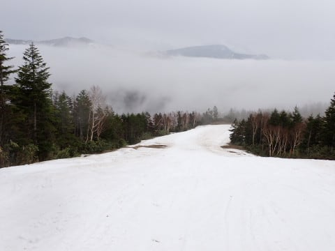
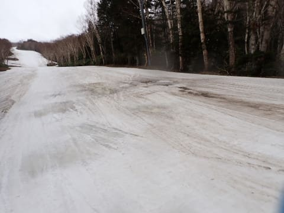

# 2024/5/1(水)，GW谷間，５月に突入した志賀高原焼額山スキー場は，曇りのち小雨．気温は高めだけど，雪はそんなに解けてないよ！

📅 投稿日時: 2024-05-01 22:28:44

ってなことで．

なんと．

この地球という惑星は，5月という世界に

突入したようです…！！

5月…それは，スキーシーズンもラストスパート．

もう，雪が残っているところを何とか滑る時期．

あぁ…スキーシーズンが終わっていく…

そんな中，シーズン終了まで残り6日となった

焼額で，今日も滑ってきました～！！

で．

今日も朝6時からの焼額の早朝営業に

間に合うように賀高原を登っていきますが…

路面は明け方降った雨でウェットですが，

今日も問題なく夏タイヤで突っ切れました！

ってなことで．

朝6時の焼額第2ゴンドラの早朝営業

スタートに並びますが…

第1ゴンドラの営業が終わったので，昨日よりは

人が多いけど．

でも，GWといえどさすが平日．

あさイチに待っていたのは10人程度．

ゲートオープンと同時に，ゲートの中に

納まっちゃう人数しかいませんでした．

で．

6時営業開始のゴンドラで山頂へ上ると…

早朝から，山頂の気温は+5℃．

うーん．今朝は冷えそうな天気図だったけど…

今日も朝から気温は高めですね（泣）

昨日かなり雪が減っていたゴンドラ降り場．

結構雪が足されたようで．

朝はまたちゃんと白い雪にもどってましたね…

でも．

朝イチのシマシマバーンを期待したところ…

うーん．明け方に雨が降った影響か．

朝から雪は締まっておらず．

緩い感じ…

朝イチから雪が緩んでいるので，シマシマ感が弱い…（泣）

そして．

コース中盤からはガスが出て，視界が悪く…

せっかく早朝2時間券を買ったのに，

なんだかいまいちの天気（激涙）

ただ，朝7時ごろになると…

ガスも晴れて，うっすら明るくなって

来ました…！

いや．

ずっとガスってたら早朝に来る意味なかった…

と嘆いていたところでしたが．

下界は雲海に覆われているものの，

焼額は雲の上に出たのか，視界はよくなり…

バーンがすっきり見えるようになってきました！

うーん．

雪面が見えるって素晴らしい…

ただ．

雪は早朝のうちから緩かったので．

朝9時ごろにはもうバーンが荒れてきた

感じ（泣）

朝からすでに，荒れた春雪用のDeaconが

出動するコンディションです…（ちょい泣）

でも．

今日もガラガラ焼額．

誰もいないコースを，ひたすらぐるぐる

滑れるのはいいよ…！！

今日は気温もそこまで高くなく，

そして日も射してないので…

雪はそこまでひどく解けてなくて，

パノラマ・サウスコースはまだかなりの

広いコースが滑れます！！

志賀高原の中で，おそらく一番雪が

残っている（というか，根性で人工雪を打ち続けた）

のは，おそらくこのパノラマ・サウスコース

なんじゃないでしょうか…

でも，朝から雪が緩く，パノラマの壁は

朝9時ごろにはボコボコになってきたけど．

でも，サウスコースは人工雪の下地が結構

硬く，幅広のコースが結構フラットなまま

滑れる感じでした～！

しかし．

日が射さないとはいえ，

昼間の気温は+10℃になった本日．

朝から緩斜面の滑りはそんなに良くなく，

昼間は完全に重い雪になっちゃいました（泣）

そのせいか…

今日もホントにガラガラの焼額．

全くコース上に人がいません…

今日はどの写真を見ても，コースに

人が写ってませんね…

そして本日．

午後12時半ごろから雨がぽつぽつ降り始め…

1時半には，パラパラ程度ながらも

レインウェアを着ないとちょっと辛い

雨が降り始め，その後降ったりやんだりで

午後3時半の営業終了まで雨が続き

ました…（泣）

ただ，本格ザーザーぶりにはならなかったので．

雪はそこまでダメージを受けませんでした！！

ただ．

パノラマの壁の一番下の部分，

ちょっと雪が薄いところが出てきて…（泣）

近づくとちょっとヤバそうな感じだけど．

でも，下から見ると，雪がヤバいのは

わずかこれだけの部分．

でも．

昨日は土が出ていたこの部分．

雪を運んで土を埋めたらしく，今日は全く

土が出てなかったので…

雪が薄くなった部分は明日までに埋めて

状況は回復しているかも？？

あと，コース上に土が出てきていたのは

サウスのこの部分．

一見，大きく土が出ているみたいに

見えますが…

下から見ると，コースの横にちょっと土が

出ている感じで．

雪がついている部分の幅が十分広いので，

そんなに気になりません．

あとは，一番下の緩斜面のこの部分ですかね～

でもここは，土は出てなくて．

ちょっと水たまりっぽくなってる感じ．

まぁ，おそらくこれらも明日のあさイチ

までには修復されていると思います…

ってな感じで．

今日もこれらの場所以外は，

結構しっかり雪がついている

パノラマ-サウスコース．

午後は雨に降られながらも，

むしろ雨で緩斜面の滑りが悪い

ところも，板が滑るようになって

いいかも？と思いながら．

幅いっぱい滑れるサウスコースは

人工降雪の下地がしっかりしているので，

最後までそれほど荒れず大回り可能で．

今日も営業終了の15時半まで，

ひたすらサウスで大回りをかまし続けて

来たのでした…

ゴンドラ乗り場のこの辺りも，営業終了後に

しっかり雪を入れていたので．

明日の朝にはもう少しきれいになっていると

思います～！！

ってなことで．

今日は早朝はガスは出るし，バーンも

未明の雨のおかげで緩んで残念だったけど．

曇り空のおかげで雪はそこまで解けず，

上部のパノラマコースは午後は荒れたけど，

サウスコースは午後まで大回り可能で．

…朝から緩斜面の滑りが悪かったときは，

早めに切り上げようと思っていたのに…

結局昨日と同じく，朝6時から営業終了の

15時半までの9時間半以上．

トイレに行く時間以外は全く休まず

食事休憩も取らず，

ひたすら滑りまくった一日を過ごしたの

でした…←この雪で9時間半休みなしで滑るのはバカだよ

明日は終日晴れそうな天気図で，

今日と違って，明日の昼間はかなり

ズブズブな雪になっちゃいそうですが…

朝はちょっと冷え込むので，早朝は

バーンが締まっていていいかも…！！

また明日も，焼額滑ってます～！

## 💬 コメント一覧

### 💬 コメント by (Skier_B)
**タイトル**: Unknown
**投稿日**: 2024-05-01 23:27:16

この春雪で、あのギザギザは終わってますねʅ（◞‿◟）ʃ

さすがです(￣^￣)ゞ

### 💬 コメント by (Skier_S)
**タイトル**: ＞Skier_Bさま
**投稿日**: 2024-05-02 22:21:37

たぶん，今日は某なおパパ（全然某になってない）が昨日の私の記録を抜いているような気がします（笑）．

### 💬 コメント by (Skier_B)
**タイトル**: Unknown
**投稿日**: 2024-05-02 23:00:30

Skier_Sさま

某にはなってないですがw、、、そのようですね。

deacon84を操れる技量があるば、春雪最強なことが証明されたわけですが、二人とも滑り過ぎです^^;

### 💬 コメント by (Skier_S)
**タイトル**: ＞Skier_Bさま
**投稿日**: 2024-05-05 04:33:41

そうなんですよ～！

やっぱりDeaconは無敵の春雪用スキーです．

こいつを履くと，春スキーの疲労度と楽しさが全然違いますよね！！！

しかし，2日連続早朝からラストまではさすがに疲れました（笑）

