# プロジェクトX2第2章…LEVORG E型にKENWOODナビ取り付け…ETC＆地デジ＆GPSのアンテナ取り付けのための内装のばらし方

📅 投稿日時: 2018-08-09 02:46:36

そーいえば．

モアルボアルに行くにあたって．

成田空港まで，高速道路を走ったのですが…

高速だと，この車の燃費はどこまで伸ばせるのか？？？

という，燃費のポテンシャル確認にチャレンジして

みたわけですが．

その結果は…

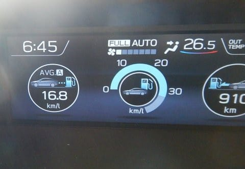

リッター16.8kmでした～！

気合いエコランすれば20km/Lを超えてくる

BRレガシィほどは良くはないですが．

300馬力の車とすれば，かなりの健闘

でしょうか…．

でも．

この燃費を出そうとすると．

かなりの自制心の訓練になります．

アクセルを踏んで気持ちよく加速しちゃうと．

一気に燃費が悪化するので．

もう，強烈な自制心を発揮しないと

この数値は出せません．

アクセルを軽く踏むだけで，軽やかな

コンプレッサー音を響かせながら，

ドカーンと気持ちよく加速していくこの車．

その快楽におぼれる欲求と戦いながら．

強烈な自制心を発揮しつづけないといけないので．

この燃費を出し続けるのは，悟りの境地に達した

解脱者にしかできないと思いました…

ってか．

こんな走り方をするのは，この車の

使い方を間違えている

という思いと戦いながらの，燃費チェックでした…

ってなわけで．

本題．

レヴォーグへのナビ取り付け記事．

今回は，ナビ＆ETCの各種アンテナ類取り付けのための，

メーター＆Aピラーカバーの外し方です．

では，どうぞ～！

----

ということで．

ETC車載器が着いたので．

次はETCアンテナの取り付けになるのですが…

ナビ＆ETCの取り付けに際しては，

・ETCアンテナ

・GPSアンテナ

・地デジアンテナ

の3種類のアンテナをつけなくてはなりません…

だもんで．

これらアンテナを一気に取り付けちゃいましょう．

まず，ETCアンテナですが…

このDENSO製のETCのアンテナ．

フロントガラス上部取り付けタイプなんです．

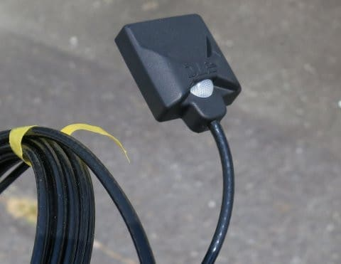

うーん．フロントガラスに着けてもいいんだけど…

ガラス上部は，アイサイトのカメラの邪魔にならない

場所がどこか分からないし．

フロントガラスに余計なものが貼り付いているのは，

私の美学的には，あまり望ましくないので…

ここは，前のBRレガシィと同じく．

メーターナセル内側に貼りつけとしましょうか．

フロントガラス取り付けタイプで，貼りつけ面が

アンテナ面となっているこのアンテナ．

貼りつけ面が上側になるようにつけられる場所となると…

メーターナセル内側がベストですね．

だもんで．

メーターを外さなくてはなりませんね…！うふふふふ．←ばらすことに喜びを感じ始めている

ってことで．

メーターAssyの外し方ですが．

まずは，メーター前のカバーから外すわけで．

カバー上部のこの2か所のネジを外せば…

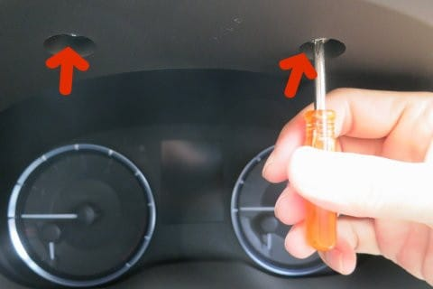

カバーはこんな風に簡単に外れます．

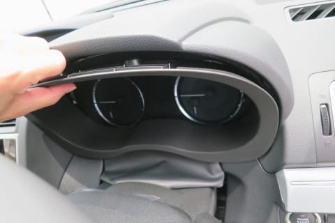

ってことで，カバーを外した後は…

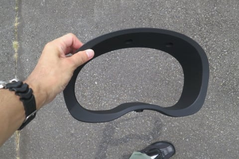

メーターAssyのこの4本のネジを…

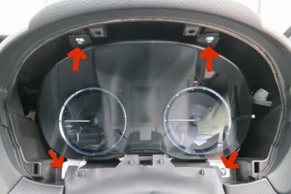

こんな感じで外していきます．

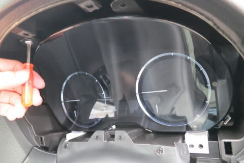

ネジが外れると，メーターAssyがこんな風に

手前に引き出せます．

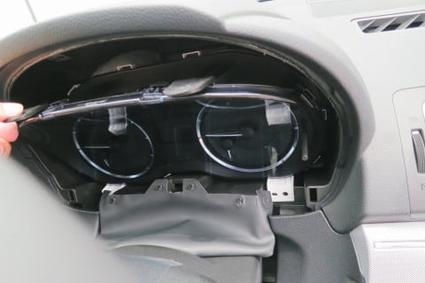

ただ，このままではメーターは外せません．

メーターの後ろには，矢印に示したような，

ぶっといハーネスがくっついてます．

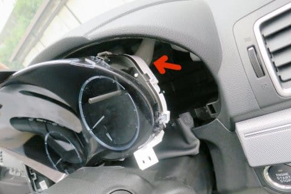

ハーネスからメーターにつながってるのは，

このコネクタ一個だけ．

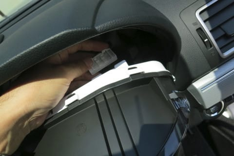

このコネクタを外せば．

こんな感じで，メーターが取り外せます…

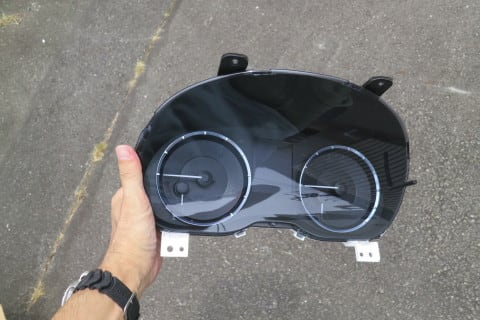

で．

ETCアンテナは．

メーターナセル内側の，

このあたりに取り付けましょうか…

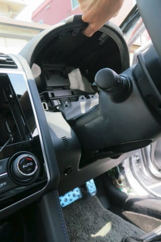

アンテナについている両面テープの剥離紙を

剥がして…

固定！

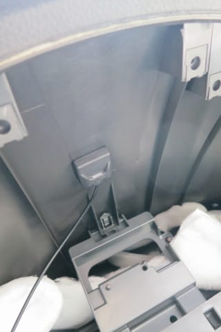

つけたのは，大体こんな感じの位置です．

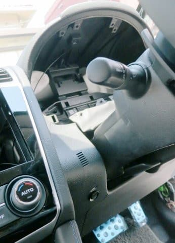

で．

ETCアンテナを貼りつけ終わったので．

ここでメーターを取り付けたくなりますが…

その前に．

次は地デジアンテナの取り付けに移ります．

地デジアンテナは，フロントガラスに貼り付けますが．

このアンテナからナビまでの配線．

メーター裏側を通すと楽に配線できるので．

メーターを外した今のうちに

地デジアンテナを取り付けちゃいましょう…

地デジアンテナの取り付け．

Aピラーカバーを外す必要があります．

このAピラー．

サイドエアバッグが仕込まれているので．

Aピラーカバーを外す前に．

エアバッグの誤動作を防ぐため，バッテリーの

マイナス端子を外しておいた方が身のためです…

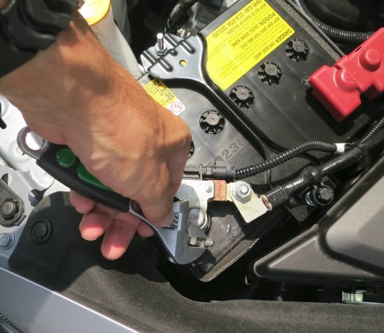

外したターミナルがバッテリー端子に

接触しないよう，バッテリーマイナス端子に

テープを貼りつけておきます．

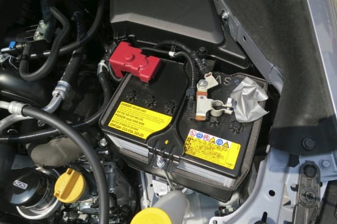

で．

Aピラーカバーを外しますが．

この部分に指を突っ込んで…

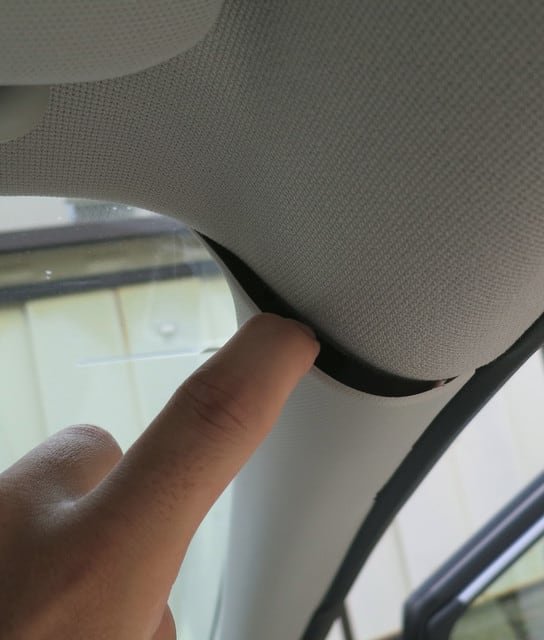

えいや！と引っ張るわけですが．

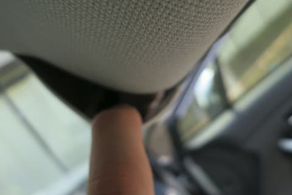

エアバッグ展開時にAピラーが吹き飛ばない

ようにするために，こんな緑色のフックが

引っかかってます

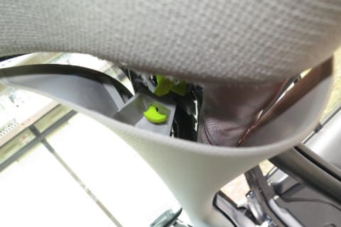

この引っかかっているフックを外さないと，

Aピラーカバーは外せません．

狭いすき間から，指かラジオペンチみたいなものを

突っ込んで．

この緑色のフックを90度回します…

文字だけでは分かりにくいと思うので．

Aピラーを外した後のフックの写真を使って説明すると．

このフック．

最初はこの向きになっているのですが…

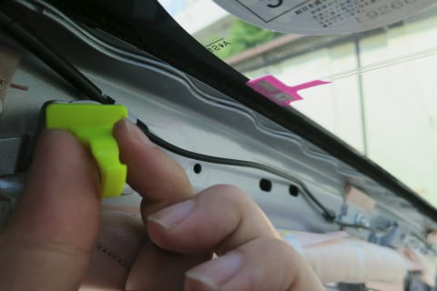

全体をくるっと90度ひねってやれば，この向きに

なります．

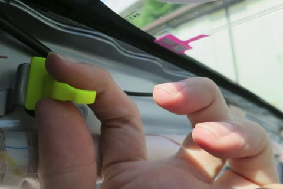

この向きになれば

こんな感じで，Aピラーカバーが外せます．

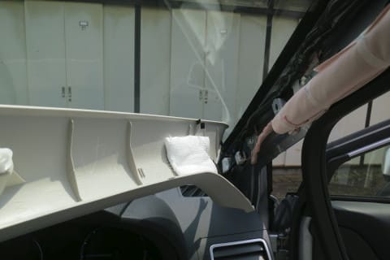

反対側のAピラーカバーも同じように外しましょう．

指を突っ込んで…

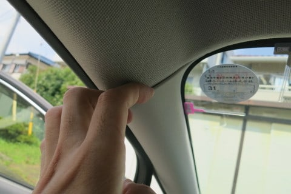

引っ張って外れたら．

この緑色のフックを90度回して…

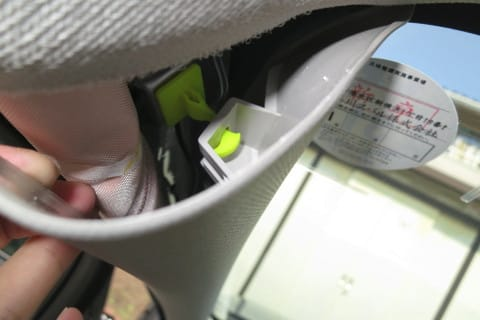

はい．

助手席側も外れました！

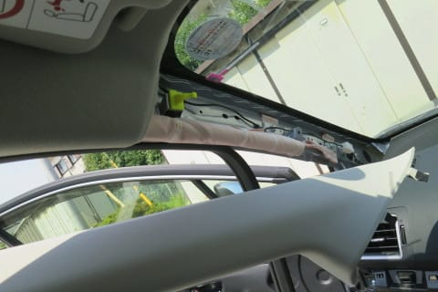

ってな感じで．

次は地デジアンテナ＆GPSアンテナの取り付け作業です！

…どーでもいいんですが．

…最近のこのBlog．

ここまでLEVORGの内装のばらし方を細かく書いてある

レポートはそうそうないだろう…

というレベルの，詳細マニュアル化してますね（笑）．

しかし，LEVORGオーナー限定，それもDIYする人にしか

意味がないような，こんな読者を限定するレポートを

書いているのに．

ダイビング日記よりも多くの人が読んでくれているという，

この不思議…（謎）

## 💬 コメント一覧

### 💬 コメント by (しんちゃん)
**タイトル**: 期待が膨らむ
**投稿日**: 2018-08-09 22:25:33

こんなにも苦労(？)してＤＩＹでナビやらＥＴＣやら取り付けた実車を、シーズンインし、ヤケビの駐車場でお目にかかれる日が楽しみで仕方ありません。

こんなに楽しいレヴォーグの内張分解マニュアルは、ここにしかないでしょうね(笑)

### 💬 コメント by (Skier_S)
**タイトル**: しんちゃんさま
**投稿日**: 2018-08-10 04:48:09

…いろいろ苦労しました（笑）．

いや，順調に行った作業自体は全然苦労じゃなかったんですよ．

やっぱり，いろいろなトラブルが…（泣）

リアカメラのトラブルに続き，これから先も，

まだトラブルが発生します…（涙）．

でも．

トラブル部分が面白い読み物になっているので，

みんな読んでくれているのかも…

人の不幸は蜜の味…（？）

