# 2021/4/17(土)の志賀高原スキー場は…終日雨．ずっと雨．強風でゴンドラ運休（涙）

📅 投稿日時: 2021-04-17 21:51:59

ということで．

今週末も志賀高原にやってきているわけですが．

…今日は．

営業開始から営業終了まで，一瞬たりとも

止む瞬間なしに雨が降り続ける

という．

悲しい一日でした…

まず．

焼額の駐車場に8時過ぎに到着したけど．

その時点で，すでに車から出るのが

ためらわれるほどの土砂降り(激涙）

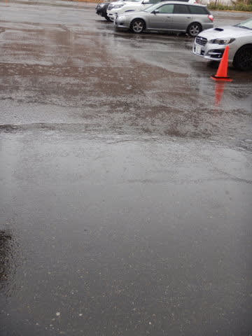

車から出ると，一瞬でびしょ濡れになる

すごい雨で．

さらに風がビュービュー吹いていたので…

焼額のゴンドラは朝から運休(泣）

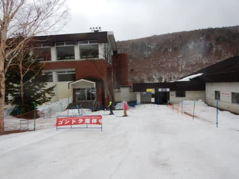

誰か，昨日の段階で

「風は思ったほど強くなさそうなので，

ゴンドラは運休にはならなさそう」

みたいないい加減なふざけたことを

言っていた気がしますが．

そのいい加減な予想は外れたようです…

誰だ～！！そんないい加減な予想を

する奴は！！←だから，自分でしょ

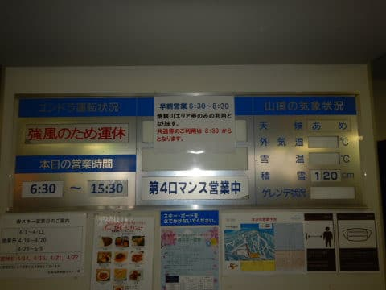

一の瀬ファミリー，高天ヶ原のクワッドは

動いたようですが…

奥志賀は本日は全面運休(涙)

焼額も，動いたのは第4ロマンスのペアリフト

1本のみという状況…(涙)

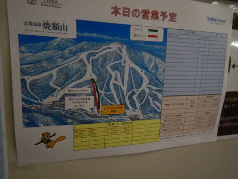

なぜ…

なぜ今シーズンは，狙ったように

週末に雨になるかなぁ…(止まらぬ涙）

さすがの私も朝イチからびしょ濡れになる

4ロマに乗って滑るのは避けて．

風が弱まり，ゴンドラが動き出すことを

期待しよう…

と，しばらく車の中で待機していたけど．

風が弱まる気配は全くなく…(泣）

だもんで．

レインウェアとゴム手袋で完全防備して，

10時過ぎに出動！

さすがにこんな天気ですから，

第4ロマンスは飛び乗りです…

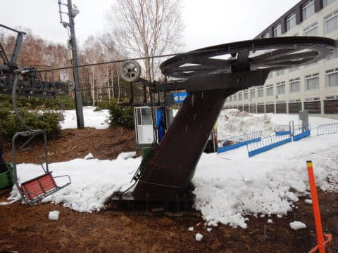

で．

朝イチではなく，朝2くらいの時間帯

ですが…

滑っている人が少ないからか．

まだシマシマが残ってます！

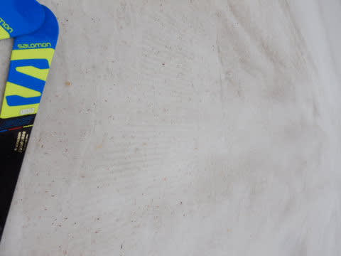

雪は，雨が降ってざぶざぶかと思うと．

意外とどっしり締まった感じで，

板が潜ったりしない，意外と

快適なバーン！

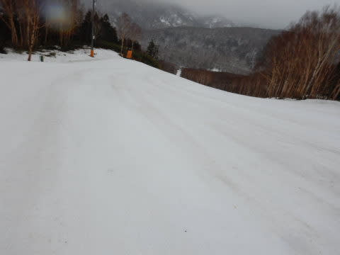

雨のおかげか，板も走るし…

いいよ．

バーンもガラガラの貸し切りだし…

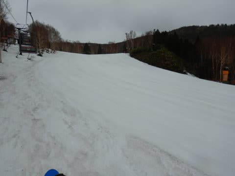

これ，いいよ！！

なんだ．

今日，意外といいじゃないか！！！←雨の中喜んで滑るおかしな人になっている

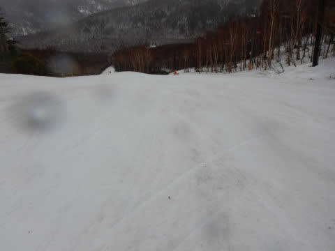

雨は強く降りしきるけど，コース上はまだ

幅いっぱい雪はあるし…

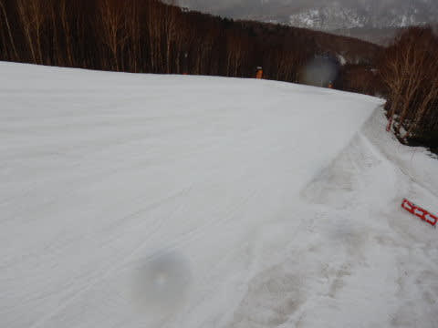

硬いわけではないけど，ザブザブではない

比較的締まった雪で．

人も滑ってないのでずっと完全フラットだし．

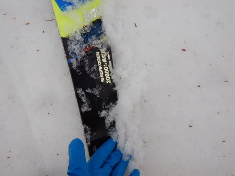

これ，意外といいよ！！！

（ただしレインウェアとちょっとずれた神経をもっている人限定）

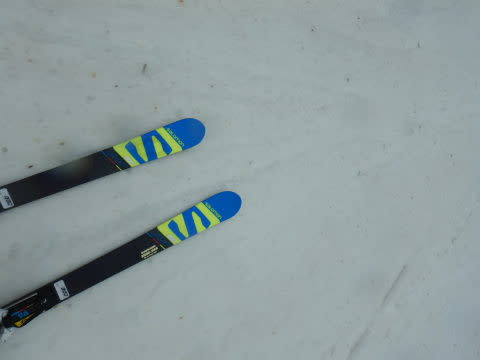

そして．

午後になると，こんな雨が降り続ける中

滑る人は，

隕石衝突後の恐竜

のように次々死に絶えていったようで．

午後2時過ぎには，バーンは焼額常連

メンバー4人だけの貸し切りに…

我々だけのためにリフト動かしてくれて，

ありがとうございます～←焼額常連メンバーのおかしさが良く分かる

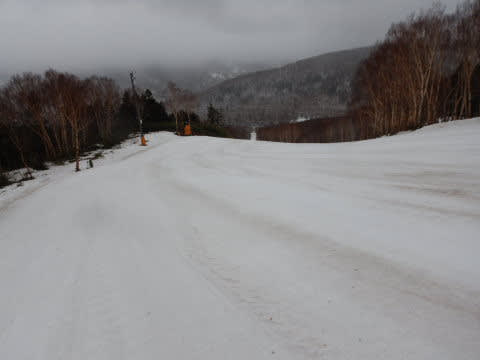

さすがにリフト終了間際になると，

ちょっと雪に汚れが浮いてきたところも

あったけど．

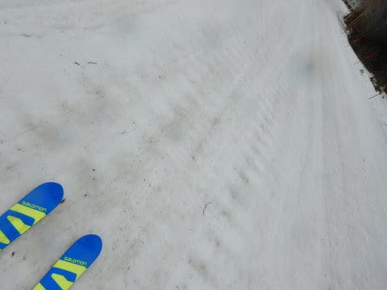

今日は午後になってから，最大でも7-8人しか

滑ってなかった焼額．

最後までバーンが全く荒れることなく．

気持ちいいバーンのまま，15:30の営業終了

まで滑りきったのでした…

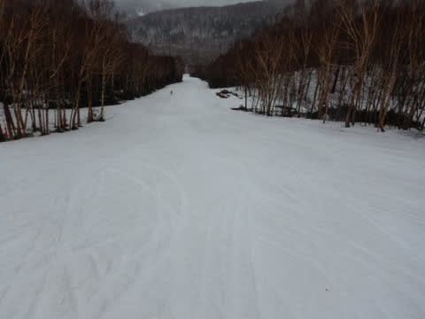

いやーー．

ずっと雨だったけど．

意外と楽しかったな…

…

…うむ．高天ヶ原と一の瀬は，16:20まで

やってるのか…

…

ふーん…

…

高天ヶ原は，まだ滑れるのか…

…

…え！？？？

…あれ？？？？

なぜか，気を失っているうちに

高天ヶ原に瞬間移動してますよ！？？

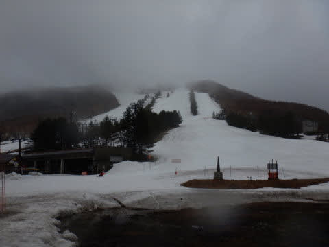

ということで．

残り時間から言ってリフト3本．

高天ヶ原を滑るぞ！！

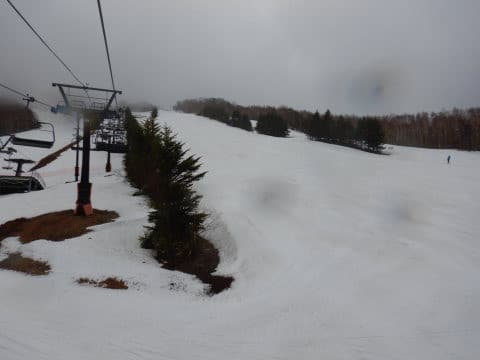

…と思ったら．

高天ヶ原は，滑っている人が多かった

からか．

ちょっとゲレンデは荒れてますね…（ちょい涙）

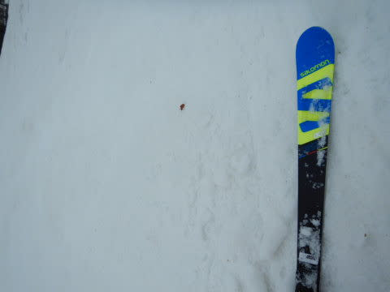

そして．

中央バーンは，ちょっと雪が薄いところが

そこかしこにありますね…(泣）

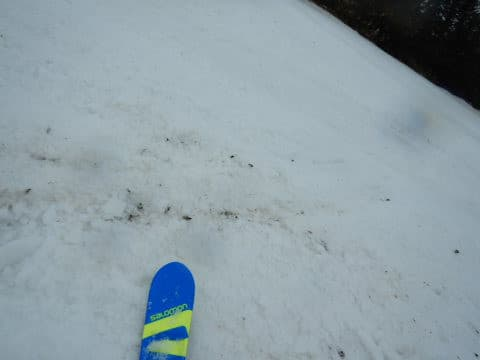

NHKバーンはまだ大丈夫だけど．

中央バーンはGWまでもたずに

終わっちゃうかも…

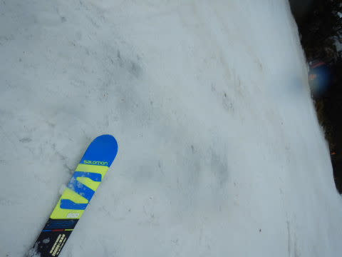

とはいえ．

まだコース全面滑れる高天ヶ原を．

雨に打たれながら，リフトストップの16:20まで

滑り倒したのでした…

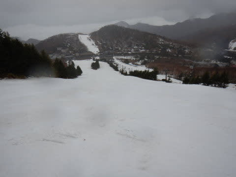

とりあえず．

今日はガラガラだったし．

雨のおかげで板も滑ったし．

途中でくじけるかも…

と思ってスタートした本日．

予想外に延長戦まで楽しんでしまいました(笑)

明日の志賀高原は．

早朝には，山頂付近は雨が雪に変わり，

1-2cm雪が乗ってるかも？

そして．

通常営業開始のころまでには止んで．

曇り空の一日になりそうかな…

明日も焼額で滑ってます～！！

## 💬 コメント一覧

### 💬 コメント by (ikkun)
**タイトル**: Unknown
**投稿日**: 2021-04-17 22:30:40

お疲れ様でしたm(__)m まさに頭が下がりっぱなしです それが本当のスキーヤーですね 見越しての一昨日でした 明日は雪になります様に願っています お気をつけて楽しんでくださいませ

### 💬 コメント by (ほっぽ)
**タイトル**: 4/17　志賀高原
**投稿日**: 2021-04-17 23:49:36

Ｓさん

今日はニアミスで失礼しました。

最後まで４ロマに乗り続ける、素晴らしいヤケビ愛です。

私は我慢できずにバス旅行に出かけてしまいました。

明日は雨が降らないことだけを祈っています。

滑走日記をblogにアップしておきました。

http://hoppo.officialblog.jp/

### 💬 コメント by (アリス)
**タイトル**: ヤケビ常連さんに恐れ入りました
**投稿日**: 2021-04-18 17:15:02

S様

皆さまの執念、根性、執着心に驚きです。

土砂ぶりの雨もなんのそのですね。

雨の中のバーンも楽しんでしまうのですから、凄いです。

1点教えてください。

高天原スキー場のNHKは何の略でしょうか？

日本放送協会では絶対ないと思いますが・・・

### 💬 コメント by (Skier_S)
**タイトル**: 日曜は微妙な天気
**投稿日**: 2021-04-19 01:30:25

＞ikkunさま

いや…雨の中滑るのは健全なスキーヤーがやることじゃないと思います（笑）．

日曜は雪でしたが，あんまり積もってくれず微妙な感じでした（泣）

＞ほっぽさま

土曜，日曜とも，営業終了後に高天ヶ原に移動しましたが，

焼額営業中は，焼額に忠誠を誓ってました（笑）．

日曜は雨にならなかったものの，微妙な天気でしたね…

＞アリスさま

日曜の雪より，雨の土曜で人がいなくて荒れなかったバーンの方が

楽しかったかもしれません…（笑）．

高天ヶ原のNHKバーン，私もいわれは知らないのです…

なんでNHKバーンっていうんでしょうね？？？

