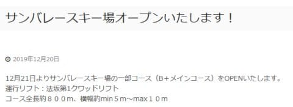
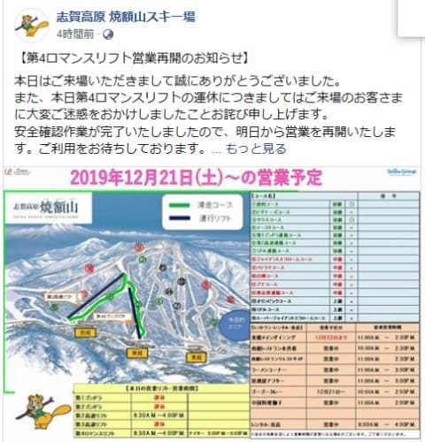

# 今週末もまた志賀高原！！…残念ながら，雪は積もらなさそうだけど，そこそこ冷えるかな．

📅 投稿日時: 2019-12-20 23:21:19

🏷️ カテゴリ: [日記](cc4b5682fb7b8b144980957a978653fb0.md)

えー．

本日の志賀高原．

予想通り，20日昼間に多少雪が

ぱらついたようなのですが．

　天気は曇り時々雪がぱらつき，

　午前中にはちょっとだけ積もるかも…

という予想をしたにもかかわらず．

全然積もらなかったようです（涙）

昨日，

もう少し風向きが北に回ると，

10cmくらいは積もってくれそうなんだけど．

逆にちょっとでも西に回ると，

0cmです．積もりません．

と書いたのですが．

その「わずかに西側」に風が回ってしまい．

志賀高原の積雪0cmパターンと

なってしまいました…（涙）

なぜ，悪いほうの予報が当たるのか…

このおかげで．

人工雪100％の横手山などは，まだ営業開始には

ほど遠い状況になってますが．

人工降雪機は動かせているので．

今週末に，サンバレーがオープン

するようです！！

（[志賀高原中央エリアHP](http://shigakogen.co.jp/archives/5223)より）

そして．

焼額も，本日運休だった第4ロマンス，また動き

はじめます！！

（[焼額山Facebook](https://ja-jp.facebook.com/yakebitaiyama/)より）

ただ．

一の瀬ファミリークワッド，高天ヶ原クワッド，寺子屋は，

今週末も動かなさそう…（涙）

そして．

21日土曜は

　朝にもしかしたら2-3cm積もってるかも？

と予想しましたが．

…これも，積雪量は限りなく0cmっぽいです（涙）

もう少し風向きが北に回ってくれれば…

憎い…

西風が，憎い…

で．

土曜は，1mmも積雪なしの曇り空．

日曜は…

午前中は曇り空ですが．

午後は予想通り雪がぱらつきそうです…

それも，かなり湿った雪です．

積雪量は，5～10cm．

残念ながら，ドサドサ積もる感じではないです．

うーむ．

もう12月も下旬というのに．

これでいいのか！？？？

とりあえず．

明日は志賀高原に行っています…

あと3時間半で出発という，

いつものパターンです（涙）

これからお風呂入って，2時間ほどしか

寝られないけど…

また，志賀高原でお会いしましょう！

## 💬 コメント一覧

### 💬 コメント by (まいる)
**タイトル**: Unknown
**投稿日**: 2019-12-21 17:58:49

ご無沙汰してます。まだスキー始動できてません。

昨日、通勤中にクレーン車にぶつけられてしまいました。

何故か見た目は小破。

ディーラーが、さすがアウトバック、丈夫だと言ってました。

保険屋にスキーに行けないじゃないかとクレームしたら、スタッドレス履いたレヴォーグを代車で用意すると

ということで、スキー始動は正月休みになりそうです。

### 💬 コメント by (Skier_S)
**タイトル**: ＞まいるさま
**投稿日**: 2019-12-21 23:58:20

あら！もらい事故ですか…

大変でしたね．

アウトバック，やっぱり丈夫なんですね（笑）．

レヴォーグは，2.0ですか…？

修理上がりまでに，ぜひレヴォーグで志賀におこしください．

いい車ですよ．

### 💬 コメント by (ゆーき)
**タイトル**: Unknown
**投稿日**: 2019-12-22 11:46:38

よく見させていただいてます、

そして私もいま志賀高原にいます。

朝、熊の湯からスタートし、

9時半くらいからクワッドがこみはじめて、

中央エリアに移動がてら、

銀嶺でらんちしてます。

多分午後は、焼額山って感じです。

早くつながって、車での移動をやめたい、、、

### 💬 コメント by (Skier_S)
**タイトル**: Unknown
**投稿日**: 2019-12-22 13:25:12

>ゆーきさま

私は今から焼額から高天が原へ移動します～！

