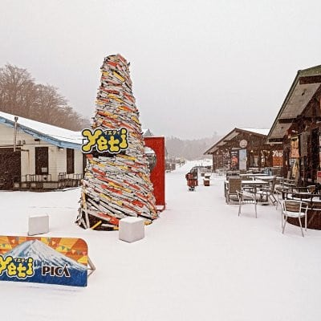
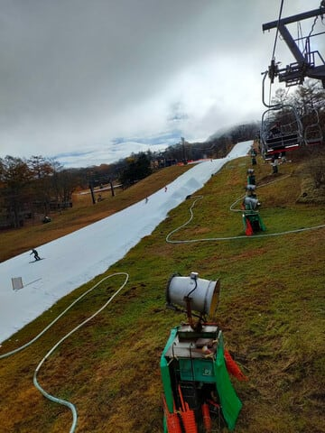

# 11月13日はイエティ雪が降り，焼額も人工降雪機が動いたみたいだけど，軽井沢特派員によると積雪無し．そして17日は恐怖の高温の雨

📅 投稿日時: 2023-11-15 02:29:13

🏷️ カテゴリ: [日記](cc4b5682fb7b8b144980957a978653fb0.md)

えー．

昨日の記事で，13日の月曜は志賀高原で

雪が積もったと書きましたが…

実は，イエティでも結構雪が積もって

いたみたいですね…！

イエティのFacebookに，13日月曜の

写真が出てましたが…

こんな感じです！！驚き！！

一方，こちらは14日の火曜のイエティの

状況．

ゲレンデが全面白くなってますが…

逆に，どこまで滑れてどこからが

コース外かわかりにくくなってる

トラップが…（笑）

（以上2点，[スノーパークイエティライブFacebook](https://www.facebook.com/YetiSnowtown/)より）

イエティへの道路，13日の午前中まで

チェーン規制がかかってたみたいですが，

今は道路の雪も解けて，ノーマルタイヤで

走れるようです…

で，この13日の雪と冷え込みで，我が

ホームゲレンデの焼額も，ついに人工降雪機を

動かしだしました！！

いやーー．

本格シーズンが近づいてきた感じ…！

（[焼額山スキー場Facebook](https://www.facebook.com/yakebitaiyama)より）

一方．

志賀やイエティでも雪が積もった13日．

軽井沢に行った特派員がいたようですが．

軽井沢は，雪が積もらなかったようですね…

でも，軽井沢のほうはイエティと違い，

11月6日から7日の土砂降りの影響はなく，

順調にコース幅が広がってるみたいですね！

…ただ，月曜の平日というのに，午前中の

リフトは結構混んでたみたいですが…

まともに開いてるゲレンデが軽井沢

しかないから，集中するのかな．

でも，午後には日も差し，リフトの列も

ほぼ解消したみたいで…

コース幅も広そうだし，よさそうな感じ…！

ただ，本日14日も，平日というのに

午前中のリフト待ちはすごかったみたい

ですが…

…ってな感じで．

13日に志賀やイエティでも雪が降り，

着々と本格シーズンが近づいてきて

いるように見えますが．

本日の最新の予報を見たところでは．

[おとといの記事](ead00a4eb40decad6c960dc0c9abca650.md)の冒頭に書いた

さらに17日は気温が上がって，雪

どころか気温が高い雨になりそうな

予報になってきてしまったので…

という予想がほぼ確実になってきました（泣）

17日の850hpa気温図を見ると，

もう，雪を溶かしまくりそうな高温を示す，

水色の+9℃線が志賀高原に近づいてるし…

この高温の状況の中，水色の降水域が

日本中を覆っていて，かなりの降水が

予想されるので…

せっかく作った人工降雪が思いっきり

融けてしまいそうな予感…（激涙）

うーーーーーーん．

せっかく雪が積もったのに，また高温の

雨で融けちゃうとは…

これは横手山も，18日までのオープンは

厳しそう…

17日の高温の雨の後がどうなるかは，

また明日詳細天気予想しますが．

過大な期待は持たないほうがよさそうな

感じ…（涙）

いかん…

うーん．「フットバスを吹っ飛ばす」って，

実は一部の人にウケて，寒いギャグじゃ

なかったので，地球は冷却されなかった

可能性が…←いや，面白いギャグでは決してないから

とりあえず，

猫が寝込んだ，

鹿が叱った，

豚がぶった，

カエルが帰る，

烏賊が怒った

サルが去る

クラスの，激寒の地球冷却ギャグを，

みんなで全力で唱え続けましょう…

## 💬 コメント一覧

### 💬 コメント by (1kamakura)
**タイトル**: Unknown
**投稿日**: 2023-11-15 07:58:42

餅は餅屋

すみません

これはダジャレじゃありませんね😅

### 💬 コメント by (Skier_S)
**タイトル**: ＞江戸の秋さま
**投稿日**: 2023-11-16 01:49:10

残念ながら，ダジャレではありませんね（笑）

ダジャレでなくてよいので，寒いギャグで地球を冷やしてやってください…

