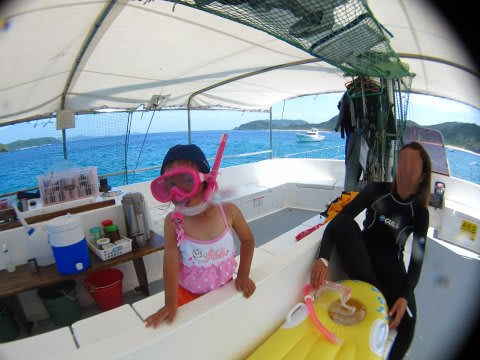
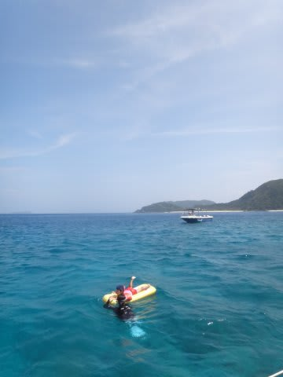
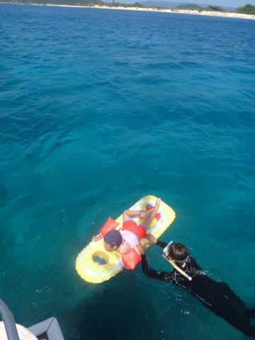
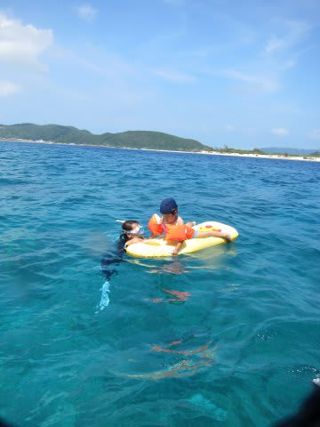
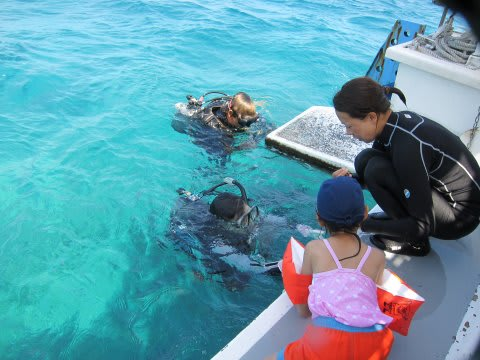

# 子連れで座間味に行ってみた　その3

📅 投稿日時: 2011-08-10 00:23:19

で．

ボートに乗って15分ほどで，最初のダイビングポイントに到着．

一応，ダイビング中に娘を見てくれるヘルパーの方が

いるので，二人揃ってダイビングに行ってもいいのだけど．

まず最初は娘の様子見，ということで．

今回は妻だけが潜り，私はお留守番．

＃出発前にひいた風邪がまだ治りきってない，というのもある…

妻が潜りに行くのを見送った後は…

娘をしばらく泳がせて．

その後，船に備えてあった，子供用のエアフロート．

この上に乗せて，船の周りをばしゃばしゃと押して回ってあげると…

…娘．自分で泳がなくても進むのに味を占めたのか．

これから後，「ボート（フロートのこと）にのる～っ！」

と言って．自分で泳がなくなってしまったという…

途中から，娘がヘルパーのおねーさんに慣れてもらうように，

おねーさんにバトンタッチ．

私は船の上で悠々と過ごします．

…うーん．

とりあえず，娘は妻も私もいなくても，遊んでくれるようだな…

しかし，お前はこんなきれいな海で遊べるなんて，ゼイタクよのぉ．

んで．

私の咳も止まったようだし…

次は潜れそうだな～

　　

1時間ほどで妻が浮上．

おかえりなさい～

で．

船は次のポイントへ移動します．

次の1本は，おねーさんに娘を預け，久しぶりに夫婦

そろって潜ろうかと思ったけど，まぁ初日ということで，

今度は妻が留守番で娘の面倒を見ることに．

…んで，私が潜りに行くわけですね．

さーて．

いつもどおり，スキーシーズンが終わってから1発目のダイビングは．

中9ヶ月のブランクダイバー．

潜り方をおもい出す，リハビリダイブになります．

機材セッティングを間違えないか？

タンクのバルブをあけ忘れて潜らないか？

フィンをはき忘れて潜っちゃわないか？

レギュレータと間違えて，シュノーケルくわえたまま

潜っちゃわないか？

タンクを背負い忘れて潜っちゃわないか？

グローブと間違えて，フィンを手につけて泳いだりしないか？

…などと，心配は尽きません

＃上のミスのうち，4番目まではやったことがある私（笑）

9ヶ月ぶりの海へ，いざ行かん！
