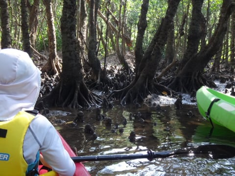

# 2015年10月　子連れで西表へダイビング旅行その19…カヤックツアー，スタート！

📅 投稿日時: 2016-09-21 02:18:33

ということで．

カヤック＆トレッキングツアー，スタートですが…

娘とタンデムのシットオントップカヤックに乗り．

河口から，いざ出発っ！

娘と2人でパドリングして，

だんだん川をさかのぼっていきます…

これまで，パラオでシーカヤックに乗ったり．

いろんなところでカヤックに乗っているわが娘．

パドリングも慣れたもの…

で．

川をさかのぼっていくと．

両側が，マングローブ林になってきましたね～．

先導するガイドさんが，時々止まっては

いろいろ説明してくれます．

なんでマングローブは海水でも大丈夫なのか，

とか，

マングローブの気根の話とか…

あ，よく見ると蟹さんがいます．

いろんな生き物の解説もあり．

じっくり解説を聞きながら，ゆるゆると

川をさかのぼっていきます．

…ってな感じで．

流れのほとんどない，

マングローブ林の中をさかのぼること，

約30分．

川はカヤックでこれ以上進めないほど浅くなったので…

ここでカヤックを置いて，

この先はトレッキングタイム．

浅くなった川沿いを…

こんな感じで，トコトコ歩いていきます．

さすが西表．

人手が全く入ってない川は，秘境感満載！

…って感じで．

ここでもところどころ，ガイドから生物やら

自然やらのレクチャーを楽しみながらの

トレッキングでしたが…

その途中．

娘「なに？これ」

ガイド「上に乗っても大丈夫．頑丈だから」

娘「ホント？」

…ってことで，

恐る恐る乗ってみた娘．

…これは，確かに頑丈．

娘「すごい！ブランコだ！」

この，自然のブランコをすごく気に入った

らしい娘．

しばらくここから，動こうとしなかったのでした…

でも．

確かに．

こんな景色を眺めながらの，自然のブランコって…

すごいゼイタクかも…．
