# そろそろ飽きてくるころだろうけど…11月23日のイエティ，詳細モード

📅 投稿日時: 2015-11-25 03:48:16

🏷️ カテゴリ: [2016スキー滑走日記](c70c67ed5248e9432b899dcd5747048bb.md)

悲しいニュース！

アサマ2000が，[今週末の営業をあきらめた](https://www.facebook.com/pages/%E3%82%A2%E3%82%B5%E3%83%9E2000%E3%83%91%E3%83%BC%E3%82%AF/544741572217955)ようです（涙）．

…早割りチケット買っちゃったんだけど，どうしよう…

嬉しいニュース！

雪です！

24日の夕方から，雪です！

志賀高原の道路状況カメラでも，

こんな感じです！

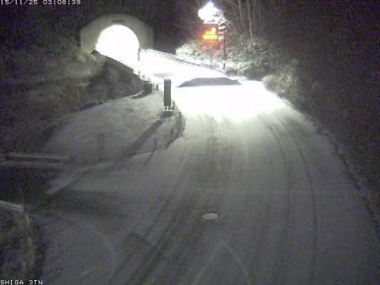

いやー．

明日は[この記事](ed8e6eb9c21a18fdacabec6e966fecaeb.md)で，

でも，25日は，このままなら，

人工雪を打てるレベルには冷え込んでくれるかな．

と書いたように，おそらく人工雪を打てることでしょう…

27日からの冷え込み＆降雪で，一気に状況が改善することを

祈るばかり…

ってことで．

本題の，Yetiの詳細レポートへ．

えー．

3連休の最終日．

意外と，夕方まで全く雨が降らず．

3連休と考えれば，雨の予報のせいか，

それほど混まずに済んだ一日でしたね～．

まず，朝は．

こんな感じの薄日が射す天気で始まり…

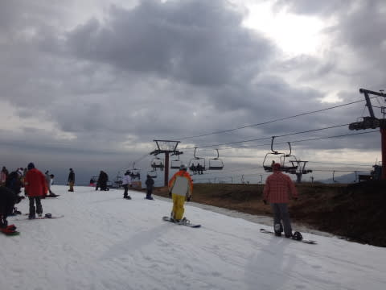

朝イチゲレンデはガラガラ！

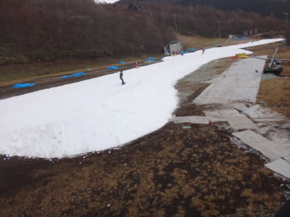

幅も，さらに広がったかな～．

雪の厚さも十分．

オープン1時間後の9時ごろでも

こんな感じで…

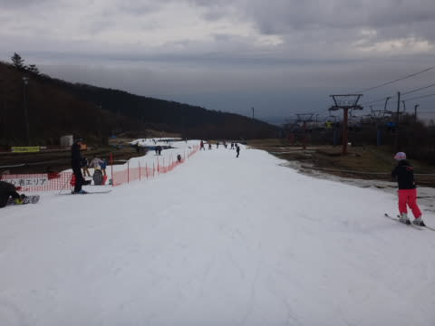

人は増えてきたものの，まだ結構快適に滑れるし．

リフト待ちもこの程度で，待ち時間は搬器3-4台分

くらい．

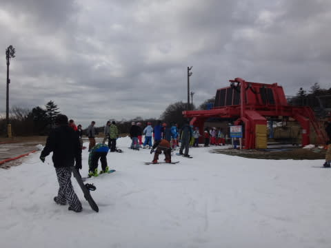

午前中は，日差しもなく，気温も低めで，

雪もそこそこ滑ったし，人も少なく．

結構気持ちいいかも！

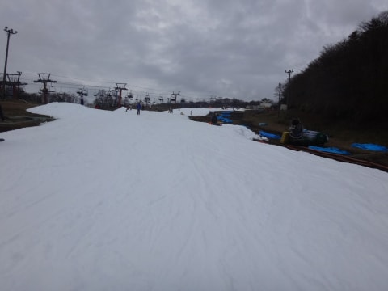

午前10時頃にはちょっとクワッドリフトが混んできたけど…

並行したペアリフトが動き出したので，

昼の12時ごろでも，リフト待ちはせいぜいこの程度．

1-2分待ちってところかな．

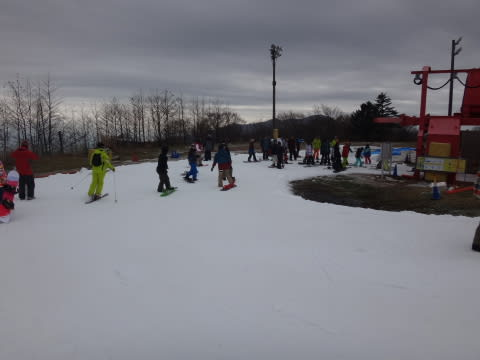

「あー，このままの待ち時間でいてほしい…」

と，思ったけど．

まぁ，ペアとクワッドの双方でゲレンデに人を送り込んでるので．

コース上は，昼にはこんな感じになってきました…

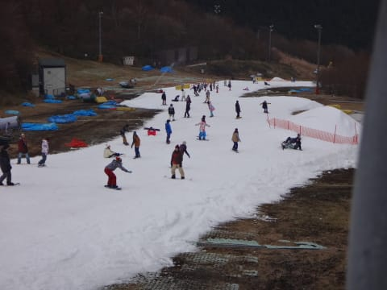

…あぁ！リフト待ちは短いのに…

ゲレンデの人口密度が…

人間ポールを縫って滑らないといけない感じに…（涙）．

ただ，ゲレンデの人口密度は異常に高いけど．

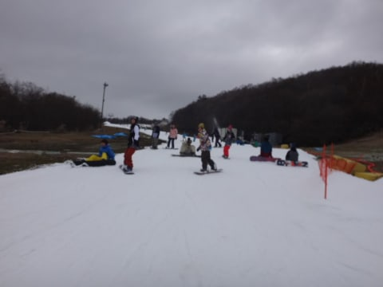

午後2時近くまで，リフト待ちはせいぜいこんな感じで．

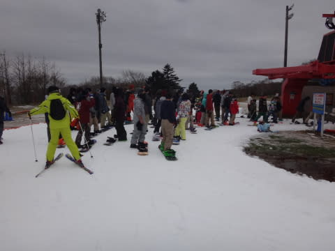

3連休というのに，リフトはそれほど待たなかったのが

救いかな～．

…でも．

午後3時を過ぎるとさらに混みだし．

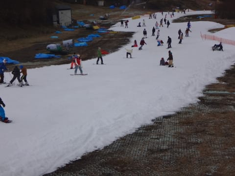

リフト待ちも，5分近くまで伸びました…

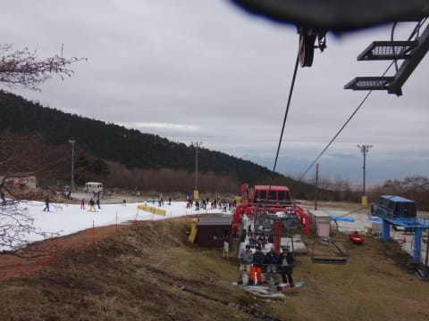

ちなみに，並行したペアリフトは待ち0です．

そこが救いかな．

＃板を脱いで歩く必要がありますが

ってことで．

意外なことに，午後4時の昼間営業終了まで，

雨が降らずにもってくれたこの日．

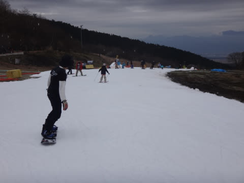

「空いてるけど，雨」

「雨は降らないけど，すごいリフト待ち」

のどちらかを覚悟してたけど，

天気ももち，リフト待ちも予想より短く．

日が射さず，気温も低め（といっても，5度前後か…）で

雪も緩みすぎることなく．

…まぁ許せるコンディションだったのかな．

…でも

今週末も，アサマ2000も丸沼もオープンしなかったら…

また，Yetiになるのかも（涙）．

うーむ．

熊の湯がオープンしたら，熊の湯まで行くかなぁ…

## 💬 コメント一覧

### 💬 コメント by (マルハバ)
**タイトル**: ＞…早割りチケット買っちゃったんだけど，どうしよう…
**投稿日**: 2015-11-25 10:31:06

3月末か4月アタマの

Alpen・ニューモデルスキー試乗会

はいかがですか？

### 💬 コメント by (Goku)
**タイトル**: 熊の湯
**投稿日**: 2015-11-25 18:25:37

熊の湯も途中下車の緩斜面のみのオープンでしょうから、Ｓさんの所から来るとなると何とも微妙ですね。

### 💬 コメント by (Skier_S)
**タイトル**: そろそろ雪が来そう！
**投稿日**: 2015-11-25 23:56:21

＞マルハバさま

うーむ．

4月頭は，一の瀬ダイヤモンドの試乗会に

参加するので…

4月にアサマ2000はいかない気がします…

うーむ．12月23日とか，そういう日帰りの日に

行くのかな～

＞Gokuさま

熊の湯も，下半分でしょうね～…

高速代払って片道5時間かけて

滑りに行く感じではないですね…（涙）．

