# これから週末までにスキー場に雪は積もるのか？そして，今週末の志賀高原の天気は？？

📅 投稿日時: 2019-11-28 02:23:40

ということで．

残念ながら気温が高く，27日（水）も

一日人工雪が打てなかったようですが．

…でも．

来ます．

前々から予告したように．

本日28日（木）から，冷えますよ～！！！

まず，28日の850hpa気温図を見ると．

ををを！！

赤い0℃線が太平洋まで下がっている

だけではなく．

志賀高原には水色の-6℃線が近づいて

ます…！

これは，真冬の並みの冷たい空気なので．

降れば確実に雪！

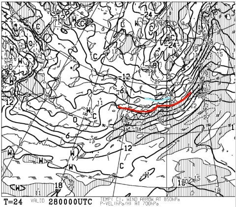

そして，28日（木）の地上天気図は…

降水域が志賀高原にかかっているので．

降ります．

積もります，天然雪が…

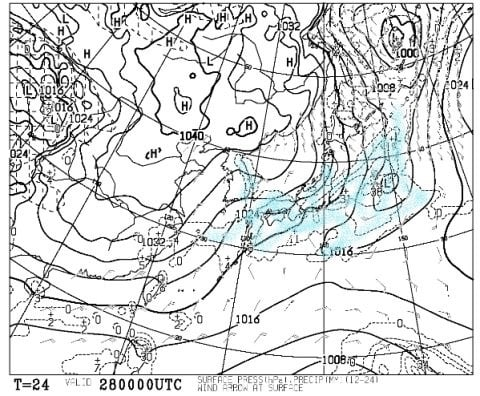

おそらく，28日は終日雪がぱらつき．

ドサドサと積もるほどではないとはいえ，

10～20cmの積雪が期待できそう！

で．

次は，29日の金曜ですが．

850hpa気温図を見ると…

素晴らしいっ！！！

なんと．水色の-6℃線が志賀より南…

というより，関東地方までかかってますよ？？

これ，関東の平野でも，降れば雪に

なる気温ですよ…っ！！！

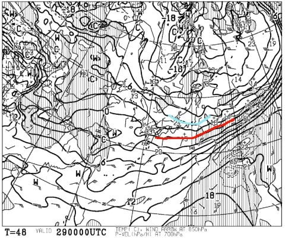

そして，地上天気図は…

うーむ．

惜しい．

水色に塗った降水域は，

わずかに新潟付近にかかっている程度…

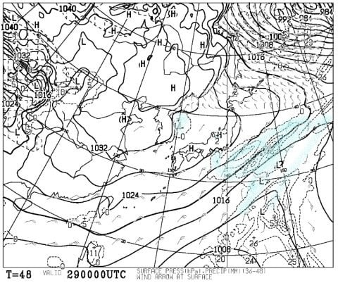

まぁ，この日は残念ながら積もるほどは

降らなさそうだけど．

志賀は終日小雪がぱらつき，

人工降雪機がフル稼働できますね．

この，28，29日の冷え込みと10cm程度の

天然雪で，何とか熊の湯再オープンできるか…？

そして．

肝心な週末．

30日土曜の850hpa気温図は…

この日も，水色の-6℃線が志賀に

かかる程度なので．

もし，30日に志賀がオープンすれば，

朝は-8℃以下に冷え込む，

今シーズン一番の冷え冷え週末に

なりそう！！

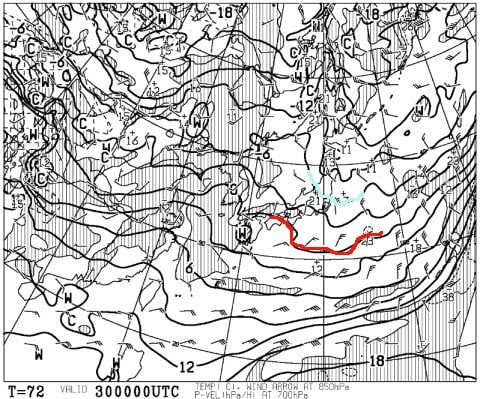

で，土曜30日の地上天気図は…

ふむ．

日本海側に水色の降水量がかかっているので．

志賀は，時折雪がちらつき，

うっすら雪が積もる程度の

天気でしょうか…

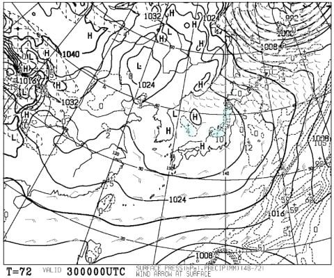

次に，12/1日曜日の850hpa気温を

見てみると．

ううううーーん．

残念なことに，この日は赤く塗った

0℃線は津軽海峡付近まで北上．

志賀高原は最高気温がプラスにまで上がり．

28日から30日まで続いた冷え冷えデーは，

12/1には終わっちゃいます…（涙）

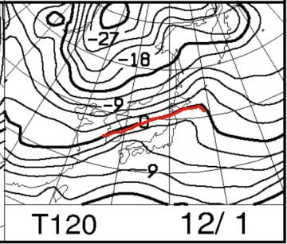

地上天気図を見ると．

網掛けの，降水量が予測されている

部分．

志賀高原にかかってないので，

この日の降水量はなさそう．

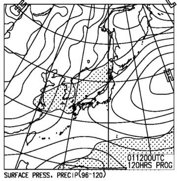

ってなことで．

まとめると

28日（木）

　この時期としては激冷え．雪も降り，この日は10～20cm積もる．

29日（金）

　この日も激冷え．天然雪は期待できないが，人工降雪機フルパワー！

30日（土）

　この日も朝は-8℃近くまで冷え込む．

　昼間も気温がそれほど上がらず，寒いよ！

　志賀は終日雪がぱらついたり曇ったり．

　雪は積もるほどじゃない．

　この日も冷えて，人工降雪機フル稼働．

　志賀への道はうっすら雪道になると思うので，

　ちゃんとスタッドレスを履いていきましょう！

1日（日）

　この日は気温が上がる．

　明け方まで人工降雪機が動かせるものの，

　昼間は志賀高原で+5℃近くまで上がりそう．

　天気は晴れ～曇り．

…ってな感じで．

28日からの3日間で，何とか人工降雪機フル稼働で，

雪は薄いながらも，運が良ければ30日土曜．

それに間に合わなくても，1日の日曜には，

いくつかのスキー場がかろうじてオープン

してくれるのではないかな…

で．そのの天気も見ておくと．

12月2日（月）の850hpa気温図は…

うーむ．

1日に続き，赤い0℃線は志賀高原より北．

…降れば雨ですね…

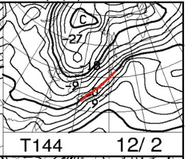

そして，地上天気図を見ると．

降水域の網掛けが志賀にかかってるので．

うーむ．

2日は，志賀も雨かも…（涙）

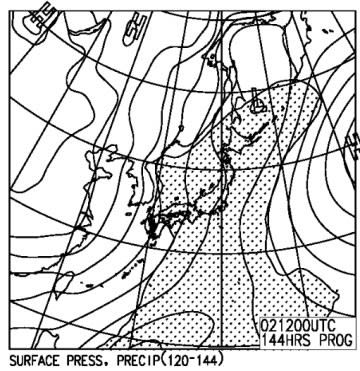

でも．3，4日の850hpa図を見ると…

うおおお！

また，赤く印した0℃線，太平洋側

まで下がってますよ！

冷えますよ！！

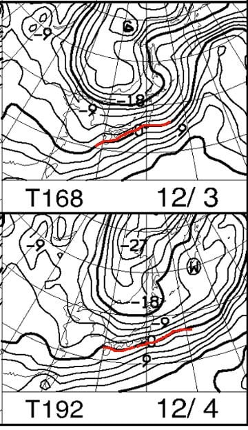

そして，3日の地上天気図を見ると…

日本海側に降水域が！！

…これは，3日は雪が積もりそう…！！

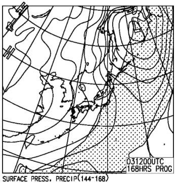

とりあえず．日，月と気温が上がっちゃって．

月曜2日は雨になりそうだけど…

でも，3，4日は冷えそうで．

3日は積雪もありそうなので．

7日の，志賀高原開き祭までには，

なんとかゲレンデが滑れるレベルに

なってくれることを期待…！
