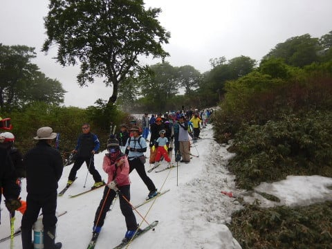

# 2019/6/9(日)の月山スキー場，詳細レポートその2…雪はそこそこ滑るし，大斜面もコブライン多数！昼からリフトは待ち0に

📅 投稿日時: 2019-06-13 02:00:07

ということで．

昨日は日帰り月山の睡眠不足が残っていて，

死にかけていたために．

中一日，スキー板試乗レポートを

挟んでしまいましたが…

本日は，日曜のご無体日帰り月山レポート，

後半です！

…ってことで．

大斜面がガスで見えなかったので．

あさイチからしばらくは，

沢コースを滑っていましたが…

いや．

沢コース．

昨日の雨のせいか．

曇り空で雪が溶けて無いせいか．

板がそこそこ滑るし．

結構気持ちいいよ…！！

と，快適に滑っていると．

数本滑った，9時前ごろ…

うぎゃーーー！

リフト，かなりの待ち時間になって

来ちゃいました…（涙）

うーむ．

営業開始からまだ1時間経ってないのに．

早くも混みだしてくるとは…っ！！

とはいえ．

天気が悪い予報だったからか．

この時期の月山でよくある，15分を超えるような

超絶待ち時間にはならず．

午前9時～10時までの1時間ほど，

最大でこんな感じの待ち時間．

ピークで5分少々待つ程度．

まぁ，並びますけど．

リフト待ち10分を超えなかったので．

この時期の月山としてはかなりマシな方

でしょうか…

で．

10時を過ぎると，リフト待ちが

短くなりはじめ…

なんと．

11時を過ぎると，リフト待ちが無くなりました！

素晴らしい！

もう，11時ごろからは，リフト待ちなしで

グルグルできます！

そして．

10時近くには，山頂に日が射すタイミングも！

すっきり晴れたわけではありませんが，

時折こんな感じで，ところどころ青空が

覗きます．

大斜面方向はまだ雲がかかってますが…

で．

上の3枚の写真．

1枚目の右端がリフト降り場付近．

そして，2枚目，3枚目と続いて．

3枚目の一番左端が大斜面ですが．

リフトを降りてから大斜面まで．

かなり長いトラバースをしないと

行けないのが良く分かりますね…

ってことで．

ガスが晴れてきたので．

大斜面を見に行ってみましょうか！

こうやって．

延々トラバース斜面を漕いで行きます…

振り返ると．

トラバースラインを，スキーヤーが

アリの行列のように一列に連なってますね(笑)．

そして．

長いトラバースを終えたら…

大斜面に到着！

さすが大斜面というだけあって．

この時期にかなり広い雪面が滑れる，

このすばらしさ…！

上部はコブラインが何本かありますが．

それほど深いコブではなかったですね…

中間から下は，ちょっとコブが深くなって

来て，全面コブになってます．

まだ6月はじめなので．

幅はまだ十分あるし．

雪質も，重くて適度にスピードが

抑えられるので．コブを練習するには

ちょうどいい感じかな！

ただ，6月上旬というのに，もうコース真ん中に

藪の島が出てきてますね…（涙）

そのため，一番狭い部分だと，こんな

感じの幅になっちゃってますが．

まだまだ上から下まで通しのコブラインが

何本も残ってるので．

雪が多い年に比べると見劣りするけど．

まぁ平均よりも雪は多めなのかな．

ってな感じで．

振り返ってみると．

左側の大斜面は，もう全面コブになってます．

右側の沢コースは，ここから見るとまだ

幅が広そうに見えますね．

で．

お次は沢コースの状況ですが．

スタート部分は，まだ藪も出てきておらず．

幅広く滑れる感じです．

コース途中もまだ雪はいっぱいあって．

まだこの程度の幅で滑れる感じ．

大斜面と違って終日コブになることはないので，

結構いい感じの中回りで滑って行けます！

ただ…

一番最後の部分．

もう結構藪が出てきているので．

沢コースの寿命はそれほど長くないか

もしれません…

今週末は大丈夫でしょうが．

22日の週末までもってくれるかな？

そして．

この日はリフトグルグルだったので，

Tバーは滑ってないのですが．

この写真を見ても分かるように．

リフト降り場からTバーまでは，結構登ります．

ゲレンデに出てから，Tバー乗り場を

見上げると．

うーん．

ちょっとあそこまで登るのは辛いなぁ…

でも．

今日はリフトがグルグルできるから．

Tバーはそれほど混んでませんでしたね…

ってな感じで．

結局この日は，終日曇り．

時々ガスったり日が射したり…

という，微妙な天気でしたが．

沢コースは最後までコブにならず，

気持ちよく中回りできたし．

大斜面もまだまだ行けるし．

リフトも混んだものの，危惧していたほどの

混雑じゃなかったし．

この時期に，これだけ滑れれば満足！！

やっぱり月山，最後の楽園ですね～！！

ということで．

まだまだ1か月は滑れそうな月山．

今シーズンは，あと1～2回は

滑りに行く予定です～！

私のシーズンは，まだまだ終わりませんよ～！！
