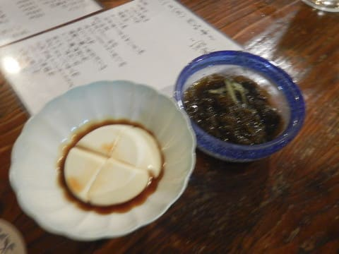

# 2019年8月，座間味で小6の娘と親子ダイビング！その1…出発！

📅 投稿日時: 2019-10-10 01:23:30

🏷️ カテゴリ: [ダイビング日記](ce3a7a8d424d112fce83ee85c81a0e344.md)

ということで．

8月上旬という，普通の人が休まない時期に

強引に夏休みを取った結果．

またもや出発前夜はほぼ徹夜状態

になってしまったという，

いつものパターンで迎えた出発日．

眠い目をこすり，朝7時の

高速バスに乗り．

乗った途端に深い眠りの世界に

旅立ちましたが．

ひどい渋滞もなかったようで，

順調に羽田空港へ到着．

さて．

さっさと飛行機に乗って，

次は機内で爆睡をかますか…

と，思ったら．

なんと．

飛行機が機材遅れで遅延！！（涙）

掲示では予定より35分遅れで，

11:20出発と表示されてますが．

…実際はさらに遅れ，ほぼ

1時間遅れでの出発となりました…

ちょっと余裕をもった飛行機にしていたので，

到着が1時間遅れても，今日乗船予定の

座間味行き高速船には間に合いますが．

那覇の空港でお昼ご飯を食べる時間は

なくなりましたね…（ちょっと泣）

まぁ，

台風で飛行機が飛ぶかどうかわからない

という状況に比べれば，

全然許せる．

1時間遅れぐらい全然許す…！

って感じで．

予定より遅れたものの．

飛行機は無事離陸しました…

そのあとは，再び夢の世界に引き込まれ．

意識を取り戻したのは，那覇空港

到着直前．

…前回の那覇到着は雨で．

熱帯低気圧に悩まされたけど．

今回は天気も良くて，

高速船も予定通り出航するとの

ことなので．

心穏やかに那覇に入れますね…

飛行機が遅れて時間が無くなったので，

ゼイタクにタクシーで泊港まで移動し，

乗りなれた座間味行きの

高速船に乗り込みます．

うーむ．

約1年ぶりなんだけど．

もう，乗りなれた高速船なので．

久しぶりという感じが無いなぁ…

台風もなく，

天気もいい中．

高速船は定時ぴったりの

午後4時に出航！

穏やかな海の上を，

かなりのスピードで飛ばします…

空港までのバスも，那覇までの

飛行機も，乗った後に熟睡

していたので．

旅行に来た感じがあまり湧いて

無かったですが．

離島に渡る船に乗っていると，

南の島に旅行に来た感が盛り上がり

ますね～！

ってなことで．

約1時間で，高速船は座間味港へ．

そして，1年ぶりの座間味島へ

上陸です！

上陸後は，もう通いなれた感がある

港からの道を歩いて…

やってきました．

今年もお世話になります，

ペンション星砂さん！

（ついこの間まで，昨年の座間味旅行記の連載を

　していたので，1年ぶりの再訪の感動が伝わりにくい…）

今回は，いつもの和室で．

部屋にトイレやシャワーはありませんが．

十分な広さがあって，掃除も

行き届いているので．

落ち着く感じの部屋です．

宿の中は，フリーのWifiもあって，

十分高速なインターネット環境が

使えます！

で．

到着後，荷物をばらして，

ダイビング器材を準備したら…

もう，夕食の時間．

今日は，宿の人の都合で夕食が

準備できない日ということで．

宿のそばの「三楽（さんた）」という

居酒屋に行ってみました．

外装は古い倉庫みたいですが．

中は木製のテーブルが置かれた，

広々としたお店で．

地物の料理があり．

なぜかあまり子供らしからぬ

味覚を持つわが娘．

ジーマーミ豆腐やモズク酢，

モズクの天ぷらに海ぶどうなどを，

目を輝かせてパクついてました…

ってなことで．

移動だけのこの日は，夜までゆっくり飲んで

一日が終わっていったのでした…
