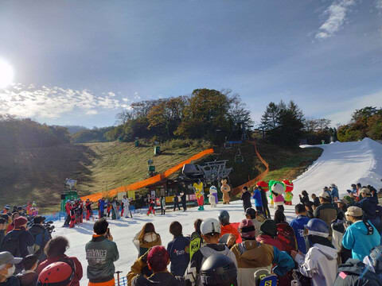

# 11月1日(金)，軽井沢スキー場2025シーズンオープン日の特派員情報！…そして，イエティは3連休初日も営業休止(涙)

📅 投稿日時: 2024-11-02 02:11:56

えー．

11月1日の本日…というか，日付が変わって

もう昨日になってますが．

軽井沢スキー場が，予定通りオープン

しましたよ～！！

特派員から写真が送られてきましたが．

朝のうちは晴れて，意外と混まなかった

みたいですね…

一方，イエティは．

ある程度は予想していたけど…

残念なことに，3連休初日の2日も営業を

諦めたようです…(涙)

まぁ，2日の土砂降りを考えたら，

さもありなん…

（[イエティFacebook](https://www.facebook.com/YetiSnowtown/posts/pfbid02xRPwrrgrK3bjwrDTMd1GZ9PwHTJnGrWwmdmU5roQoAwMYZWNEeqx5AV5gNRVRcAnl)より）

ライブカメラを見ると…

ほとんど昨日から雪が増えてないですね（泣）

この状況で雪を広げても，かなり薄いゲレンデに

なっちゃうし，その薄く広げた雪で雨が

降ったらひとたまりもないだろうから…

明日2日の営業休止はやむを得ないところ．

…でも，この時間のイエティは雨が降ってる

はずなんだけど…雨で雪が融けないよう，雪山を

ブルーシートで被うとかはやらないんだ…

（[WNIライブカメラ](http://webcam.wni.co.jp/KAC24326/loop.html)より）

3日(日)にイエティがオープンできるのかは

かなり厳しいと思ってますが．

うーん．やっぱり3日も営業中止で，ぎりぎり

オープンできて4日(月)でしょうねぇ…

うーん…

軽井沢は，明日の雨でも営業するようですね～！

明日からの雨を見越して，コースをそれほど

広げず，厚みをもたせたコース整備をしたとの

情報が流れてますが…

確かにコースの雪の厚みは十分な感じ…！

この雪の厚みなら，問題なく2日の雨も

乗り越えられるでしょう…

ってなことで．

軽井沢スキー場の2025シーズンオープンの

本日の特派員情報ですが．

朝のうちは晴れて，太陽のもとオープニング

セレモニーが行われたようです！

あさイチのコースは…

確かに例年よりコース幅が狭いのかな？

それだけ分，雪の厚みがありますね～！

とはいえ，今シーズンのオープン直後の

イエティよりコースは広いし．

輸送力がペアリフトで，コースの人口

密度は低いし…

割と余裕をもって滑れる感じのコース幅＆

人口密度に見えますね！

リフトも，平日ってこともあり軽井沢としては

それほど混んでおらず．

待ち時間は午前中はこんな感じで最大5分．

栗の木ペアもこんな感じで3分待ち程度と，

そこまで待ち時間が長くなかったようです…

ただ…

やっぱり栗の木コース側，かなり幅が狭い

ですね…

でも，イエティより人口密度が低いので

許せるのかな．

朝のうちは晴れていたものの，10時過ぎ

くらいから雲が増えだしたようですが…

11時を過ぎると，リフト待ちがほぼ無くなり，

2時ごろには飛び乗りになったようで…

午後はコース上の人口密度もかなり

低そうですね…！

午後になったら逆に混んでいくイエティとは

えらい違いだ…

さすがに夕方はちょっとゲレンデも荒れて，

コブの底に穴が開きかけたところもあった

ようですが．

土が出て雪が茶色くなるようなことはなく．

明日も問題なく営業できそうです～！！

…ちなみに．

営業終了後しばらくで，帰り準備をしている

頃に雨が降ってきた，という報告もあり．

明日軽井沢に行く人は，朝からかなりの雨

なので覚悟していってください…

3連休初日はかなり壊滅的な豪雨とは

いうものの．

2日目は，朝から雨がやみそうですよ～！

そして，3連休が終わった後…

予告通り冷えるのですが．

今の天気図だと，11月7，8日は

赤い0℃線が本州南まで下がります！

冷えます！

かなりの冷え込みです！

これ，イエティでも人工降雪打てる

かも？？

そして，志賀高原は7日前後は天然雪が

積もり，人工降雪機も本格的に動かせ

そうです！！！

でも，9日以降はまた気温が上がりますが（涙）

ってなことで．

明日はイエティが営業し，天気も悪いので．

3連休初日は，私は家でゆっくしてます…
