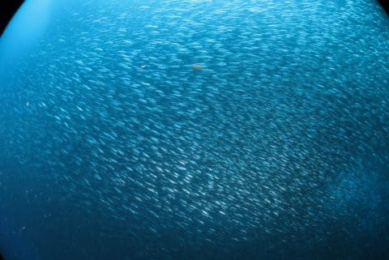

# そして，今シーズンも冬モード終了…

📅 投稿日時: 2017-07-15 02:31:18

🏷️ カテゴリ: [日記](cc4b5682fb7b8b144980957a978653fb0.md)

ということで．

スキーシーズンも終わり．

定番のシーズン総括もやっちゃったので．

スキーヤーブログのはずの，このブログも．

…そうです．夏モードにチェンジです

…このモードチェンジ．

早くも7回目にですね．

あぁ．

Blogを書き始めてから，そんなになるのか…

で．

このモードチェンジ．

いまさら説明は要らないかと思うのですが．

そうです．

スキーが終わると．

私のもうひとつの趣味のシーズンが始まります．

もうひとつの趣味…それは，潜ること．

あー．

毎年お約束のボケですが．

スキーできない夏の間，地面に潜るわけじゃないですよ．

地面に潜って夏眠するんじゃないですよ～！

ダイビングです．海に潜るやつです．タンク背負って．

ということで．

これからは，ダイビングの話題が復活しますが．

一応，このBlogは

「徒然スキーヤー日記」ですから．

時々スキーネタも織り交ぜていきますので．

スキーヤーの皆さんも，引き続き読んでやってください…

　

　

　

　

## 💬 コメント一覧

### 💬 コメント by (ちょく)
**タイトル**: 魚群
**投稿日**: 2017-07-15 04:15:29

どこの海ですか？魚群にウミガメ、熱帯魚。綺麗ですね。

いやらしい話ですが、ダイビングってどのくらいの予算が必要ですか？

### 💬 コメント by (Skier_S)
**タイトル**: ちょくさま
**投稿日**: 2017-07-15 23:17:59

コメントありがとうございます～！！

この海は，ウミガメと白い海底は慶良間諸島の座間味近辺，

それ以外は陸上含めフィリピンのモアルボアルです．

まだ，去年のレポートはできてませんが，

おととしも座間味＆モアルボアルに行っているので，

そのレポートをご覧ください～．

ダイビング費用は…

一日2ダイブで1万2千円～1万3千円，

3ダイブする場合は1本追加で4000円～5000円かかる

くらいでしょうか…

国内だとそのくらいですが，フィリピンだと半額

くらいで潜れちゃいます．

結構お金がかかります…（涙）

