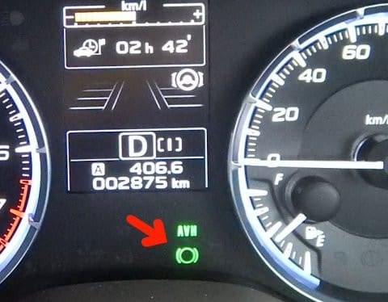
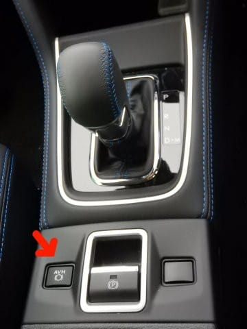
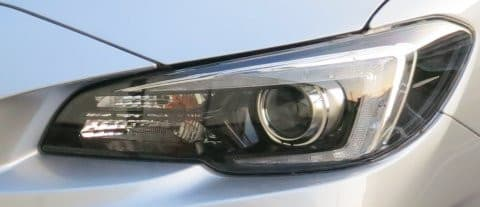
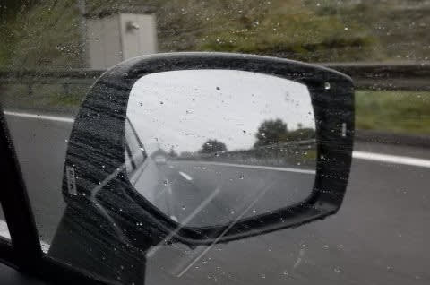
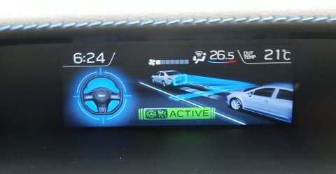
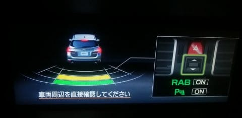
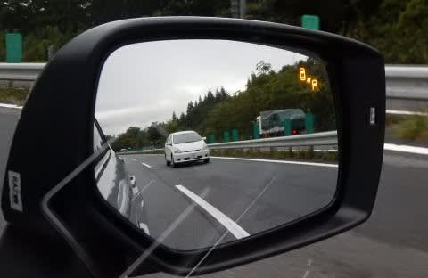
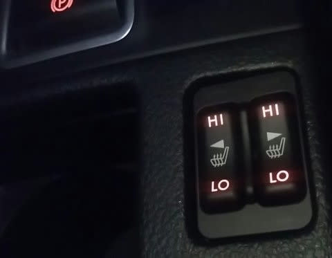

# LEVORGに乗ってみて…使って便利な機能たち！

📅 投稿日時: 2018-10-05 01:21:26

ということで．

[悲しいパンク事件](e73a891fe8e9b77985f42fe6a849e125f.md)なんかがあったものの．

納車からはや2か月半経ちましたね～．

ってなわけで．

[数日前，レヴォーグの走りについてレポート](edb19f9f7e7dcee16edf835bdb90178a1.md)しましたけど．

今回は，いろんな細かい機能について，

レポートしてみます…

この車．

レガシィのころからある，フロントワイパーデアイサ―や

ドアミラーヒーターなど．

なかなか他の車にはついてない，スキーで

役立つ便利な機能はそのまま継続されてて．

やっぱりスバル車は，スキーヤーのこと

考えてるなぁ…

って思いますが．

そのほかに，今回のLEVORGでは．新しい機能として

便利なものが結構増えましたね～．

その代表的なものとしては．

D型以降に新規追加された，AVHですか…．

これは，ご存知と思いますが．

信号待ちなんかで一旦停止した後，

ブレーキを踏み続けなくても停止保持

してくれるという，最近はやりの機能．

（これがAVH作動を示すインジケーター）

信号待ちや踏切待ちなどの長めの停止時間．

ブレーキを踏み続けることから解放されると，

こんなに楽と思ってなかった…

坂道で止まってる時なんかもブレーキを

踏まなくても止まっていてくれて．

アクセルを軽く踏むと普通に発進できるので．

坂道発進なんかで後ろに下がる心配無しに

動き始められるというメリットも…

ただ．

この車．

エンジンを止めるたびに，AVHオフの状態に

戻ってしまうのはなぜ…（涙）

毎回エンジンをかけるたびにAVHボタンを押して，

この機能をONにしなくてはならないのが，

ちょっと残念…

（こいつがAVHボタン）

そして．

次に，「こいつはすごいや！」と思ったのは，

ステアリングに連動して，ヘッドライトの光軸が

左右に動くという，ステアリング連動ヘッドライト．

使うまで，そんなに意味があるのかな？

と思ってましたが…

使ってみると，これは便利！

山道で，行きたい方向にライトが首を

振ってくれると，ここまで見やすいとは！

LEDヘッドライト，元からかなり明るいと

いうのもありますが．

コーナーの先の見通しが，かなり良くなります．

想像以上に有効です…！

志賀高原の登り下りとかで重宝しそう．

さらに．

フロントドアのガラス＆ドアミラーが撥水加工されて

いるんですが．

購入前は「そんなに意味がないのでは…？」

と思っていた，この撥水加工．

想定以上にいいよ…！

雨が降ってもドアミラーが見やすい！

これ，結構な雨が降っているんですが．

ドアガラスの雨水が吹き飛んでいて，

ドアミラーも水滴がつきにくく．

雨が降っていない時と同じように見えるのが

分かるかと…

…どうせなら，ドアガラスだけじゃなく．

フロントガラスも撥水加工してくれれば

いいのに…

で．

次はアイサイトですね．

ツーリングアシストで0kmからステアリングアシストが

効くようになったのも，すごい進歩ですが．

そのほかに．自動ブレーキが前進のときだけじゃなく，

D型以降は，バック時でも自動ブレーキが利く

ようになりました…

それに伴い，リアの超音波センサーが

標準装備になったので．

マルチファンクションディスプレイに，

バック時の障害物接近の警告が出たり…

バック時のサポートが手厚くなったのも，

かなり便利！

そして．

アイサイトセーフティープラス（運転支援）．

・後側方警戒支援

　－ななめ後ろに車が近づいてると警告．

　－駐車場からバックで出る時に，横から

　　近づいてくる車があると警告

・自動防眩ミラー

・ハイビーム自動切り替え

がセットになっているメーカーオプションですが．

うちの車には，こいつをつけていて．

後側方警戒支援は．

こんな感じで斜め後ろに車が近づいていると，

ドアミラーにオレンジの警告が点灯するという，

これも最近の車では流行の機能．

うーむ．

でもこれ，さすが流行るだけのことはある…

安全のために，これはあった方が

いい機能だな！

で．

もう一つのハイビーム自動切り替えですが．

こいつは，機能をONにすると，

　・40km以上

　・対向車＆先行車のライトが検出できない

　・周囲が明るくない

というすべての条件に合致するとハイビームになり．

その条件から外れると，自動でロービームになる…

という機能．

ハイビームにして戻し忘れが無くなるので．

まぁ，結構便利かな…

ただ．

自動モードだと40km以下でハイビームにならないので．

低速で走っている時にハイビームにしたい場合には，

手動に切り替える必要があるのがちょっと

惜しいところかな．

で．

アイサイトセーフティープラスの視界拡張，

・モニタ式リヤビューミラー

・フロント左右カメラ

・フロント左下カメラ

のオプションは，約7万円プラスと高かったので．

今回は装着を見送りました．

あったら便利そうだなぁ，とは

思ったんですが…（ちょっと涙）

あとは．

D型から，標準でフロントシートヒーターが

着くようになりましたが．

…こいつは，まだ暑い日々が続くので．

未だに使ってません（笑）．

でも…LEVORGはリヤシートが寒そうなので．

リアの方にシートヒーターをつけて

ほしかったかな．

ってな感じで．

いろいろな機能がてんこ盛りになった，

今回のLEVORG．

そもそも，これまで安いグレードの車に

ばかり乗っていて．

電動シート車すら初めてだった私にとっては．

「最近の車は，便利になったのぉ…」

と．

時代に取り残された老人のようなセリフを

言わずにいられない，Skier_Sだったのでした…

## 💬 コメント一覧

### 💬 コメント by (michi)
**タイトル**: Unknown
**投稿日**: 2018-10-05 08:28:53

同じ車なのにこんなに装備が違って悔しいです(>_<)

ちなみに私が一番に感じている機能は後側方警戒支援機能ですね。後は左ミラーに着いているカメラで左前方を見れるのでこの2機能は素晴らしいと感じます。

シートヒーターは付けなかったので羨ましいです。

### 💬 コメント by (Goku)
**タイトル**: Unknown
**投稿日**: 2018-10-05 20:56:47

フォレスターのプレミアムにもほぼ同じ装備が標準で付いていますけど、AVHについては同意見です。

いちいち面倒ですよね。

スバル車は初めてですが、あれだけの装備が標準で付いていてあの価格は、正直バーゲンプライスだと思います。

明日は初めての長距離ドライブなので、アイサイトが大活躍してくれることでしょう！

### 💬 コメント by (チョ)
**タイトル**: Unknown
**投稿日**: 2018-10-06 08:10:55

フロントガラス撥水は別途オプションで無いですか？

ハイビームアシストは反応が鈍いことがあるので頼り過ぎに注意ですね

ホ○ダのレジェン○だったかは前走車がいてもハイビームのままのお粗末な仕上がりでした。

### 💬 コメント by (Skier_S)
**タイトル**: 便利になりました…
**投稿日**: 2018-10-06 08:45:34

＞michiさま

D型以降で，便利機能が結構追加されました…

多少値上げされましたが（涙）．

左ミラーについてるカメラ，欲しかったですけど

7万円のオプションだったので諦めました…

やっぱり素晴らしい機能だったんですね…

＞Gokuさま

フォレスターも装備充実ですよね…

プレミアムは全部入りですよね（笑）

私だったらツーリングを選んじゃいます．

でも，CR-Vやヴェゼルの値段を考えると

まさにバーゲンプライスだと思います．

長距離ドライブ，楽しんできてください～！

＞チョさま

コメントありがとうございます～

確かにフロントガラス撥水加工は，ディーラーでの

施工が可能なようですが…

持続期間が1年で，かつお値段もちょっとお高いので，

やめておきました…

で，マニュアルでは利用禁止と明記されている

市販ガラス撥水材を使ってます（汗）．

LEVORGのハイビームアシストは，戻し忘れの保険

くらいにしか使えないだろうなぁ…と思っていたら，

かなりの精度で結構満足しています．

でも，確かに完全に頼り切るところまではいけない

所もありますが…

### 💬 コメント by (Goku)
**タイトル**: Unknown
**投稿日**: 2018-10-06 10:12:02

ツーリングに欲しいオプション付けたら、プレミアムと５万しか違わなかったので、プレミアムにしちゃいました。

### 💬 コメント by (Skier_S)
**タイトル**: Gokuさま
**投稿日**: 2018-10-07 02:20:04

確かに，ツーリングにオプションつけたら

結構いいお値段になりますよね…

フォレスターの長距離ドライブはいかがでしたか？

燃費は良かったようですが(笑)

