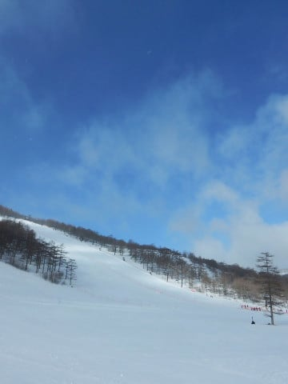
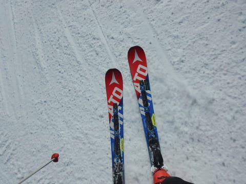
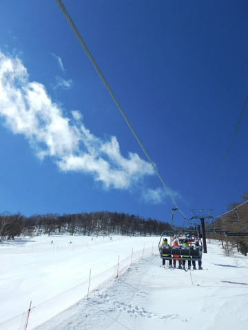
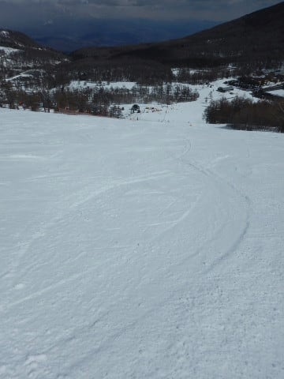
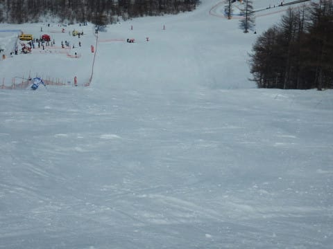
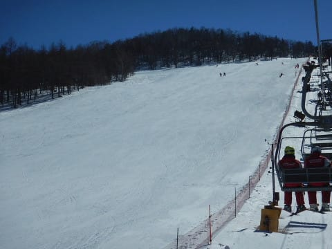
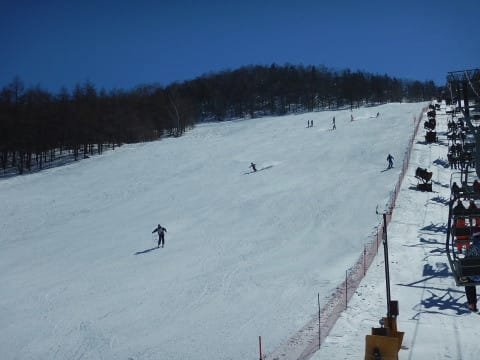
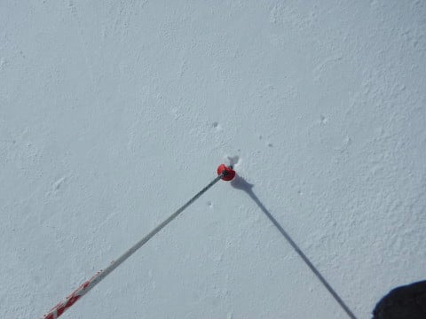
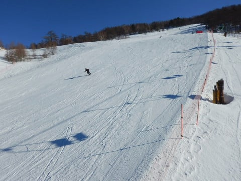
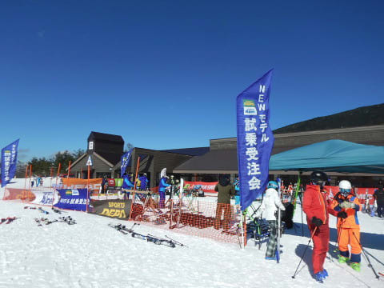

# 2019/3/24(日)はアサマ2000！速報モード…朝から晴天で，エッジの効くいい感じの締まったバーン！午後はちょっと硬くなったけど…

📅 投稿日時: 2019-03-25 01:36:43

えー．

本日．

Skier_Sはいつも通り志賀高原を

滑っているとお思いでしょうが．

今日は，アサマ2000で滑ってきました～！

で．

本日は関越の上りがかなりの

渋滞だったので．

帰宅もかなり遅くなっちゃいました（涙）

だもんで，いつもの日曜深夜恒例，

速報モードにて…

えー．まず．

朝8時ごろにアサマ2000に到着

しましたが．

朝から青空が広がり…

志賀高原や野沢なんかは，

朝は雪が降り，10cm以上

積もったようですが．

ここ，アサマは朝からすっきり晴れ！

雪が積もってないので，アイスバーンを

覚悟しましたが．

これは…

アイスバーンではなく，いい感じで

硬めにパックされた，エッジが効く

超快感バーンじゃないですかっ！！

いや…

この雪質，楽しいんですけどっ！？？

志賀高原の冷え冷え新雪も捨てがたいけど．

しっかりパックされた，エッジが食い込む

ハイスピードバーンも，この上なく

いい感じ！！！

気温はマイナス10℃近くと

冷え込んでいるので．

天気はこんなすっきり晴れなのに．

いい雪質をキープして…

昼過ぎでも．

3月下旬とは思えぬ，

いい感じの冷え冷えバーンを

キープ！

ただ，ステージ2のコースの半分が，

本日開催のアサマ技術選でクローズ

されていて．

一般開放されている，コース半分に

人が集中するので．

午後になると，ちょっと

コースが荒れてきちゃいました（涙）

と，思っていたら．

午後2時過ぎに大会が終了し．

大会コートがオープン！

朝からクローズされていたコースは，

いい感じでパックされた，あさイチの

雪の状態のまま！

午後になって，完全フラットの

ピカピカバーンが滑れる，

この素晴らしいボーナス！！

うひょひょひょ！！！

最高っ！！！

最高だよっ！！！

…ただ．

午後3時を過ぎてくると．

コース全体が磨かれて，

ところどころ固いところが

出てきましたが…

でも，夕方のリフト終了まで．

ピカピカ晴天の中，冷え冷えの

いいい雪を滑り続けることが

できて．

アサマ2000に来ても，

しっかり4:30のリフト終了まで

滑り続けたのでした…

…いやーーー．

良かった．

雪が降らないからガチガチ

アイスバーンを覚悟していた

アサマ2000だけど．

今日は結構良かった…

ってことで．

本日，志賀高原ではなく．

アサマ2000で滑っていた理由は…

皆さん，大体予想がついていたかと

思いますが．

そうです．その通りです．

ってことなので．

また，試乗レポートをお楽しみに！

## 💬 コメント一覧

### 💬 コメント by (Atom)
**タイトル**: Unknown
**投稿日**: 2019-03-25 05:38:04

30.31日には横手山でタナベスポーツの試乗会があります。

### 💬 コメント by (ほっぽ)
**タイトル**: Unknown
**投稿日**: 2019-03-25 12:28:43

Sさん

早朝からの移動、お疲れ様でした。

私は今日、アサマで試乗会に参加してます。

今日もいい天気、平日なのに事前エントリー満員御礼に

ビックリしましたが、硬いバーンの試乗会、いいですね。

### 💬 コメント by (NorthFox)
**タイトル**: Unknown
**投稿日**: 2019-03-25 17:29:49

昨日の帰り際に声をかけさせて頂いた者です。

銀のお札、ありがとうございました。何処に貼ろうか楽しく考え中です。

昨日の試乗会は残念ながら横目で見るだけでしたが、一の瀬の試乗会はエントリー出来ましたので楽しみです。

志賀高原でまたお会い出来る事を楽しみにしています。

また、物欲選手権の方も楽しみにしています。

では！

### 💬 コメント by (yasu)
**タイトル**: Unknown
**投稿日**: 2019-03-25 19:44:06

S様、ご無沙汰しております。20000m達成女(ナイター込みですが)のyasuです。そして、なるなる様昨日はお声かけ頂き、ありがとうございました。日曜日はS様不在のヤケビ1ゴンをグルグル、今日は一の瀬クワッドをグルグルし、今帰宅中です。

今シーズンは、長野県共通シーズン券が当たったこともあり、日曜午後にヤケビにいることも多かったのですが、S様とはお会いできず残念です。それにしても、何のアピールもしていないのに(20000mクラブの話題になった覚えもないのに)、なぜ宿でなるなる様にバレたのか今でも謎ですが、S様、なるなる様、そして20000mクラブの皆様今後ともどうぞよろしくお願いします。

### 💬 コメント by (なるなる)
**タイトル**: Unknown
**投稿日**: 2019-03-25 22:29:19

今日の志賀高原…

良かったです。超良かったです!!

天気も良いし、昨日降った雪が圧雪されて、何でも出来てしまう雪質でした。

もぅ、同じ斜面なのに一昨日のカリカリツルツルは何だったんだろうかと。

>yasu様

昨日はありがとうございました。

S様Blogでの高天ヶ原に凄い人が居るとの情報と、あの宿での常連感。

何より、やはり20,000m達成された方は、なんとも言えないオーラがあるようなw

### 💬 コメント by (大阪のS)
**タイトル**: Unknown
**投稿日**: 2019-03-26 02:15:29

アサマも良いコンディションで良かったですね。やはりザブザブの雪を滑るのと、ハイシーズンさながらの雪を滑るのとでは、板の印象も違うでしょうね。私は購入予定はありませんが、また試乗会レポートも楽しみにしています。

私は白馬さのさかで滑りましたが、白馬村は国道沿いも真っ白で、ゲレンデも固い下地の上にサラサラの新雪が15cmほど積もっていました！まさか３月下旬に新雪が滑れるとは思いもしませんでした。加えてこの日が最終営業日のさのさか、閉店イベントもやっているので賑やかかと思いきや、白馬村のスキー大会をやっているエリア以外は全くの閑古鳥。あんな快楽ゲレンデを数人で何時間も貸切状態。午後は強い日差しにバーンも多少緩みましたがかえって滑りやすく、ただひたすら、誰もいないゲレンデを繰り返し繰り返し、心ゆくまで味わい尽くしました。

志賀高原のシーズンはまだあと１月以上ありますね。どうにか、仕事の都合をつけれたらもう一度焼額に行きたいなと思います。S様やGoku様に「今度一緒に滑りましょう」と言っていただいたのはホントに嬉しい限りです。是非とも実現したいと思いますので、また行ける時にはカキコミします(^^)

### 💬 コメント by (Skier_S)
**タイトル**: 今週末も冷えそう！
**投稿日**: 2019-03-26 07:56:13

＞Atomさま

うーむ．

今週末も試乗会行けるのなら行きたいのですが…

子連れなので，横手まで遠征は厳しいです（涙）

小学生無料の焼額で娘と滑ってます…（残念）

＞ほっぽさま

あ，月曜にアサマだったんですね！

月曜も満員で募集打ち切ったとの通知があったので，

びっくりしました…

お望みの板には乗れましたか？

＞NorthFoxさま

日曜はお会いできて良かったです～！

ちょくちょく志賀高原にお越しのようですので，

また志賀高原でお会いできればいいですね～．

そして，一緒に物欲選手権に負けましょう(笑)

では，試乗会の日に志賀高原でお会いしましょう！

＞yasuさま

をを！！

召喚呪文に反応いただきありがとうございます！

長らくお会いしていませんでしたが…

お元気そうで何よりです．

で，焼額も滑ってらっしゃるんですか？？

全然お会いできてませんが…

ぜひともまたお会いしたいです！！

…でも，お互いウェアが変わっていて発見できない

可能性大ですが(笑)．

板は変わってないので，板を目印に見つけてください…

今週土日も焼額滑ってますので，ぜひ焼額にお越しください～！

＞なるなるさま

20000m達成者には，オーラがありますか(笑)．

20000mの話題が出たわけでも無いのに見抜くとは，

すごい眼力ですね(笑)．

月曜まで滑ってらっしゃったんですか？？

日曜の雪が圧雪されて，いい感じになったんじゃ

無いでしょうか…

うらやましいです…

＞大阪のSさま

今回は最高のコンディションで試乗できました．

ただ，雪がしっかりしすぎていたので，

逆に柔らかい雪だとどうなるか分からず，

張りの強い板がいい印象になりがちなので，

試乗という意味ではちょっと難しいコンディション

でしたが(笑)．

さのさかも良かったんですね．

この週末は，ホントにいい感じでしたね～！

志賀高原はまだGWまで続きますよ～！

あさイチの焼額スタートなら，朝礼メンバーと一緒に滑れますから，

ぜひまた焼額にお越しください～！

