# プロジェクトX2第2章…LEVORG E型にKENWOODナビ取り付け…車両コネクタとナビを接続するハーネスの準備

📅 投稿日時: 2018-08-17 04:25:44

🏷️ カテゴリ: [車](cba0e8330b3f2ded7c1addfacc75d4547.md)

ということで．

LEVORGも納車1か月，走行2000kmを超えたけど．

まだまだ終わらない，ナビ取り付け詳細記事．←詳細すぎるから終わらないんだよ…

本日も，Blog記事としては桁外れのスケールである，

構想1時間．記事作成3時間の超大作を

お送りします…っ！←そろそろここまで手間暇かけるのに疲れてきた…

----

ってなわけで．

これからは本体の取り付けに移りますが…

本体を取り付ける前に．

車両側コネクタとナビを接続するケーブル類．

こいつを準備しないといけません．

用意するのは．

まず，ナビ本体に付属のこのケーブル．

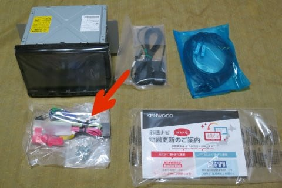

このケーブルは．

車両からの各種電源線（電源供給用バッテリー線＆アクセサリー電源＆イルミ線），

オーディオ関係接続線（フロント＆リア左右スピーカ線，ラジオアンテナブースター電源線）

車両情報線（車速パルス＆パーキング線＆リバース線）

等を，カーナビ本体のコネクタに繋ぎこむためのモノ．

そして，もう一つは．

スバル社用カーナビ取り付けキットの

これら3本のケーブルセット．

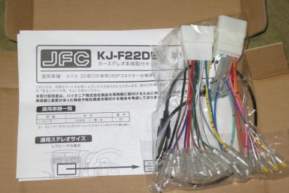

ひとつが，スバル車のオーディオ用20ピンコネクタ

（各種電源線＆オーディオ線＆ステアリングリモコン線）

から，各種信号線をバラすもの．

もう一つが，スバル車の車両情報用の

サービスコネクタ（15ピンコネクタ…

車速パルス＆パーキング線＆リバース線）

から，各種信号線をバラすもの．

さらに，この取り付けキットには．

分かりにくいのですが，赤く囲ったコネクタからつながる，

水色の線で示した，車両側のラジオアンテナコネクタと

ナビを接続するためのケーブルも入ってます．

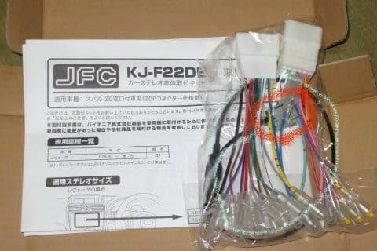

これは，取り出すとこんな感じのケーブルです．

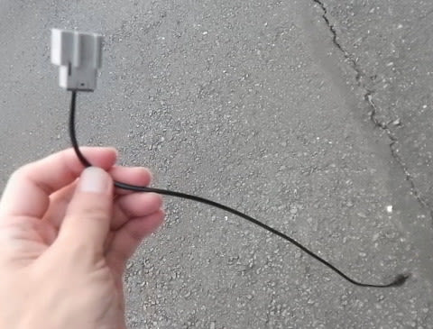

…そして最後が．

ナビ連動型DENSO製ETCの信号線とステアリングリモコン線を

ナビに繋ぎこむ，ETC連動用ケーブルですね…

KENWOODのナビ．

なぜか，ETC連動線とステアリングリモコンが

同じコネクタに収容されます…

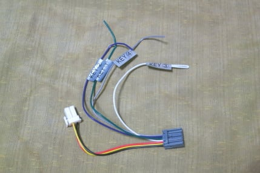

このケーブル，[以前書いたように](e5b4a0008da86b739c8c1524992b71c81.md)，KENWOOD純正の

オプションケーブル（KNA-300EX，1500円ほど）が

売っているのですが．

これとコンパチ品が1000円以下で売っていたので，

コンパチ品をGetしています…

ってな感じで．

なんだかいっぱいケーブルがあって分かりにくいので．

簡単な図面を描いたのが，こちらです．←なんて親切なんだろう…！（自画自賛）

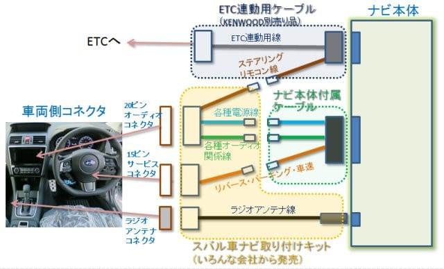

ナビ取り付けキットには，3種類の車両コネクタ

・20ピンオーディオコネクタ…ナビスペースにあり

・15ピンサービスコネクタ…運転席足元にあり

・ラジオアンテナコネクタ…センターコンソール助手席側足元にあり

に接続するための，3本のケーブルがあります．

それを，ナビ側につながる，

・ナビ付属ケーブル

・ETC連動ケーブル

に適切に振り分けてつないで

行かないといけないわけで．

そのうち，ナビスペースでつなぐことになる，

この図で示したケーブル類．

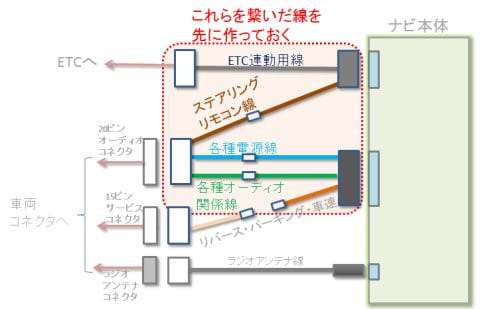

これらを先につないだものを作っておきましょう…

というのが，今回の作業です．

まぁ，作業自体はそれほど難しくなく．

こんな感じで，それぞれのケーブルについている

ギボシ端子を，対応するケーブルどうしでつないでいく

だけです…

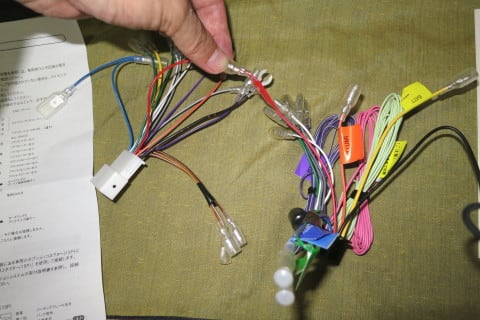

20ピンコネクタからの線と，

ナビ付属ケーブルをつなぎ終えたのが，この状態．

（上に何もつながらず転がっているのは，15ピンコネクタに接続する線）

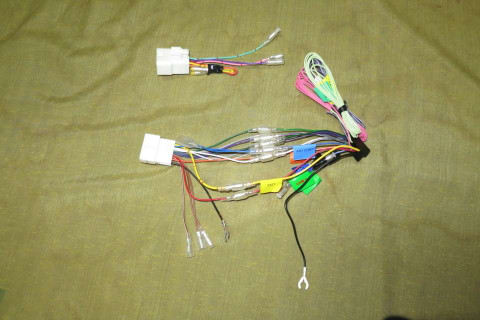

繋ぐ線は12本．

BATT，ACC（アクセサリー電源），ILLUMI（イルミ），ANT-CONT（アンテナ電源），

フロント左スピーカー＋/-，フロント右スピーカー＋/-，

リア左スピーカー＋/-，リア右スピーカー＋/-，

です．

20ピンコネクタ側の線は…この段階では，

・ステアリングリモコンに行く茶色の線3本

・後で車両にねじ止めする黒いアース線

・アンテナ電源端子が2種類あるうち，ギボシ端子じゃない

　平端子側（こいつは今後も利用しない．平端子が無くて

　ギボシ端子のみの取り付けキットがほとんどだと思うけど…

　今回のキットには平端子が着いていた．下写真参照）

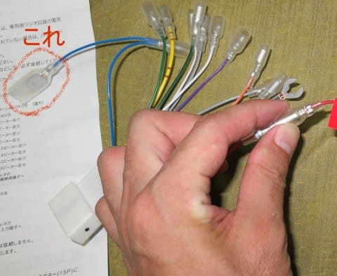

が未接続になります．

ナビ付属ケーブルは…未接続なのは．

・15ピンコネクタにつなぐ3本（パーキング，リバース，車速パルス）…後で接続

・車両にねじ止めするアース線…後で接続

・オプションのフロントカメラにつなぐ2本（CAM+，CAM-）…未使用

・パワーコントロール…未使用

の計7本が未接続になります．

「アンテナ電源」は，ナビからの「ANT-CONT」に

つなげばOKです．

ちなみに，15ピンコネクタはナビスペースから

離れた場所にあるので．

15ピンコネクタへの繋ぎこみは，現場でケーブルを

ひきまわしながら繋ぐ必要があります．

だもんで，この段階では何も繋ぎこみません…

で．

次は，20ピンコネクタのステアリングリモコン線を，

ETC連動ケーブルへ繋ぎこみます．

20ピンコネクタケーブルから出ている，この

茶色-黄色，茶色-白色，茶色-黒の3本の線．

これがステアリングリモコン線です．

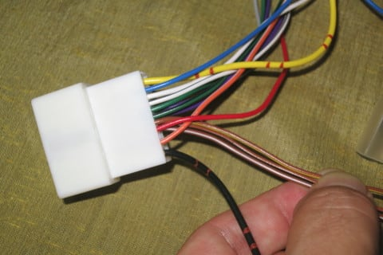

違うメーカーだとケーブル色が違うかもしれないので．

念のためにコネクタピン位置を図示するとこんな感じ．

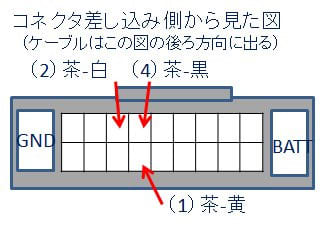

図中の（1）茶-黄，（2）茶-白，（4）茶-黒というのを，

それぞれこのETC連動ケーブルの「KEY1」「KEY2」「KEY4」に

つなぎます．

「KEY3」が余りますが．

スバル車の場合，「KEY3」には何もつなぎません．

で．

20ピン端子のステアリングリモコンケーブルはギボシ

端子が着いてますが．

ETC連動ケーブル側にはギボシ端子が着いてないので．

ギボシ端子を取り付けます．

ケーブルを剥いて…

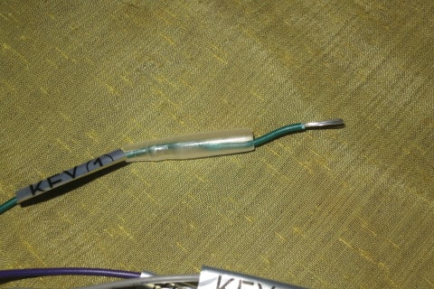

圧着ペンチでギボシ端子を圧着して…

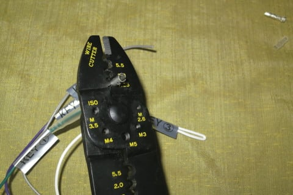

はい，完成．

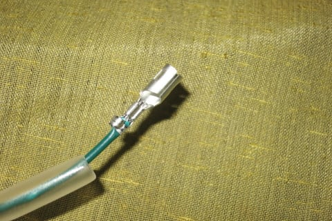

あとは番号を合わせながら，20ピンコネクタ側と

ETC連動ケーブル側のギボシ端子を

はめ込んでいきましょう…

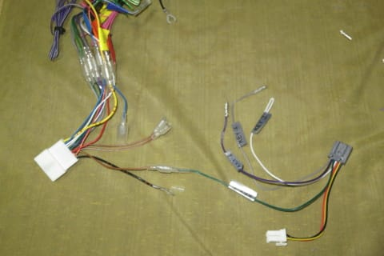

この写真では1本しか刺さってませんが．

残り二つのギボシ端子もはめ込んでおきます．

…で．

まだ終わらない．

まだ追加加工をするんですね～．

ETC車載器からナビスペースに引っ張った，

ETCケーブル．

こいつにはこんな感じで，ETC車載器に

電力を供給するための，バッテリー電源と

アクセサリー電源線がついてるのですが．

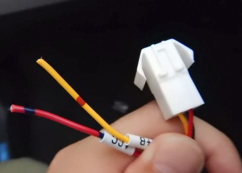

こいつも，今回作りこんだハーネスからつなげられる

ようにしておきましょう…

ETCケーブル側は，こんな感じでギボシ端子を

つけておいたので．

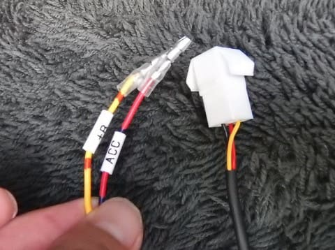

20ピンオーディオハーネスからのバッテリーと

アクセサリー線を分岐させて，

このETCに電源が供給できるようにしておきましょう…

まず，こんな感じの横取りケーブルを作って…

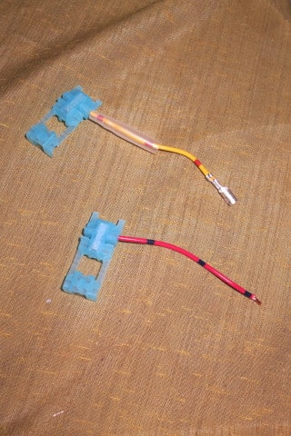

ギボシ端子を取り付けておきます．

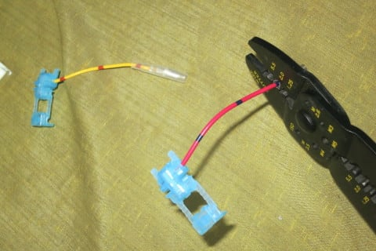

そして，こいつを20ピンコネクタからの

バッテリー線とアクセサリ―電源線に

カチッとはめ込むと…

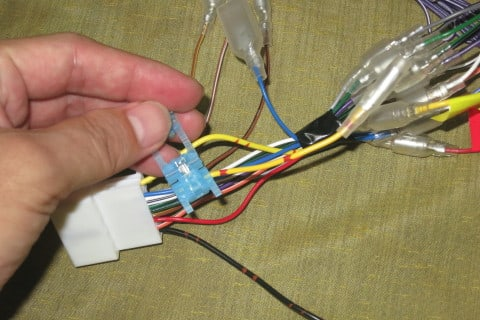

こんな感じで，バッテリー線とアクセサリー電源線の

分岐が出来上がります！

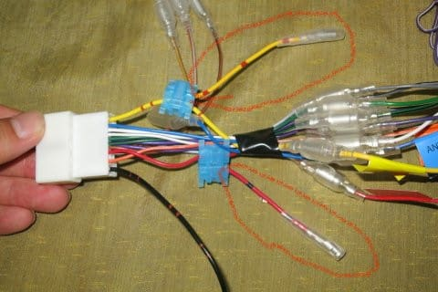

あとでこいつを，ETCケーブルの電源線に

繋いでやればOK！

って感じで．

ケーブルの事前加工はこれで終わりですが…

んん？？

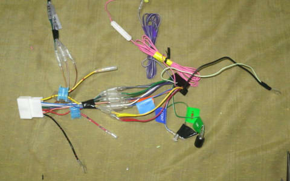

んんんんん？？

なぜか，ナビ側コネクタから伸びる，

緑色のパーキング線．

なんだか，間違った線につながっている

気がするのですが…！？？？

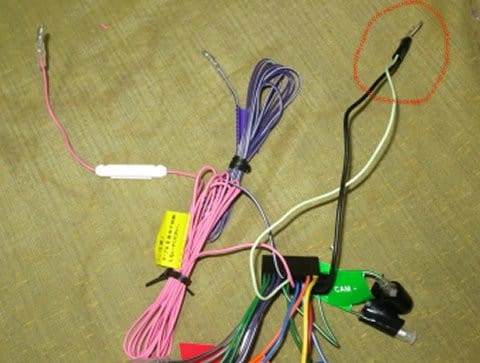

パーキング線が，間違えてしまったのか何なのか．

アースにつながっていたように見えていたのは．

…たぶん，目の錯覚でしょう…

ってことで．

この作製したケーブルを使って．

ついにナビ本体の取り付けに突入するのだっ！！

## 💬 コメント一覧

### 💬 コメント by (ノムノム)
**タイトル**: 凄いですね！
**投稿日**: 2018-08-18 17:34:19

Sさん

詳しい解説を読んでいるとDIYの苦労がよくわかります。それも楽しむ勢いでないとやってられないですよね。

当方もディーラーでナビ取付後、オーディオに不満が出てしまい、デッドニング、スピーカー交換、アンプ設置などに手をかけてしまいました。

特にアンプを設置するためにナビの音声出力線にアンプ入力を接続する必要があるので、ご紹介のあったギボシ接続を行いました。頼むと2～3万取られちゃうので馬鹿らしいですよね～。

でも、他にも車内の配線取り回しに気を遣わないといけなかったり、もうやりたくないかな(笑)

### 💬 コメント by (Skier_S)
**タイトル**: ノムノムさま
**投稿日**: 2018-08-19 04:38:44

ご自分でデッドニング＆アンプ設置やられたんですか…

大変だったのではないでしょうか？

自分で手を加えると，いろいろ愛着も増しますよね…

そして，いろんなメーカーの車の仕上げの違いや

時代による設計の進歩もわかってきたりします（笑）．

