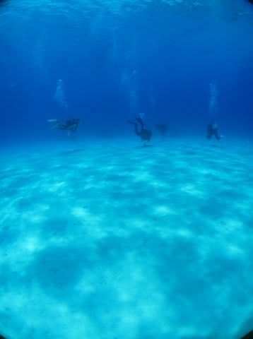

# 子連れで座間味に行ってみた　その8

📅 投稿日時: 2011-08-17 00:51:40

🏷️ カテゴリ: [ダイビング日記](ce3a7a8d424d112fce83ee85c81a0e344.md)

えーー．

今，私はコモドの船の上にいます．

っつーか，いるはずです．

…って，離島の間の海で，ネットワークが使えるわけも無いので．

投稿予約しておいたものです（ネタばらし)．

------------

さて．

座間味のダイビングも最終日です．

今日も，いつもどおりボートに乗り込むと…

なんと．

今回は，うちの子供以外の子供が乗ってます！

幼稚園児と小学生の2人の子連れのお母さんが乗ってきており，

子供3人というにぎやかボートです．

さらに，男女ペアの体験ダイバーも乗船．

ということで，今日のゲストは，大人7人，子供3人．

初日の貸切から比べると，かなりの大人数ですが，

このボートのでかさでは，まだまだ余裕の人数ですね～

きれいな海を走って…

最初のダイビングポイントへ向かいます．

ポイントは港から10分ほど，

今回，他の子もいて遊んでくれそうなので．

安心して子供を預けていけそう…

(舳先によその子供が立ってます）

子連れ経験が無い人にはわかりにくいかもしれませんが．

子連れにとって，「他の子供がいる！」

というのは，すごい安心材料です．

子供も，大人と遊ぶより子供同士で遊んだほうが楽しいようなので．

他の子供がいるってのは，いいですね～．

ということで，今日の１本目も．

子供をショップのおねーさんに預けて．

＃と書くと聞こえは良いが，実態は娘を船に置いていって

夫婦で潜ります．

ポイント名は，「ニシ浜北」

ここは，日本ではめったに見られない，「トウアカクマノミ」がいるポイントです．

夫婦揃ってエントリー．

なんか，昨日2本潜っただけなのに，もう夫婦で

潜るのが当たり前みたいな感じになってきてますね～．

＃娘を置いていく罪悪感が薄れた，という見方もできなくはない

ニシ浜のきれいな砂地に面するポイントなので，

砂地がきれい…

イソギンチャクカクレエビなんかを見ながら進んで…

（ダイバーじゃない人は，こんなエビ見て何が嬉しいんだろう，

　って思うんだろうなぁ…)

トウアカ発見！

なんか，あんまり色がきれいじゃないなぁ．

おっと．

こいつは卵を育てているな…

(茶色い砂粒みたいなのが卵)

卵を守っているんで，ちょいと凶暴なわけだ．

カメラに向かって，盛んにアタックされたよ…

しかし…

トウアカクマノミを撮るのに，

イソギンチャクと一緒にとるのに必死で，

ワイコンをつけたままずっと撮ってた…

今から考えると，1枚くらいワイコンなしで

撮っておけばよかったなぁ．

んで．

そのあとは．

「いやー．慶良間だね」

って海を進みます．

(続く)
