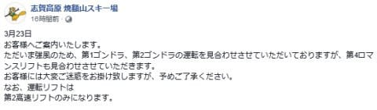
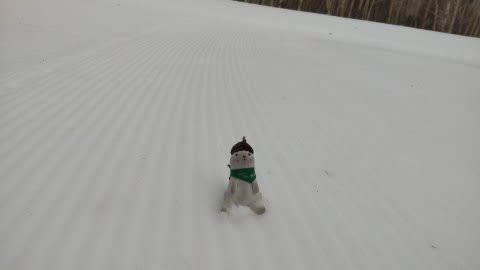
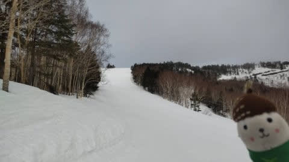
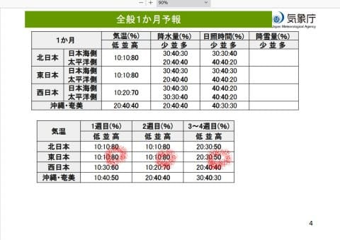

# ダメだ…今日発表の1か月予報も高温の予想(涙)．そして3月23日の志賀高原スキー場は高温&強風でゴンドラ・リフト運休多し(泣)

📅 投稿日時: 2023-03-24 02:56:20

えー．

ホントは2024シーズンモデルのスキー板の

試乗レポートとか書きたいんだけど…

長い記事を書く暇が取れない…(涙)

それどころか，今週末こそスキーに行く！！！

という強い信念で休日に仕事を漏らさないよう

頑張っている結果，平均睡眠時間がとんでも

なく短い…(泣)

今晩もこれから3時間くらいしか寝れないぞ？？

こんなBlog書いてる暇がないはずなのに，

記事書いてて大丈夫か？？

とりあえず．

時間がない時に特派員の写真があると，

手軽に記事が書けてありがたい…

特派員の皆さん，ありがとうございます(感謝)

で．

今日は朝から激烈強風だったようで…

まず，朝からゴンドラは全滅(涙)

それどころか，昼前には焼額の第4ロマンスも

止まってしまい，一の瀬方面も軒並み

止まったようです…(泣)

（[焼額山Facebook](https://www.facebook.com/yakebitaiyama/posts/pfbid0h7JCs8PevCb3jsurk4RDZfY3vt1iJ2Cng9wnjMriu7GDd5Ka5PXMzBGpY4A6eAmdl)より）

天気は，朝は曇り空だったみたいですが．

朝から気温は高く…

そして，ゲレンデもあさイチからザクザクの

緩んだシマシマ(泣)

バーンはほぼ貸し切りだったみたいですが…

途中からペアリフトも止まるほどの強風で，

昼ごろには雨も降り出し．

今日の志賀高原は，かなりひどい状況だった

みたいです…(激泣)

しかし．

気温が高すぎる．

雪が解けるのが早すぎる！！！

ってなことで．

木曜はこのBlog読者ならご存知，気象庁の一

か月予報の発表日です！！

前回の激烈高温予想は外れて，いきなり

低温の予想に切り替わっているはず…！

と，楽しみに見てみるわけですが．

…だめだこりゃ

先週に引き続き．

今週の予想でも，1週目，2週目共に

気温が高くなる確率が80%！！！

そして，3，4週目も気温が高くなる確率50％だと…

これから4月下旬まで，冷える気配がない

ということですね(涙)

ダメだ…

今シーズン，GWまで雪がもちそうにない…

こんなダメなシーズンになろうとは…(泣)

そして．

日曜の26日は，かなりの雨になりそう(激泣)

24時間の予想降水量が20~30mmなので，

かなり強い降りですね(泣)

ただ…

志賀高原なら液体か固体か，ギリギリの

気温になってきました…

あと1-2℃下がると確実に雪なんだけどなぁ…

とりあえず．

日曜は雪になったとしても，ウェアに着くと

びしょ濡れになり，ゴーグルに水滴がつく

辛い感じの雪だろうなぁ…

あぁ…

滑りに行けなかった週末や21日の祭日は

晴れたのに，なぜ私が滑りに行ける週末に

限ってそんな天気になるのか…←あなたの日ごろの行いが悪いからでしょ

## 💬 コメント一覧

### 💬 コメント by (レインボー75)
**タイトル**: Unknown
**投稿日**: 2023-03-24 12:14:47

金曜日の志賀高原情報

残念なお知らせです。

ブナコースの左半分が大きな地肌。

唐松コースの上部右が２ヶ所地肌

オリンピックコース急斜面が地肌広々。

GSコース下部急斜面(しんちゃんバーン)上部右側が長く地肌。

サウスコースのいちごん連絡分岐の下が、雪が薄々。明日にも地肌の危機。

SGSコースにも一部で地肌。

根性なしスキーヤーは、早期撤退を覚悟しました。

今日は雪は良かったのですが濃霧がしつこ過ぎて、2時間で終了しました。その頃にはかなり柔らかくなってましたよ。

### 💬 コメント by (Skier_S)
**タイトル**: ＞レインボー75さま
**投稿日**: 2023-03-25 01:16:33

もう，すごい勢いで雪が解けてますね…

私が志賀に通うようになって長いですが，3月でここまで雪がひどいのは

最悪に近いです(泣)

早期撤退残念です…でも，今シーズンはやむなしな感じですね(涙)

