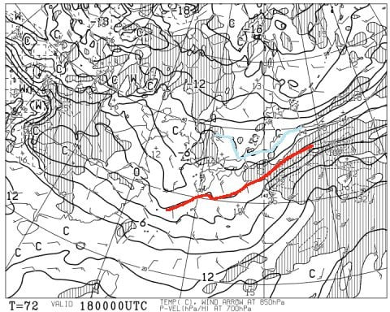

# 1月18，19日の週末の志賀高原スキー場の天気は？…土日ともそこそこ冷えそうだけど雪の積み増しはほとんど無し(涙）

📅 投稿日時: 2020-01-16 06:49:23

えー．

現在の志賀高原．

ちょっと雪が積もったようですね…

今朝の焼額のFacebookでは，

昨晩からの積雪20cmになってます！

([焼額山Facebook](https://ja-jp.facebook.com/yakebitaiyama/photos/a.533933973368620/2649437891818207/?type=3&theater)より）

…そんなに積もったのかな？

とりあえず．

少しはゲレンデ状況，改善したのかな…

ってなわけで．

今週末のスキー場の天気ですが．

うーむ．

やっぱりあんまり積もらなさそうな

予想です（涙）

まぁ，雨になって雪が解けることは

無さそうなので，そこは安心ですが…

まずは，16日（木）の850hpa気温から見てみますが．

うむ．水色の-6℃線が志賀にかかっているので，

この日はそこそこ冷えそう…！

しかし．16日の地上天気図を見ると．

きれいな冬型になっておらず．

志賀高原には水色の降水域がかかってないので．

冷えてくれるけど，雪は積もるほど

降らなさそう…（涙）

そして，17日（金）の850hpa気温を見てみると．

この日も，志賀高原は-3℃線がかかる程度．

激冷えというわけではないですが，昼間も

0℃を超えず，雪が緩むほどの気温では

なさそう！

…ただ．

地上天気図の降水域は，この日も志賀に

かかっておらず．

積雪の積み増しはなさそうな感じ…（涙）

で．

肝心の週末，18日（土）の850hpa気温図ですが．

うむ．

この日も，水色の-6℃線が志賀高原にかかる程度

なので．

朝は-8～9℃くらいまで冷え込み，

1月として標準的な冷え込み．

ただ，地上天気図を見ると…

この日も水色に塗った降水域は，

志賀高原にはかかってません（泣）

雪は積もりそうにありません

あぁ…ダメだ．

今シーズン，冷えると降らない…（涙）

そして，日曜19日ですが…

この日も，赤い0℃線は志賀高原より南．

昼間の気温は0℃近くまで上がりそうですが，

まぁ，雪が緩むほどではなさそう．

地上天気図を見ると…

この日も，網掛けの降水域は

志賀にかからず．

ダメだ…

ダメです．

この日も雪の積み増しはなさそう（泣）

あぁ…

今日積もってくれたのは，せめてもの救いだけど．

これから週末まで，雪の積み増しは

全く期待できなさそうです（激涙）

ってなことで．

まとめると．

16日木曜：朝の気温は-8℃程度の，そこそこの冷え込み

　朝は新雪が圧雪された，久しぶりの柔らかい圧雪！

　実に久しぶりの，1月の志賀高原らしいふわふわ雪．

　天気は朝は曇り，午後にかけて晴れ間も．

　気温は終日冷えて，午後はちょっと荒れ気味になるかも

　しれないけど，今シーズンには珍しい，

　柔らか雪のグッドコンディションの一日！

17日金曜：朝の気温は-6℃程度．

　この日は朝イチは最高のシマシマ圧雪バーン！

　午前中は日も射し，トップシーズンらしい

　いいコンディションで滑れそう…

　午後に向かって雲が増え，曇り空に．

　昼間も気温はそれほど上がらず，

　冷え冷え雪を終日キープする，

　トップシーズンらしい一日．

　でも，雪の積み増しは無し．

18日土曜：朝の気温は-8～9℃程度．

　冷え冷えのいい感じの朝．

　あさイチは締まったいい感じのシマシマを

　楽しめそう！

　ただ，天気は曇り空．

　昼ごろから雪がぱらつきそうだけど．

　ちらつく程度で全く積もらず．

　雪が積もらないのに，曇って凸凹が

　見にくい，ちょっと残念な天気．

　気温は昼間も-5℃程度しか上がらず，

　冷え冷えのいい雪質をキープ．

　ただし，この日も全く雪の積み増しが

　無いので，午後遅くになると，急斜面は

　上の雪がはがされ，

　下地の硬いのが出てくるところも

　ちらほらありそう．

　でも，この週末は，そんなに

　混まないと思うので，ゲレンデはそれほど

　ひどく荒れないんじゃないかな？

19日日曜：朝の気温は-5℃以下かな？

　この日も朝イチは締まった感じの

　ハイスピードシマシマバーンを

　楽しめそうだけど…

　そろそろ締まった感じじゃなく，

　フワフワ積もりたての圧雪バーンを

　滑りたいところ（涙）

　この日の天気はまだ読みにくいけど，

　基本的には終日曇り，時折晴れ間も．

　運が良ければ，朝はすっきり晴れてるかも？

　昼間も気温は0℃を超えないので，

　激冷えではないけど雪質の悪化は無し．

　まぁまぁの冷え冷えコンディションで

　楽しめるのでは…

　ただ，相変わらず積雪の積み増しは

　全くなさそう（涙）

という感じで．

これ以降の積雪の積み増しは

全く期待できないので，

今，積雪が無いスキー場は，

これから週末にかけて，

滑れるゲレンデが広がることは

無いので，厳しい状態が

続きそう…

だけど．

1月の標準的な気温をキープして

くれるので．

今，ほぼ全面滑れる積雪がある

志賀高原は，いい雪質で

週末を過ごせるんじゃないかな…

…ちなみに．

20日の月曜日．

久しぶりに西高東低の冬型に

なり，降水域が日本海側に

かかっているので．

雪が降ってくれそうです！

まだ，どのくらい積もるかの予想は

難しいですけど…

運が良ければ20cm

運が悪ければ，数cm程度か…

でも．

なぜ，週末が終わってから降るかな（涙）

## 💬 コメント一覧

### 💬 コメント by (レインボー１隊員red)
**タイトル**: Unknown
**投稿日**: 2020-01-16 15:21:04

本日木曜日、ベストでしたよ。オリンピックは某Ｋ藤ご夫妻の後塵を浴びたものの、三番手で新雪20センチ。こんな快感、こんな幸せが、世の中の何処にありますか。奥志賀もパラダイス。一ノ瀬も、寺子屋も、高天も、たんねも。

こうしてきっちりレインボー(にじあがり)した１号red、２号orange、３号yellowでした。

### 💬 コメント by (かず)
**タイトル**: Unknown
**投稿日**: 2020-01-16 20:13:03

本日奥志賀でした  朝どこも底突きしましたが浮いて良かったです 車が少なかったので期待してましたが  想像より人が多い…すぐ荒れましたよ  3連休後なのに…

### 💬 コメント by (ももも)
**タイトル**: Unknown
**投稿日**: 2020-01-16 22:14:21

20000m達成しました!

息子がチャレンジしたいと言ってたので、どんなものだか主人で実験しようというふしだらな思いから始めました(主人が渋ってたので3人でやろうと嘘ついて！娘と私は午前中だけ付き合って無理だから辞めると言えばいいやと考えていました)

しかし、途中でKonSuke様にこのペースならいけるかもとお声をかけていたたき、娘のヤル気スイッチがON!!(それって私も付き合うのか!?)

息子のために過去の20000m書き込みを読み漁り、タイム表まで作って準備していたのが幸いし無事に達成することができました。

KonSuke様の応援があってこその達成です。ありがとうございました。

### 💬 コメント by (西館)
**タイトル**: ただいま荷造り中
**投稿日**: 2020-01-16 22:42:08

明日のお仕事後、特急しなので長野へ出発です。その後湯田中まで。土曜日の朝、志賀高原へ。

Skiline導入直後は周回数でBEST100入りするとTシャツがいただけたのです。10周すればほぼ確実で木戸池へ行くタイミングがポイントでしたね。

以前はスタンプだったため手袋を外して台紙を出して押印して台紙をしまって手袋して。吹雪くと辛かった。でもロープウェイ乗って板抱えてシングルリフト乗って。笠岳、前山他、今では無くなってしまったリフトがいっぱいあって、大変だったけど楽しかったなー（年がばれますね）。

ビワ池からですと焼額までは15分は掛かりますよね。それで朝イチの1ゴンに並ぶなんて、さてはSkier_S様ってば、かなりの早食いですね？。

私は公共交通機関で志賀入りしていまして、お宿は西館斜面中段、ほっぽ温泉始発バスが8:29のため、朝礼には間に合わないのです...（良いお宿で板、靴、メットを預かってくださっているのでした。裏切れない～）

ところでSkier_S様は何セットの板を志賀高原へ持参されるのですか？。そしてメンテナンスはいつされるのですか？。そんなに滑ったら都度メンテナンスが必要になりそうですが、時間の余裕が全く無さそうに思えます。それともゴンドラの乗り降り同様メンテナンスも瞬時にやっちゃえるのでしょうか。

あああああ、Skier_S様の記事や皆様のコメントを読んでいたら板が欲しくなってきてしまいました。やばい、やばいです物欲選手権完敗の気配ですショップへ行く余裕は全く無いんですけど今はネットでも買えちゃいますからやばさ倍増です!!

### 💬 コメント by (Skier_S)
**タイトル**: 今日の志賀高原は良かったようですね…
**投稿日**: 2020-01-17 02:38:49

＞レインボー1隊員redさま

…隊員1号は，Redなんですね（笑）．

やっぱり，今日はベストコンディションだったのですね．

うらやましいです…

新雪20cm，滑りたかった…（涙）

＞かずさま

今日滑ってたのですね！

今シーズンとしては当たりの日で，良かったですね．

でも，そんなにすぐに荒れちゃったのですね…

＞もももさま

えええええ！！

20000m達成ですか！！

史上2人目＆3人目の女性20000mゴールド＆

初の未成年ゴールド達成者です…！！！

…しかし．

タイム表まで作る執念．

素晴らしすぎる…

おめでとうございます！！！

＞西館さま

あ，公共交通機関で移動されてるのですね…

だとすると，あさイチ焼額は難しそうですね．

私は朝7時過ぎからご飯を食べて，7:50~8時頃に

宿を出発します．

食事時間は30分近く取れるので，そんなに早食いじゃ

無いですよ…（笑）．

ちなみに，私はいつも車に

・ロング用板（SALOMON X-Race)

・ショート用板（ATOMIC Bluester SX)

・太板（LINE)

の3セットを積んでます．

ただ，今シーズンはまだ太板の出番はありませんが…

いつも使うのは，ロングとショートの2セットです．

メンテナンスは，スキー宿で，あるいはスキーから帰宅した後にやります．

…なので，いつも日曜のBlog更新が深夜になるのです（涙）

睡眠時間を削って，エッジを削ってます．

板2セットのワクシング＆エッジ手入れで1時間以上かかるので，

なかなか大変です．

今はネットがあれば，右手のクリック一発で板が届いちゃうので危ないですね．

物欲選手権の行方を見守っています（笑）

### 💬 コメント by (Northfox)
**タイトル**: Unknown
**投稿日**: 2020-01-17 09:56:13

西館様

コメント失礼します。

A notherSkiというサイトはご存知でしょうか？（知っていましたらスルーして下さい）

http://anotherski.skr.jp/skireport/

年度毎に各メーカーのDEMO板やレース板、ファット板等全モデルの一覧とそのレビューサイトが纏められています。S様のレビューもリンクされてますよ。

物欲を刺激するので閲覧注意ですが。

私も発哺温泉（スイスイン）に泊まったりします。ゲレンデ目の前だし、また泊まりたいです。

