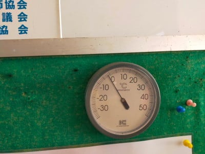

# 今週末の志賀高原スキー場はダイヤ，高天ヶ原クワッド，そして焼額第2高速運転開始！…で，12月18日から冷えそう！！！

📅 投稿日時: 2021-12-10 01:04:54

本日，仕事中のこと．

志賀高原特派員から写真が送られてきたので．

ちらっと見てみると…

…

う，う，うぎゃーーーーー！！

目の毒だ～っ！！

なんだ，このシマシマは！！

そして，なんだ，この晴天はっ！？？

それも，積もりたての雪を圧雪した

柔らかシマシマだったらしく…

…この写真を見て，私が仕事を続ける

精神力が一気に抜けてしまう，悪魔の

写真だったのでした…

さすがに，あさイチでも-2℃程度と，

気温はそれほど低くなかったようなので．

昼前には急斜面はちょっと緩んで

ボコボコになってきたみたいですけど…

でも．

一の瀬ファミリーの下側緩斜面はガラガラで，

昼ごろでもシマシマだったみたいです！

ぐはぁ…！！（血を吐く音）

うらやますぃ～っ！！！！

ぐおおお！！（のたうち回るSkier_S）

明日も晴れて，今日より締まった雪になる

ので．朝イチは最高シマシマだろうなぁ…

（全く仕事をする気を失った放心状態のSkier_S）

ってなことで．

8日の，見事に志賀高原のまわりを

覆うように0℃線が突き出してくれるという

奇跡のおかげで．

雨で雪が融けるところが，逆に30~40cm

積もってくれたわけで…

そのおかげで．

今日も最高のシマシマだったし．

さらに…なんと．

今週末11，12日に，

高天ヶ原クワッド運転開始！！

そして，ダイヤモンドクワッドも運転です！

高天ヶ原からダイヤモンドまでが繋がり

ますね…！！

（[志賀高原中央エリアホームページ](http://shigakogen.co.jp/archives/13127)より）

そして…

焼額も，第2高速リフト運転開始！

第2高速＆第2ゴンドラが滑れるように

なります！

（[焼額山スキー場Facebook](https://www.facebook.com/yakebitaiyama/)より）

すばらしい…

12月第2週でこれだけ滑れるのは，

ここ数年ではなかったですね…！！！

昨年だと，焼額はまだ4ロマだけしか

滑れなかったのに…

ってなことで．

今週末はいい感じで滑れる週末に

なりそうですが．

本日木曜は，気象庁の一か月予報が

出る日なので，今日もちょっとだけ

一か月予報を見てみましょう…

…最近，

スキー場レポート以外，

天気の記事しか書いてないぞ

という読者からのツッコミを受けそうですが．

…でも，自分がこれからの天気が気に

なって仕方ないんだもん！

あ，そうそう．

これまで何回か書いてますが，

あえて繰り返し言っておくと．

私の仕事は天気関係ではありません

単なる趣味で，天気図から志賀高原の

天気を予想できるようになっただけ

ですので，お間違え無きよう…←だから外れても仕方ないよね，と予防線を張っている

ってなことで．

今回も，[FCXX92](https://www.sunny-spot.net/chart/FCXX92.pdf)から読み解くわけですが．

まず，気温傾向は…

うげげ．

第1週（12/11~12/17）は，気温が高い確率が

50%（涙）

気温が低くなる確率は10%しかないですね…（泣）

でも，2週目は，高くなる確率は20%と低くなり．

平年並みかそれより冷える確率が40%ずつと，

ちょっと冷えそう！！

で．

1週目の解説を見ると…

うむ．今回はすごいシンプルですね．

500hpaと850hpa，どちらも正偏差に覆われる

＝寒気が入ってない，ということを述べてます．

確かに，[QVXX12](https://www.sunny-spot.net/chart/QXVV12.pdf)から，500hpa

図を見ても．

赤く囲った日本付近，負偏差を示す

網掛けがかかっていない＝正偏差，

つまり，500hpa高度が平年より高い≒

500hpaの気温が平年より高い

ということを示します．

同じく，850hpa気温図を見ても．

負偏差の網掛けがかかっておらず，

正偏差＝平年より気温が高い

ことを示してます…

ただ，赤い0℃線は志賀高原より

南にあるので．

この1週間，気温が平年より高めとは

いえ．志賀高原の雪が融けるほどの

高温にはならないかな～…

で．

2週目，12/18～12/24の解説を見ると．

ここは単純に，850hpa気温が低く，寒気の

影響を受けやすい！と言ってるだけですね．

…確かに．

この期間の850hpa気温図を見ると．

日本はすっぽり網掛けの負偏差部分に

覆われて．

平年より気温が低いことを示してます！

そして，赤い0℃線は太平洋くらいまで

下がってます…！！

これは，この1週間は冷え冷えです！！

この予想が当たれば，結構雪が積もるかも！？？

…ちなみに．

また，3，4週は

「スプレッドが大きいので平年並みの予想で…」

と書いてあるだけで．

あまりあてにならないので気にしないで

おきましょう…

ってなことで．

おそらく来週1週間は，激冷えに

ならないまでも，壊滅的な高温で

雪が解ける心配はしなくていいし．

18日以降は冷え冷えになりそうなので…

この年末に向けて，スキー場の積雪は

結構いい状況になりそう…っ！！

## 💬 コメント一覧

### 💬 コメント by (レインボー74)
**タイトル**: Unknown
**投稿日**: 2021-12-10 15:07:53

金曜日の志賀高原情報

朝の蓮池0℃。暖かい。でもゲレンデは明け方-10℃位に冷え込んだとか。

朝から雪面は硬め。所々ツルッとなる。昨日の極楽バーンとはほど遠い。だけど、昨日休場した隊員にとっては極上に感じたらしい。

極楽を経験すると、贅沢になるんですねえ。結構硬いコロコロも出現したし、人口密度も高くなったので、早期終了。

イエティで鍛えた特派員曰く「こんなの混雑とは言えん」

### 💬 コメント by (アリス)
**タイトル**: 今日は一の瀬＆熊の湯
**投稿日**: 2021-12-10 17:36:27

S様

こんばんは♪

今日は朝一に一の瀬ファミリークワッド＆天狗コースを6本（シマシマの貸し切り）

久しぶりに滑りました、斜度は緩やかですが以外と距離が長いのに驚きです♪

後半は思い立ったように、熊の湯に移動して楽しんできました。

アマズフィットですが、どうも故障ではないような感じです・・・

スマホ側を開いてみると、未接続の表示でアクティビティを指定すると、まず時計に接続してくださいと表示されます。

申し訳ありません。

接続のやり方教えてください。

参考までに時計側は何をしても動きません・・・

### 💬 コメント by (Skier_S)
**タイトル**: 明日は参戦できず（涙）
**投稿日**: 2021-12-10 22:36:56

＞レインボー74さま

結構バーンは固かったんですね…

明日は朝のうちはコロコロが出そうです．

胃腸の調子を崩し参戦できなくて残念ですが，土曜に復活予定です！

＞アリスさま

あれ？スマホと接続できてないんですか…？

・時計を再起動する

・スマホのBluetoothをいったん切ってまた入れる

これでもスマホとつながらないようなら，時計をファクトリーリセットすると

いいんですが…

時計が何も反応しないと，ファクトリーリセットもできないですよね．

### 💬 コメント by (アリス)
**タイトル**: PASE
**投稿日**: 2021-12-10 23:46:25

S様

ご迷惑をおかけしてます。

ボタンを長押ししましたらファクトリーリセットでき、スワイプで画面が切り替わるようになりました。

ただスマホ側ではBluetoothの入切をしたのですが

未接続の表示のままです・・・

### 💬 コメント by (すももの子)
**タイトル**: Unknown
**投稿日**: 2021-12-11 14:55:26

アリス 様

割り込みリプ失礼します。

私もAmziftGTRで同じような症状に陥りました。

その時は時計を初期化（ファクトリーリセット）して再度スマホのZeepアプリに接続しようとしたのですが、同期させる事が出来ませんでした。具体的には時計側で測ったサイクリングの記録がスマホのアプリに反映されない状態です。

自分の場合はZeppアプリ＞プロフィール＞マイデバイスを選択＞ペアリングを解除

して再度接続をしたら治りました。

この操作によって起こりうるデメリットは直近の活動データが消失する事です。（正常に動いてた時のデータがどうなったかは…すみません覚えてないです。）

あと考えられる原因としてはバックグラウンドで実行する許可が与えられてないことです。（手動で同期も出来ないようでしたら考えにくいですが…）

これは"ペアリングを解除"の少し上辺りに｢バックグラウンドで実行｣という項目があり、そこに設定の仕方が明記されてます。

ご参考までにです。復活する事をお祈りしてます(-人-)

### 💬 コメント by (Skier_S)
**タイトル**: ＞すももの子さま
**投稿日**: 2021-12-11 23:01:54

おっと．アドバイスありがとうございます．

私も同じことアドバイスしようとしていました…

ペアリングを一回解除して，再度ペアリングするしかなさそうですね．

その前に，バックグラウンドで実行も試してみる価値はありそう．

復活するといいですね…

### 💬 コメント by (アリス)
**タイトル**: Zeppアプリ
**投稿日**: 2021-12-12 12:07:50

すももの子様、S様

アドバイスありがとうございます。

ご教授いただきました内容進めました♪

ペアリング解除までは上手くいきましたが

再度接続が上手くいかないようです。

PASEのQRコードも読み取りができないようですが、もう少し色々やってみます。

### 💬 コメント by (アリス)
**タイトル**: PASE復活しました
**投稿日**: 2021-12-12 12:18:36

すももの子様、S様

お蔭様で復活しました♪

最終的にPASEのＱＲコード読み取りが成功しました♪

これで来週からの志賀高原でのスキー記録ができます♪

誠にありがとうございました。

### 💬 コメント by (Skier_S)
**タイトル**: ＞アリスさま
**投稿日**: 2021-12-13 01:53:51

復活しましたか！

良かったです…

ここのコメントが役だったようで何よりです．

