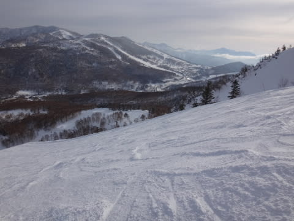

# 1月26日の志賀高原詳細…恵まれたいい日曜でした！

📅 投稿日時: 2015-01-27 01:50:28

🏷️ カテゴリ: [2015スキー滑走日記](c09ea645cfc085f86dfcd80f49599dd89.md)

あら．

あらららららっ！！！

なんてこったい！

…[以前予想した](e5043343af191a3920bcb6e9ccc307621.md)通り…

なんだか．

27日に日付が変わったあたりから．

志賀高原近辺，雨になってるようで…（涙）．

志賀の登り口，上林チェーンベースはどしゃ降りだよ…

なんだか，蓮池のカメラにも水滴が！？？

…こんな夜中に，志賀高原で雨になるとはっ！！！！

ただ，蓮池より上のカメラでは，雨になっているように見えないので．

うーん．

標高が高いところは，大丈夫だと信じたい…

とりあえず．

明日の朝には止んで，そのあとは冷え冷え雪が降り積もるので．

週末には回復するはずなんだけど…

…って，現状を報告したあとは．

本題の，この日曜日の志賀高原の詳細レポートをば…

えー．

まずは，朝ですね．

志賀高原に登る道路．

土曜の晴天で路面の雪が解けちゃって，

アイスバーンになってるんですが…っ！

かなりつるつるエキサイティングな道路でしたね～．

ツルツル路面堪能後，いつもの焼額第1ゴンドラで山頂へ登ると…

気温は-8度と，この時期としては平均的なところですか…．

で．

前日に予想したように，朝イチは雲…

というより，山頂はガスの中（涙）．

みんな，「今日は晴れの天気予報じゃなかったの…？」と残念がる中．

自分一人，「晴れるっ！あと1時間くらいで，晴れるっ！」…と，

自分の予想を強く信じていたところ．

その強い信念が雲を取り払い…

ゴンドラ2～3本滑ったころには，日が射してきましたよ！

そして，9時半にはすっきり晴れましたよっ！！

ふはははははっ！！！

見よっ！！

志賀高原の天気を決めているのは，私だっ！！！←なにか勘違いをしている

って感じで．

晴れて日差しが降り注ぐ中…

雪質は最高のまま！

新雪が降った直後みたいに柔らかすぎず．

しっかり締まった，カッツリエッジが食い込んで，

気持ちよく切れ込んでいける，快楽の

超快感ハイスピード大回りバーンっ！！！

脳内麻薬絶賛大放出バーゲンっ！！！！

オリンピックコースも，柔らかすぎず，

適度にカッツリエッジが食い込むシアワセバーンで，

自由落下大回りっ！

ああああ…

シアワセ．

シアワセだよ…

で．

比較的コースも空いていて，ゴンドラ待ちも駅舎の外まで

並ぶことは無く，最大でもこんな感じ．

いいの？

こんなに雪がいいのに，こんなに空いてて，いいの？？

そして，いつも通り午後は

「無人か？？」

と思うほどに人が減り…

おーい．

誰もいませんよ～

おかげで，午後までゲレンデが荒れることはなく…

超さらさらってほどではないけど，晴天の割に

午後まで雪質はかなりいい状況のまま！

こんないい雪で，ガラガラで…

リフトストップの時間になっても，こんな雪質で…

こんなにフラット．

いいの？

こんなシアワセで，いいの？？？

…って感じで．

いつも通り，日が暮れるまで滑り続けてしまいました…

いやいやいやいや．

恵まれた日曜だったな～．

これで，土曜も滑れれば…（ちょっと残念）

…でも．

700km日帰り往復するだけの価値はあったなっ！！！←普通の人はやらないと思う

## 💬 コメント一覧

### 💬 コメント by (Goku)
**タイトル**: Unknown
**投稿日**: 2015-01-27 19:48:39

行いの良い私達のおかげで素晴らしい週末でしたね（笑）

土曜日の八方も良かったけど、やっぱり私は志賀が好きだな～。

### 💬 コメント by (aqura)
**タイトル**: Unknown
**投稿日**: 2015-01-27 22:47:17

初めてです、オリンピックコースが楽しいと思ったのは……。スキーは好きだけど？、へたっぴいな私は、楽なコースへ逃げていたのですが、その私が滑れる位、最高U+1F603U+2934U+2934のコンディションでした。こんな週末は２度と来ないのかなぁU+1F605

### 💬 コメント by (Skier_S)
**タイトル**: いい週末でした！
**投稿日**: 2015-01-28 01:34:51

＞Gokuさま

やはり，日ごろの行いは良くしておかないとダメですね！（笑）．

でも，やっぱり志賀がいいですよね～．

…私は志賀というより，焼額ラブですが．

偏った愛情です（＾＾；

＞aquraさま

オリンピックコース，良かったですよね！

私も午前中はオリンピックコース大回りを

堪能してました！

…どこかですれ違っているのかな～？？？

で．

大丈夫です．

日ごろの行いさえよければ．

また，こんないい日がやってきます！

