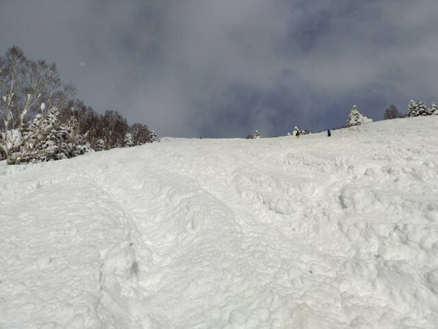

# 2月20日(木)の志賀高原スキー場は曇り～晴れ，朝は50cmだけど昼は積もらず．そして木曜定番，気象庁の1か月予報が出たよ！

📅 投稿日時: 2025-02-21 03:00:43

🏷️ カテゴリ: [日記](cc4b5682fb7b8b144980957a978653fb0.md)

ということで．

本日も志賀高原の特派員から写真が

送られてきましたが…

木曜朝の志賀高原．予想通り，かなりの

積雪があったようで…

ライブカメラを見ると，朝の段階で

積雪80cm！！

([焼額山スキー場ライブカメラ](https://www.princehotels.co.jp/ski/shiga/livecamera/)より)

特派員の写真を見ると，朝の駐車場に

止めっぱなしの車，すごいことに

なってますね…！！！

当然夕方圧雪のオリンピックコースは

70～80cmの腰パフ！！

…というより，板が細かったら際限なく

潜ってしまいそうな雪ですね…

そんな感じで，朝まではかなり気合が

入った降りっぷりだったのに．

なんと私の予想を裏切り，朝から日が射す

タイミングもあったようです…！！

終日晴れたわけではなく，晴れたり曇ったり

だったようですが．

それでも，こんなディープなパウダーが

積もった後にこんないい天気になるとは…

うらやましい…っ！！

…しかし，ホントに積もりましたね…

第2高速リフト，もう乗ってる人のの足が

雪面に着きそうなレベル…！

かなり積もってますよ！！

昨シーズンの今ごろは，2月21日の雨で

コースのそこかしこに穴が開き，

2月というのに，オリンピックコースが

クローズになったことを思い出すと…

それと同じ時期でこれとは，今年はすごい

恵まれてますよ…！！

（昨年がひどかっただけという説が…)

ということで．

これからさらに積雪が期待されるところですが．

どうも，金曜の天気図が変わって．

赤丸で示す高気圧が発生するような予想に

なり…

山陰地方を除く日本海側の降水域がほぼ

なくなった感じで，かなり冷え込むけど

志賀高原では金曜はほとんど雪が降らなさ

そうな予想になっちゃいました(泣)

まぁ，もう十分積もったので，これ以上

積もると逆に大変というレベルなので．

むしろ金曜も木曜と同じく，曇りでときおり

晴れる，穏やかな天気になりそうなので

良いかも…？？

土曜日も，風はそんなに強くなく，

雪もそこまで降らなさそうな予想に

変わりました…！！

ゴンドラが止まるような風は吹かず，

朝の積雪は10cmくらいかも…

また明日，最新の土日の天気予想を

やりますので，そっちを参考にしてください…！

ってなことで，本題へ．

そうです．今日は木曜定例の，一か月予報が

出る日です…！

今度は3月21日までの予報です．

…まず．

概要を見ると…

2月28日までの1週目は，今の冷え冷えが

続いて，平年より気温が低い確率が70％と，

結構冷えそう！

そして2週目は逆に，平年より高い確率が50％と，

ちょいとあったまりそうで．

3，4週目は大体平年並み．

積雪量も平年並み…という予想です．

第1週の850hPa気温を見ると．

本州全体が，平年より気温が低い

網掛け領域に入っており…

志賀は水色の平年比-2℃線が近く，

平年より2℃近く気温が下がりそう…！

赤い0℃線も太平洋まで南下していて，

2月いっぱいは冷え冷えですよ～！！

で，第2週の3月1日から3月7日までの

850hPa気温は…

うーん．

こちらは打1週目とは逆に，水色線は

平年比+2℃と高くなることろを示す

線で…うーん．2週目，志賀高原は平年より

+2度以上高くなる領域に入ってますね(泣)

そして，赤い0℃線も本州にかかり，

わずかに北上すると志賀にかかるので…

運が悪いと，液体が降りそう(涙)

最後の

3，4週目，3月8～21日の850hPa気温は．

九州・沖縄は平年より気温が低い網掛け

領域に入っているけど，

本州は平年より気温が上がる白抜き領域で．

志賀高原は，平年より0～1℃上がる領域に

入ってます…

ただ，赤い0℃線は2週目とほぼ変わらず．

本州の南にかかっているので…

運が悪いと液体が降ることがあるかもしれ

ないけど，降れば確実に雨というわけでは

ないので．

…まぁ，運が悪くないように祈っておきたい

ところ．

ってな感じで．

1週目，2週目で低温から高温にすごい極端に

変化しそうですが．

気温グラフを見ても，2月27日ごろまでは

冷えて，その後3月7日くらいまで高温の

期間が続き．

3月8日くらいからは，だいたい平年並み…

という感じで推移しそうです．

…まぁ，1-2月の冷え冷え祭りは

残念ながら2月いっぱいで終わり，

3月は平年並みかそれより高い気温

になりそうということで．

まだ，気温が平年比で激高になるのは

第1週なので，まだ平年並み気温が

低い時期．

そこまでクリティカルな高温にはならなさ

そうだし．

後半が平年並みであれば…

奇跡の冷え冷え3月ではなくとも，

そこまでひどい3月にはならなさそう．

うーん．

でも本音なら，2月が平年並みで

3-4月が冷え込む方が，春までいい雪で

楽しめるのでうれしかったけど．

ちょっとその逆になっちゃった感じが

惜しい…
