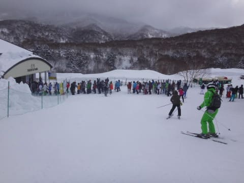

# 2月19日（日）の志賀高原，詳細レポート…下地はちょいと固めだったけど，冷え冷え最高雪質＆晴天の恵まれた一日だったよ！！

📅 投稿日時: 2017-02-21 02:38:56

🏷️ カテゴリ: [2017スキー滑走日記](c7d777cecfc91bdf0fa464ad62c6d49ab.md)

えー．

どうやら．

本日の志賀高原．

やはり，昼から雨が降ってしまったようで．

…そして．やはり強風でゴンドラが止まってしまったようで．

でも．

現在．

雪がドサドサ降ってます．

ええ，ドサドサと．

…そして，この雪は明日も降り続き．

かなり積もりそうです．

明日21日，朝はまたパウダー祭りになりそうです…

＃雪は重そうだけど

で．21日は雪降り，22日に晴れた後．

…来ます．

23日の木曜日は，来ます．

壊滅的に来そうです．

850hpa気温図を見ると…

どどーーん．

水色の+6℃線が志賀高原に…（泣）

そして，地上天気図を見ると…

どかーーん！！

水色で塗った降水域が日本全国に…

これは…

木曜は強風荒れ荒れゴンドラ営業できず

絶賛高温南風雨降りの一日になりそう…（激烈涙）

ただ．

木曜夜から金曜にかけて．

今度はまた雪になりそう…

…今週は

月曜雨→火曜ドカ雪→水曜晴れ→木曜雨→金曜ドカ雪

って感じで．

雨とドカ雪のサイクルが2サイクル回りそうです．

ってか．

先週金曜から．

一週間で3回雨に降られる

ってのは…

志賀高原の2月として，どうよ？？？

…って感じですが．

とりあえず．

今週は毎日冒頭で天気予想速報を

続けよう…と思っている今日この頃．

皆様いかがお過ごしでしょうか．

…という，「これだけで普通のBlogなら一つの記事では？」と

突っ込みたくなる長い時候のあいさつの後は．

本題の，日曜の志賀高原．

詳細レポートです～！

えー．

まず．

朝イチで，いつも通り焼額の山頂へ上がるわけですが…

＃ゴンドラスタートに5分遅れたという，私にとってかなりの屈辱の出来事により，

＃厳密に朝イチでは無いという細かい事実は隠しておく

朝イチの山頂の気温は，-13℃ですか．

水曜予想の-15℃までは冷えなかったけど．

いい感じの冷え込み！

で．

朝イチの山頂は．

…これも水曜予想通り，朝のうちは

雪がちらつく曇り空でのスタートですね…

ゲレンデは…

うほ～っ！！

圧雪コース上も，

コース全面，朝に降った激烈に軽い

フワフワパウダーが積もってます！

いや，これ，軽いよ！！

って感じで．

新雪を蹴散らしているのが分からないほど軽い，

激軽パウダーのコースを攻めていると…

うむ？

ゴンドラ2本ほど滑ったところで，

日が射してきましたね…

ってところで，

日が射すオリンピックコースに出てみると…

うむ．

軽いブーツパフ！！！

ブーツパフを切り裂きながら，

気持ちよく落下していけるよ！！

一見凸凹に見えますが…

朝のうちは，激軽パウダー斜面だったので，

ほとんど抵抗なくこのモフモフを突っ切れて，

かなーり気持ちいい感じ！

いやー！！

気持ちいい！

激軽パフパフ！

パフパフ最高！

…と，気持ちよくオリンピックコースを

グルグルしていると…

あり？

10時過ぎ，ちょっとゴンドラに人が増えてきたかな…

そして．

11時近くには．

あうううー．

ゴンドラ待ちの列が…（涙）．

でも．

これだけ待ったのは1回だけ．

第1ゴンドラは，午前中は，駅舎の外に

ちょっと人がはみ出るかな…

という，平均2-3分待ち程度で，

まぁ我慢できるレベル．

お昼には，一人乗りレーンは搬器2-3台待ちに

短くなってました．

ただ，2ゴンはこんな感じで

午前中は20分待ちまで行ったようで…

とりあえず．

さすが2月の週末．

多少のゴンドラ待ちはあったものの．

天気は良く，雪質最高！！！

昼になっても気温は-6℃程度と，

日が射しているのに冷え冷え！

すっきり晴天のもと…

こんな冷え冷え最高雪質のゲレンデを

満喫できるなんて．

あぁ…

恵まれた週末…

…ただ．

惜しいのは．

徐々にゲレンデが荒れ始め，

ところどころ下地の固いのが

出てきたのと…

あと，GSコース．

一部，こんな感じで．

それほど多くはないけど，氷のコロコロが…（涙）

とはいえ．

全体的に見れば．

雪質は冷え冷えGood！

で．

今日も午後，ちょっと一瞬奥志賀へ出かけてみたりしましたが…

奥志賀第6ペア沿いのパークが完成したようですね…

すごいデカい，本格的なアイテム多数揃ってます…

第3高速ペア沿いは，かなりいい感じの雪質！

＃今日も[この方](https://www.youtube.com/channel/UCdeK4rOu5gO_jbO2IJDyhtQ)とお会いすることかなわず…

＃1時半ごろに見に行ったんだけど…

ゲレンデも午後は比較的すいてて良かったですね～．

いやー．

志賀高原のトップシーズンで，

こんなに天気が良い週末ってのは．

ホントに恵まれてるな～！！

…と．

天気よし，雪よし．

午後になると人も減ってガラガラになった，

いい感じのゲレンデを気持ちよく

滑っていたんですが．

…しかし．

昼を過ぎてしばらく経つと…

…雪質はいいんだけど，ちょっと荒れてきたかな？

…雪質はいいんだけど…

かなり荒れてきたかな？？（ちょい涙）

荒れてきただけでなく．

コブとコブの間は，かなり固い

下地が出てきたかな？？（けっこう涙）

という感じで．

昼過ぎは，ゲレンデがかなり本格的に荒れだし．

夕方には，緩斜面を除くとコース全面

コブコブになってしまった焼額でしたが．

コブコブに飛ばされてヘロヘロになりながらも，

お約束通り，夕方のリフトストップまで

滑り続けたのでした…

いやー．

しかし．

下地がちょっと硬かったのが残念だけど．

気温冷え冷えで雪も天気も良かった週末．

金曜に雨だった時はどうなるかと思ったけど…

志賀のトップシーズンらしい，いい週末を

過ごせました～！！

…今週も，雨2連発を乗り切って．

今週も金曜にいい雪がドサドサ降って．

週末にいい雪で滑れることを願うばかり…

いや．

そうなるよう，祈る．

…そして，踊るっ！

久しぶりの，冷え冷え踊りを踊るのだ！

今週金曜は冷え冷えになって

いい雪がドサドサ積もって下地の

アイスバーンが隠れる踊り

を，踊る！

…だから，今週末は．

絶対にいい雪になるはずだっ！！←だから，あなたが志賀高原の天気を決めてるわけじゃないんだから…

## 💬 コメント一覧

### 💬 コメント by (つーちゃん)
**タイトル**: Unknown
**投稿日**: 2017-02-21 18:25:02

２０日（月）ダイヤモンドとヤケビで滑りました！！

朝から雪でしたが、一本滑るとゴーグルに雪がﾍﾞﾁｬﾍﾞﾁｬ付いて

視界不良を起こすような湿雪で

板も滑ったり滑らなかったりする下手っぴーには厳しいコンディション．．．

嫌になって１３時ころには引き上げちゃいました。

下るにつれて雪はみぞれっぽくなり、サンバレー辺りでは完全に雨でした(´・ω・｀)

### 💬 コメント by (かず)
**タイトル**: 天気いいですね
**投稿日**: 2017-02-21 19:33:40

今週末パウダーボードのみの試乗会が白馬であるので土曜は白馬です　店の予告見るとスキーのほうがメインな感じですけど

### 💬 コメント by (Skier_S)
**タイトル**: 今週末，どうなることやら…
**投稿日**: 2017-02-22 02:16:03

＞つーちゃんさま

あ，月曜滑ってましたか！

月曜は，午後は雨になったようなので…

13時に切り上げて正解だったかと思います．

しかし，運の悪い日にあたりましたね…

ご愁傷さまです．

＞かずさま

今週末，パウダーボードの試乗に適した雪が

積もってくれるといいですね…

とりあえず，試乗会楽しんできてください！

