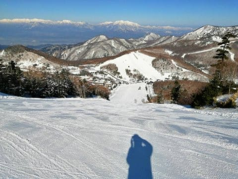

# 明日から3連休！初日20日の天気は晴れて冷えるけど強風．21日は曇りのち晴れで気温が上がり，22日も気温が高めの曇り空

📅 投稿日時: 2020-03-20 01:04:06

🏷️ カテゴリ: [日記](cc4b5682fb7b8b144980957a978653fb0.md)

ということで．

今日も志賀はすっきり晴天で．

あさイチはいい感じでエッジが

食い込む最高斜面だったようですね…

（またもや某特派員からの写真）

ただ．

やはり予想通り，強い日差しと高温で

午前中には雪が緩み始め，

昼ごろには，ところどころで板が

滑らない雪になっちゃったみたいですね…（涙）

あぁ…16日に積もった冷え冷え雪．

やはり週末までもたなかったか…（泣）

で．

予想通り，3連休の初日の明日20日は，

早朝に，降り始めは雨かもしれないけど

うっすら雪が降り．

あさイチはちょいとカリカリした上に

うっすら積雪でスタートかな…

そこそこ冷えた曇り空で始まりそうな朝ですが．

…やっぱり，風が激烈に強そう（涙）

ゴンドラが動けばいいんだけど…

でも．

風が強いものの．

強烈な西風なので．

志賀高原は，明日は晴れ間が広がるかも…？？

で．

それ以降は，大体昨日の予想通りかな．

3連休中日は晴れ，

朝は締まった雪だけど，昼間はプラス気温で

雪が緩み．

3連休最終日もそんなに冷えず．

朝はカリカリに固まった雪が，

この日も午前中は晴れそうで，

気温も上がるので．

すぐに緩んで重い雪になっていく

感じでしょうか…

とりあえず．

春スキーっぽい3連休になりそうですが．

私はあと2時間後に出発です（涙）

あと1時間半しか寝れない…（泣）

## 💬 コメント一覧

### 💬 コメント by (626)
**タイトル**: Unknown
**投稿日**: 2020-03-20 06:16:41

あれ？

夢の中で、板や車等の日記を読んだ気が…

### 💬 コメント by (Skier_S)
**タイトル**: Unknown
**投稿日**: 2020-03-20 08:23:44

> 626さま

それは夢です。

きっと夢をみたんですよ…

### 💬 コメント by (m&t)
**タイトル**: Unknown
**投稿日**: 2020-03-20 11:52:36

私達も見たような・・・。

都合がつかず今日は欠席です。日曜日に参戦予定です!

ウェア変わってます。

### 💬 コメント by (レインボー)
**タイトル**: Unknown
**投稿日**: 2020-03-20 14:04:27

志賀高原情報

本日金曜日は、視界悪、寒い、硬すぎ、コロコロ、満員の５悪が重なったため、2ゴン渋滞には並ばないで、山菜採りに行ってきました。今夜は借家の大家さんと山菜天ぷらディナーです。

九時半過ぎには、志賀へ上ってくる車の多いこと多いこと！

志賀の明日が心配になるけど、こうやって繁盛してくれると嬉しくなります。志賀高原に栄光あれ。

### 💬 コメント by (ヒータロゥ)
**タイトル**: Unknown
**投稿日**: 2020-03-20 17:02:41

今日はご一緒いただきありがとうございました。m(_ _)m

どこまで今シーズンは滑れるか分かりませんが、娘と行きますので、またお話しさせてください。

### 💬 コメント by (いちと)
**タイトル**: Unknown
**投稿日**: 2020-03-20 19:16:36

本日から参戦しています　私の踊りのおかげで、今日は風はあったもののまずまずで、最後は晴れ間まで持ってきました　

→はい　自惚れです

### 💬 コメント by (Skier_S)
**タイトル**: 今日は夢を見た人が多かったようですね…
**投稿日**: 2020-03-21 01:28:11

＞m&tさま

何のことでしょうか？

見たというのは…

きっと夢を見たんですよね…！？？

＞レインボーさま

え？？

今日は山菜取りだったのですか…

ちょっと午前中は手ごわかったですが，

午後は悪くなかったですよ！！

＞ヒータロゥさま

今日はお付き合いいただきありがとうございました～！

今度は子連れでみんなと一緒に滑りましょう！

＞いちとさま

最後の晴れ間は，営業終了時の16時過ぎになって

晴れてくるという，嫌がらせのような晴れでしたね（涙）

そうか…あの嫌がらせのような晴れは，いちとさんの

せいだったんですね！！←違うから

