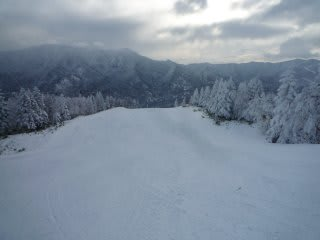

# 大晦日の志賀高原

📅 投稿日時: 2010-12-31 22:56:03

天気予報では大荒れのはずの今日．

朝起きたら，うす曇で時々日が差すほどの穏やかな天気．

気温はマイナス16度と寒いですが．

最高もマイナス13度くらいまでしか上がらず．

寒いです．

期待した雪も朝は数cmしか積もっておらず，

朝イチパウダーとはいかず．

残念．

でも，天気がいい中きれいな圧雪で最高．

…と思っていたら．

12時前に前が見えないほどの大雪に．

午後は降ったりやんだりの天気が続き，

午後だけで10cm以上積もりましたかねぇ．

天気が悪かったおかげで，午後はゴンドラ待ちはほとんど

なくなりました．

午前中は，焼額第一ゴンドラが最大10分待ったんですが，

11時半ごろからリフト待ちが2分以下になりました．

しかし，降り続けというより降ったりやんだりなので，

積雪はそれほどではないですね～．

ナイター前に圧雪が入りましたが，1時間での積雪がこのくらいですから，

それほどたいした雪じゃないですね．

今も雪が降ってるんですが，降ったりやんだりなので，

夜になってから10cm積もってない感じですね…

明日も朝イチパウダーは無理か？
