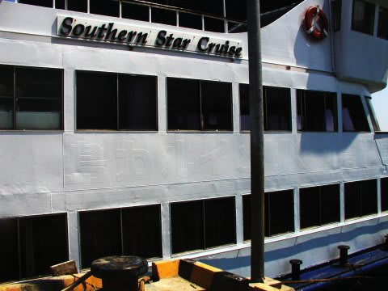

# コドモとコモド！子連れダイブクルーズ31　追記

📅 投稿日時: 2011-08-04 00:46:03

ということで．

コモドクルーズの報告は終わりましたが．

最後に，これから参加しようという人に追加情報を．

●基本情報

・ゲストは全て日本人．日本人オンリークルーズ．

・ベストシーズンは，日本の夏．向こうの冬（乾季）にあたる．

　9月が一番いい．

・水温は最高28度，南エリアでは最低は22～24度に落ちることも多いそうで，

　（私が行ったときは最低水温26度だったけど，そういうことは珍しいらしい…）

　フードベストがあったほうがよさそう．なくても何とかなるだろうけど．

・グローブ着用OK．というより，積極的につけてください，といわれます．

　流れが速いので，とっさに岩につかまれるように装着推奨といった感じ．

・1日3本が基本．4本目オプション．

　1日目乗船後の午後2本，2，3，4日目3本，5日目午前2本の13本が基本．

　1～4日目にオプションあり（ゲストの人数によるとも思いますが）．

・食事は合格ライン．和食多し．フルーツは美味い！

　時たま，あれれ？と思う料理もあるけど，それはラマダン期間

　だったため，味見できなかったからとか，そういう時期ですかね…

●持って行くとよいもの

・洗濯バサミ（洗濯物を干す紐はあるけど，洗濯バサミが少ない）

・コンセントを分岐させられるもの（三口タップなど…ゲストが

　少なければ大丈夫だと思うけど）

・飛行機内などで冷えたとき用に，軽く羽織れる服（国内線とか

　バリの空港内とか，結構冷える）

・カメラをコンピュータにつなぐUSBケーブルやTVにつなげる

　コード（船に積んであるTVやPCで写真を見るため)

・スニーカー，長ズボン（コモドドラゴン見学用）

●とくに持って行かなくてもなんとかなるもの

・バスタオル（部屋に二つついている）

・シャンプーと石鹸（シャワーに備え付け）

・ボートコートなど（気温は高く，エグジット直後のぬれているとき

　以外，屋外で寒いと思うことはない）

・器材用メッシュバッグ（まったく使いません）

●お土産に持っていくと喜ばれるもの（K澤さんが泣いて喜ぶもの）

・日本酒

　（多分，安いお酒でも1本お土産用に持っていくと，泣いて

　喜ばれると思います．「熱燗が飲みたい…」と切望してました）

●通信状況

・携帯電話は，バリでは3Gが通じます．

　しかし，ラブハンバジョー以降，コモドエリアは

　GSMじゃないとダメです．GSM携帯を持っていれば，クルーズ1日目の

　午後までと，5日目の昼以降使えます．あ，3日目の昼間にも一瞬通じます．

　通じている間は，iモードメールが普通にやり取りできました．

●余談

・この写真，うっすらと「鳥羽湾めぐりとイルカ島」の文字が

　浮かび上がっていますねぇ． 

