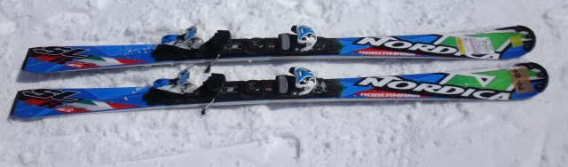
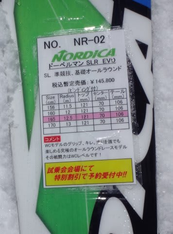
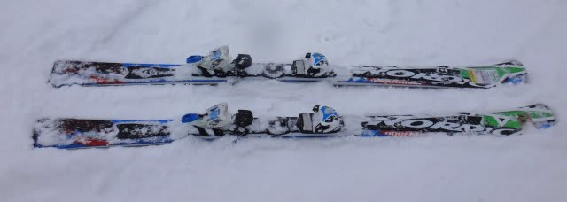
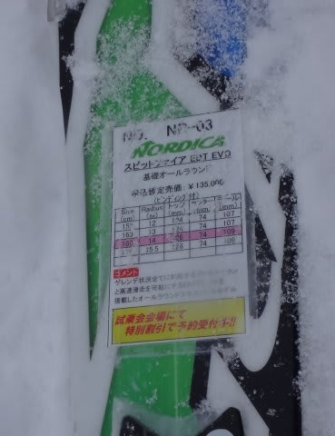
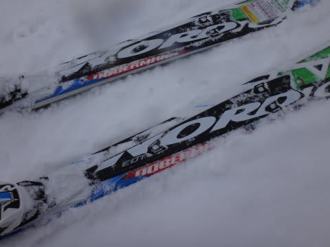

# そろそろ終了！2015シーズンモデルのスキー試乗レポート22…NORDICA編

📅 投稿日時: 2014-05-28 02:15:23

🏷️ カテゴリ: [スキー板試乗](c0bd8048615710cee890e403a36cc9a2b.md)

うーむ．

今日もこんな時間に帰宅．

眠い…

でも．

でも．

ちゃんとブログ更新する自分．えらい！←誰も誉めてくれないので自分で誉めておく

ということで．

まだまだ続いている，スキー試乗レポート．

ぼちぼち残りも少なくなってきました．

本日は，ノルディカ編です．

では，どうぞ～

---

NORDICA DOBERMANN SLR EVO 165cm

SL競技用＆基礎小回り用

これは…

DOBERMANN proと似た感じ．

トップが食いついて回ってくる板です．

板のセンターからトップ寄りしかない感じがする…

板のトップが食いついてぐぐぐぐっと回っていきます．

トップを押さえ続けていくと，いい感じで回って

きますねー．

張りはかなり強く，トップを抑えるとエッジの線に

乗ってスパーーーっと切れていきます．

その切れ方も，かなりトップが回転内側にステアしていく感じ．

板が強く，かなり小さな旋回半径で走っていくので，

この押さえどころをつかまないとおいていかれるけど，

このポイントさえ抑えられればかなり切れの良い，

鋭い小回りができる板です．

テールに抜く，とかそういう動作してもテールのエッジは

利かない感じ．

ちょっとATOMICブーツの特性を生かせる板かは微妙だけど，

トップ寄りコントロールの小回り板としては

かなり鋭い，攻めるターンができる板です．

NORDICA DOBERMANN SPITFIRE EDT 168cm

基礎オールラウンド．

粘りのあるフレックス．

この板もやはり，比較的トップを抑えて回っていく板です．

トップを抑えていくと，エッジ全体が雪面をとらえて，

エッジに乗って回っていきます．

返りもSLRほどではないですが，比較的早く

返ってくる板です．

スピード耐性は結構強く，荒れた雪でも

安定感を十分に感じます．

SLRほどの攻めた小回りはできませんが，

回転半径は小さめで，どちらかと言えば小回り

ベースかな．

たわみとサイドカーブで気持ちよく小回りができて，

高速安定性もあり．

また，粘りのあるフレックスで，比較的たわみも

出しやすいので，それほど過激でない小回りベースの

オールラウンド板として，納得の板かな～．

…しかし，Nordicaの板．

どのモデルも，明確にトップ寄り荷重で

コントロールする板だったなぁ…
