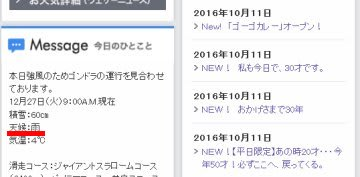
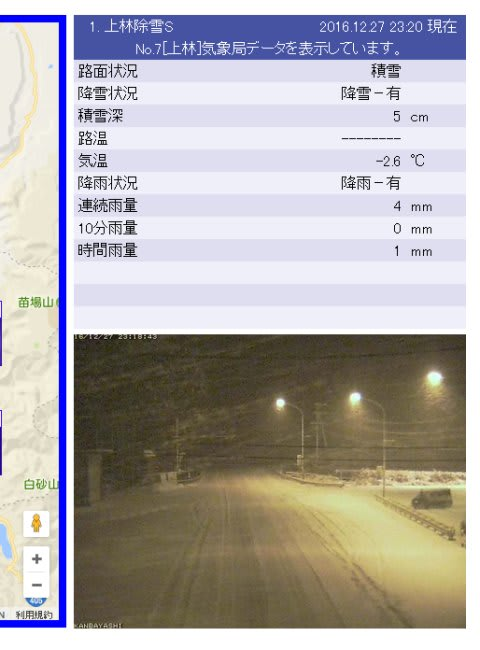

# え？明日は休みなの？？…ってことで．28日に日帰り志賀高原へ行ってきます

📅 投稿日時: 2016-12-27 23:38:33

🏷️ カテゴリ: [日記](cc4b5682fb7b8b144980957a978653fb0.md)

えー．

昨日の予想がドンピシャ当たり．

志賀高原は，午前中はプラス気温で．

かなりの大雨だったようですが…

（[焼額山ホームページ](http://www.princehotels.co.jp/ski/shiga/)より）

でも．

今現在．

かなりの勢いで雪が降っているようです！

（[北信建設事務所ホームページ](http://www.q0.ws302.smilestart.ne.jp/index.htm)より）

いやーーー．

これは．

明日の朝は，昨日の予告通り，

パウダーデーになりそう！！

で．

どうしたわけか．

今年は仕事納めが一日早まり．

なんと．明日から休みなんですね～．

いやーー．

きっと．

そのことを知った神様が．

私のために今晩ドサドサ雪を降らせてくれたに

違いない！←だから，違うから．断じて違うから．

だもんで．明日．

志賀に行ってきます～！

たらふくパウダー楽しんできます～！！

＃あと3時間しか寝れない…

## 💬 コメント一覧

### 💬 コメント by (いか)
**タイトル**: Unknown
**投稿日**: 2016-12-28 05:47:37

今シーズンもよろしくお願いします。今晩は、ずいぶんたくさん降ったそうで、絶好のパウダーチャンスですね！

私はここまで滑走4日でパウダー2日、完璧整地1日とかなり満足度は高いです。今回の降りで白馬エリア、滑って下山できるようになってくれると良いのですが…、年末年始のゴンドラ下山は過酷かと…

### 💬 コメント by (れお)
**タイトル**: 今日は行けず…
**投稿日**: 2016-12-28 12:06:20

今日は仕事の関係で行けなくなってしまい、残念です(>_<)

冷え冷えパウダーデイなのに～

楽しんできて下さいませ!!

### 💬 コメント by (しんちゃん)
**タイトル**: ステッカーお礼
**投稿日**: 2016-12-28 23:02:38

ステッカーありがとうございました。

12/28に１ゴン前でいただいたＳ様ファンです。

これからもブログを楽しく拝見させていただきます。

### 💬 コメント by (Skier_S)
**タイトル**: 眠い…
**投稿日**: 2016-12-29 06:16:00

＞いかさま

あ，今シーズンもよろしくです！

…八方は，まだかなり厳しい状況のようですね…

でも，かなりパウダーには当たっているようで，

いいですね～．

次は30日がパウダーねらい目でしょうか…

＃今日ほど積雪は多くなさそうだけど

年末までに，どっさり降ってほしいものですね！

＞れおさま

あら～．

今日は良かったですよ…

楽しんできました！

また年末年始，お会いしましょう！

＞しんちゃんさま

先週お渡しできなかったので，

今日は，ちゃんとステッカー渡せて

良かったです…．

でも，今日はあれからゲレンデで一度も

お見かけしませんでした…．

焼額を脱出されていたのでしょうか？

また，志賀でお会いしましょう！

