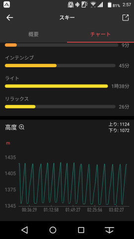

# Amazfit GTRスマートウォッチのスキーモード，Auto pauseを切ったらどうだったのか？

📅 投稿日時: 2019-11-06 02:10:42

🏷️ カテゴリ: [PC,カメラ&小物](c0d8caed13e597efe97b661a8ae56bed0.md)

えー．

この週末は3連休だったわけで．

ホントは3連休最終日の4日も，

Yetiに行きたかったのですが．

…いろいろ切羽詰まっていて，

スキーどころではありませんでした（涙）．

とりあえず．

今晩もBlog更新してるどころじゃない

気もするのですが．

それでも更新！

偉い！！

…ってなわけで．

本日のネタも，そろそろ皆さんが飽きて

来てるんじゃないか…

と危惧している，Amazfit GTRのネタを行きます…

えー．

[先週](e29f3f0e50c4f1facc44bbff6d4859de6.md)は，Auto pauseがONの状態で

ログを取ったため，何度何度も繰り返し

pauseが入ってしまい．

そのせいで，滑走標高差の精度がちょいと低く，

また，Pauseのたびにバイブレーターが

震えるために電池の減りも早めで．

さらに，スマホで読み取ったデータも

おかしくなっていた…

という状況だったので．

今回のYetiにて，

Auto pause OFFで

アクティビティーログを

取ってみて．

これらの問題は解決するのか？

というところを確認してみました～！

ってなことで．

Auto pauseをOFFにして滑った今回ですが．

…ただ，リフト乗り場でストックで漕ぐ際に，

どうも手首の曲げでボタンが押されて，

Pauseに入ってしまうことが数回ありましたが．

（ボタンを5秒連続で押すとPauseに入る）

基本的には[前回のよう](e29f3f0e50c4f1facc44bbff6d4859de6.md)に，ひたすら何度も

Pauseしたり動いたりを繰り返す…

ということもなく．

そのおかげで，バイブレーター作動しまくりの

前回と違い．朝8時から夜6時まで，

途中1時間ほどの休憩をはさんで

9時間ほどログを取り続けても，

電池残量の変化が90%⇒60％と，

30％ほどの消費で済みました…

丸一日スキーで滑ったのをGPS記録して，

電池の減りが30％なら，

かなり電池もちいいんじゃないかな？

うむ．

これはカタログ通り，30時間ほど

ログが取れそうだなぁ…

で．

GPS記録をスマホで見てみますが…

ふーむ．

この縮尺で見ると，概ねGPSは正確っぽい

ですね…

リフト乗り場付近を拡大すると．

乗り場でストックで漕いだ時に，

ボタンが押されてPauseしてしまった

○マークが何回分か残ってますが．

でも，途中一回，上側の赤い屋根の

建物（トイレ）に寄ったのが

分かるほどの精度で，軌跡が残ってますし…

滑ってる途中の軌跡も，コースから

それほど外れてませんね．

ただ，なぜかリフトで登っている時の軌跡は，

左右に10mほどぶれてますが…

リフト降り場付近を拡大しても，

建物を出てログをONにして，

建物に戻ってきてログをOFFにしたのが

正確に分かるほどの精度だし．

L字型の建物の横にスキー板を

置いて移動したのも分かるくらいの

細かさで記録が残ってます…

ただ，リフト降り場付近をさらに

拡大すると．

うーむ．

リフト降り場までたどり着かずに

ゲレンデに出てるような軌跡が…

概ね精度は10m以内ですが．

時折20m程度の誤差にずれる

ようですね…

まぁ．

とはいえ．

GPS着きデジカメ，NIKON Coolpix W300で

記録したGPSログがこんな感じだったので．

これに比べれば，GPS精度はかなり

いい方かな…

で．

前回はなぜかこんな感じで，スマホで読み込んだ

記録が途中で途切れてしまってましたが．

今回は，無事最後まで正しく記録が

スマホで読み込めました～！

やっぱり，前回はPauseで記録を中断

しまくったので，ログデータがおかしく

なっていたのか．

Auto pauseを切った今回は，

ちゃんと読みこめてます！

これで何本滑ったかが，

大体分かりますね…

でも．

このスマホアプリ．

運動時間や心拍数，

滑走標高差や消費カロリーが分かるのに．

何本滑ったかが出てこないのは

ちょいと惜しい…

何本滑ったかは，時計本体で

確認するしかありません（ちょい涙）

そして．

この日の午前の記録を見ると…

なに？この最高時速211kmってのは？？

いくら私が滑るスピードが早めとはいえ．

あの狭くて人口密度が高いYetiで，

新幹線並みのスピードで滑った思い出は無い

のですが…

…どうやら今回，途中でGPSの測位が

一回狂ったようです…

そのほかにも．

ナイター記録を見ると…

うむ？

なんだ，これは？

他の4本は，全て2分くらいで滑り切って

いるのに．

この1本だけ，5分以上時速30kmをキープして

滑ってるように見える…

で．

標高差グラフを見ても．

他の部分はきれいに登って，滑って降りて…

を繰り返しているのに．

時速30kmをキープしたこの部分だけ，

なんだか途中で標高差の変化が止まっている

ように見えますね…

うーん．

何だろう…

ログ記録上のミスかなぁ…

…ってな感じで．

あの激込み紐ゲレンデのYetiを

時速210km以上で滑ってみたり，

長さ600m程度しかないコースを，

なぜか時速30kmで5分以上滑り続けられたりと，

時折謎の記録が残ってはいるものの．

Auto pauseをOFFにすることで

電池もちや，ログが途中で切れる問題も

解決し．

滑走標高差も，Altimaxより2～3%ほど低めの

値になってますが，大体同じ値が記録されてますし．

うむ．

Auto pauseをOFFにすれば，まぁ十分

使えるレベルかな…

とりあえず．

滑っている途中でも，時計本体で

これまで滑った距離や最高速度．

（この時点で7.8km滑り，最高速度37.7km）

滑走本数は当然としても，

最大傾斜が分かったり．

（最大斜度11度）

そのほか，消費カロリーが分かるなど．

スキーを滑るときに身に着けておく

おもちゃとしては，面白いかな～．

## 💬 コメント一覧

### 💬 コメント by (yumi)
**タイトル**: Unknown
**投稿日**: 2019-11-06 06:43:14

Ｓさぁ～ん🎉❄️⛷️

この ウォッチ⌚️ 最大斜度が判るのが 良いですねぇ～☺️

誰かのNZｲﾝﾁｷレポート📝✒️で、推定斜度とか言ってるのは かなり怪しいので これ⌚️✨良いカモ🦆⁉️

三連休は １日しか 滑れなかったのですね😅

私も やっと🙄昨日、イ～ン🎉❄️⛷️しましたぁ～😁

軽井沢も各コース、狭いです💧💧💧

### 💬 コメント by (Skier_S)
**タイトル**: Unknown
**投稿日**: 2019-11-07 02:29:28

>yumiさま

シーズンインおめでとうございます！

って言っても、ついこないだまでNZ滑ってたばかりですよね(笑)

最大傾斜、どのくらい正確かわかりませんが、参考になります。

いろいろ遊べるウォッチですよ！

