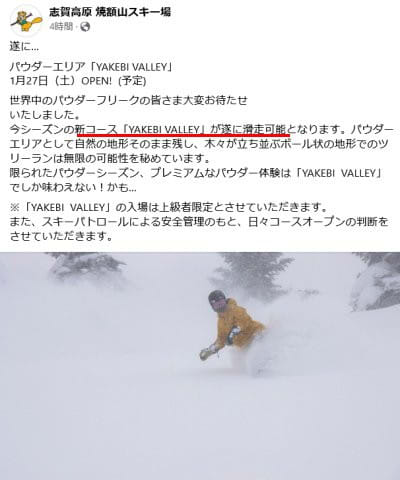
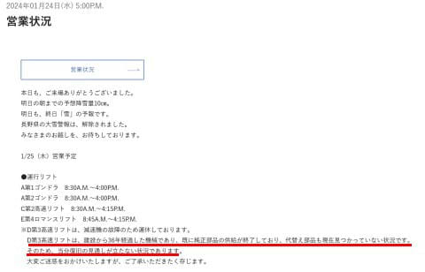
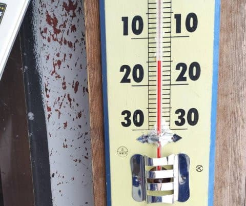
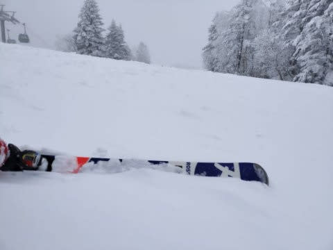
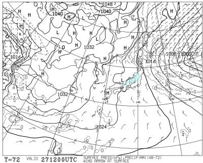
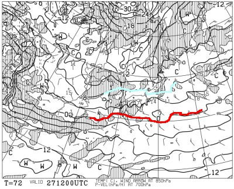
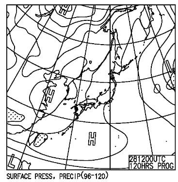
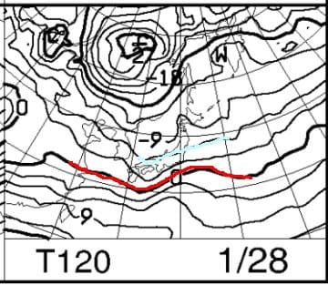
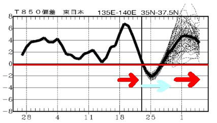

# 1月27，28日の週末の志賀高原スキー場の天気は？…土日とも平年並みの冷え込みで雪．久々のトップシーズンらしい柔らかい雪が滑れる週末！今週がチャンス！！

📅 投稿日時: 2024-01-25 04:15:56

えー．

本日は，焼額山に関する，

いいニュースと悪いニュースが

ひとつずつ．

まず，いいニュースから行きますと…

今シーズンからオープンの新コース，

YAKEBI VALLEYが，明日からオープン

です！！

いやーーー．限定オープンで

上級者限定の新コース，どんな感じなのか…

今週末も滑れれば，チャレンジしようと

思います…！

（[焼額山スキー場Facebook](https://www.facebook.com/yakebitaiyama/posts/pfbid02QwF9W7r7FbvuA5FEn2SwcWNs1kzqMXuYo38CoAEA5T8hRYR1XYzRawQWdSjKAzxyl)より）

…そして，悪いニュース．

いや．

かなり悪いニュースなんですが…

かねてより，

「壊れたら補修部品がもう出ないんだよね…」

と言われていた第3高速リフト．

部品が出ないので，フードが割れても

そのまま使われている悲しいリフトでしたが…

今回，かなり致命的な部品が壊れたようです．

一応，代替え部品や他スキー場の余りを

探しているようですが…

復旧の見通しが立たない

ということで．

最悪このまま今シーズンは営業できない

という可能性も…（涙）

（[志賀高原焼額山スキー場ホームページ](https://www.princehotels.co.jp/ski/shiga/winter/)より）

うーーーん．

部品が見つかってほしいけど…

見つからなかったら，

第3高速リフト廃止

という恐ろしいシナリオが…（涙）

運よく廃止にならず，新規リフトに

架け替えとなっても．

プリンス系列のスキー場，最近は

お金がかかる高速リフトをかけたことが

なく，架け替えてもペアリフトなので…

フード付き第3高速がフードも何もない

単なる低速ペアリフトに架け変わる

という可能性が…っ！！

ジャイアントスキー場も高速トリプルから

ペアリフトに架け変わった，悲しい運命を

たどったけど…

今回はフード付きから架け替えなので，

フード無しペアリフトになっちゃったら，

その衝撃はかなり大きい…（泣）

とりあえず．

部品が出てきて直ることを祈りましょう…（本気の懇願）

ってなことで．話題は変わって．

かなりの雪が期待されていた本日．

志賀高原特派員から送られ来た

情報によると…

朝は‐15℃と冷え冷え！！

朝までに予想がぴったりの30㎝ほどの

積雪があり，

圧雪コース上もうっすら新雪が乗って

いたようですが…

…ただ，昼間は雪が降ったりやんだりで，

そこまで積もらなかったみたいです…

昼間の積雪は，せいぜい10cm弱．

うーん．もう少し積もるかと思ったけど…

でも，志賀高原は今も雪が降っていて．

また，今日の夕方から明日の朝までに，

30cmほど積もると思います！

まぁ，脛パフ程度です．

うーん．関ケ原とかに降らなくていいから，

志賀に降ってほしい…

で，そのあとの木曜，金曜の天気は

[昨日予想した](e33e5f079d4a23ca89c11d7c4bdbd7bc8.md)ので．

本日は週末の土日だけ予想すると…

まず，土曜27日の地上天気図を見ると．

この日も日本海側に降水域がかかっているし．

北風の傾向なので…

志賀高原は雪が降りますね．

そして850hPa気温も，水色の‐6℃線がかかり．

激寒というほどではないけど，1月の平均的な

冷え具合ですね．

まぁ，この日は終日冷え冷えで，雪がパラパラ

舞う一日でしょうか…

続いて，日曜28日の地上天気図を見ると．

この日は網掛けの降水域が本州には

かかっていませんが．

等圧線が縦じまになっていて，弱い冬型

なので，志賀は晴れることはなさそうで，

曇り～時折雪も舞う天気でしょうか．

で，この日の850hPa気温図を見ると．

この日も水色の‐6℃線が志賀にかかる

レベルなので…

まぁ，平年並みかな．

ってな感じで，

まとめると．

27日(土)：朝の気温は－9℃程度．

　前日から10～15㎝程度の冷え冷え積雪．

　あさイチのバーンは，柔らかめの圧雪の

　上にうっすら新雪．

　あさイチは冷え冷えのうっすら新雪を

　蹴散らしながら滑れる，トップシーズン

　らしい快適バーン．

　非圧雪バーンはブーツパフ．

　天気は曇り時々雪．

　時折薄日が差すかも…

　昼間も数㎝雪が積もる．

　雪が柔らかいので，午後はバーンが

　荒れそう．

28日(日)：この日も曇り時々雪がぱらつく．

　朝イチまでに数㎝～10cmくらい

　積もるか．

　この日もあさイチの気温は‐9℃くらい．

　あさイチは柔らかシマシマ！

　この日もトップシーズンらしい，

　冷え冷え柔らかバーンを堪能できる．

　この日も雪が柔らかいので，午後は

　急斜面ではバーンが凸凹していく．

　天気は晴れなさそうで，雪もぱらつく

　けど，トップシーズンの志賀らしい

　冷え冷え雪が滑れる一日．

という感じでしょうか…

すっきり晴れなさそうですが，

トップシーズンらしい，柔らかい冷え冷え

雪の志賀高原が楽しめると思います…！

…ってな感じで．

今週は冷え冷えウィークだったけど…

実は，来週はヤバいのだ．

下の図の左側の赤矢印，先週の18～21日の

悲しい雨の週末の高温期間に続き．

23～28日の水色の矢印部分，冷え冷え

雪降りの今週が続いてるわけですが…

その後．29日～2月3日以降にかけて．

また，雨が降った先週並みの高温に

なりそうです(涙)

ってなことで．

今週末は雪ですが．

来週，また雨が降る危険性が…

…それも，また狙ったように週末に

雨になる危険性も(涙)

いや．

1月，2月のトップシーズンの志賀高原で，

3回の週末のうち2回雨が降ったら暴れる．

全力で暴れる…！！

冷えたら中国四国や関ケ原付近の

交通がヤバくなるくらいに降って，

冷えなかったら志賀高原まで雨が降る…

って，極端すぎる（涙）

ここまで極端じゃなく，平均的に

冷えて降ってほしい…（懇願）
