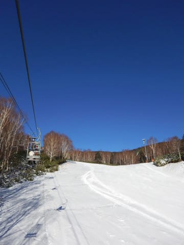
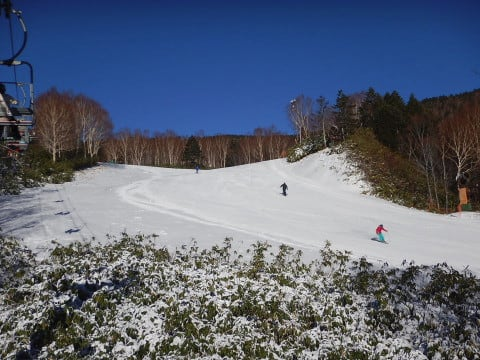
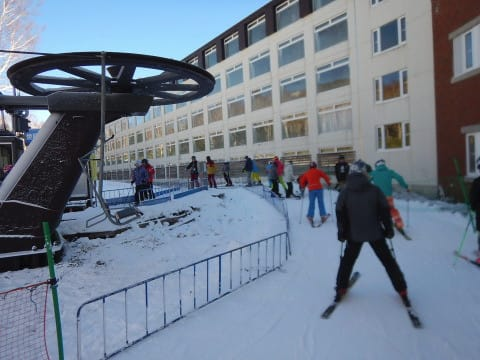
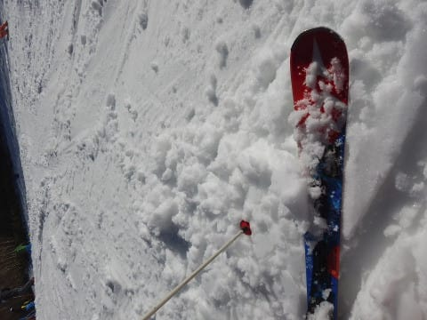
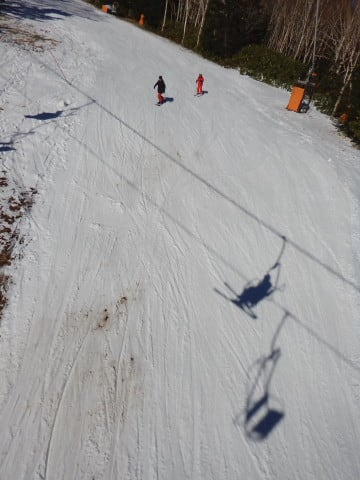
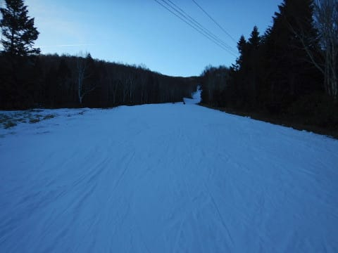

# 2018/12/2(日)の志賀高原，焼額スキー場速報モード…気温があがったものの，晴天でそこそこ空いてて楽しめたよ！

📅 投稿日時: 2018-12-03 02:27:21

🏷️ カテゴリ: [2019スキー滑走日記](c3e4496fc0fb7f9c17ff21214a35b1ace.md)

ってなわけで．

本日もラストリフトまで滑り．

その後温泉，夕食と立ち寄って．

帰宅したのは，日付が変わるころ…（涙）

だもんで．

本日は日曜深夜定番，速報モードにて！

えー．

本日は，すっきり晴天で始まりました～！

昨晩，わずかに1cmほど積雪があり．

このわずかな積雪がゲレンデ表面に乗った状態で

圧雪されていたので．

朝イチゲレンデは，柔らかい表面に

エッジがしっかり効くという，

今シーズン最高のバーンコンディションで

スタートっ！！！

…今シーズン初の，快楽の極みまで傾くことが

できる，脳内麻薬バーン！！

熊の湯はすごい並んだらしいけど．

焼額のリフト待ちはせいぜいこの程度．

それほど待ちなく，ガンガン回せます．

…ただ．

昼間は+7℃と，気温が結構上がったので．

表面の雪はちょっとしっとりしてきて，

昼ごろには，ゲレンデは多少荒れ気味で，

急斜面は小回り道っぽくなり，下地の

硬いのが出てきてました…

そして．

リフト乗り場近辺と急斜面部分のごく一部ですが．

…ちょっとうっすら，茶色くなっている部分が…（涙）

とはいえ．

夕方になると，ゲレンデは誰もいない

貸し切り状態になり…

思う存分，かっ飛ばすことができました～！

ってな感じで．

あさイチは最高だったし．

昼間はちょっと雪は緩んだものの，

下地の固いのはずっと残り，ゲレンデは

壊滅的にドロドロにならなかったし．

リフトは比較的空いてたし．

…まぁ，雪が少ない割には楽しめたかな～．

また明日，詳細レポートやります．

では，おやすみなさい…

## 💬 コメント一覧

### 💬 コメント by (もりや)
**タイトル**: 楽しかった
**投稿日**: 2018-12-03 04:14:17

今日は1日お世話になりました！朝一からラスリフまでカッ飛びで滑った後に子供達3人での雪合戦が凄く楽しかったみたいです。それにしても、年々小学生の滑走スピードが超が付く程上がって行くので追い掛けて行くのが大変です(泣)

### 💬 コメント by (若杉勲71)
**タイトル**: Unknown
**投稿日**: 2018-12-03 14:32:41

s様、もりや様。子供たちが凄すぎです。私の孫と大違い。家族で来れるって、いいですね。

またお声かけくださいね。

今日の熊は雨で、ゆみりんさんは五本でやめたそうです。

### 💬 コメント by (はっち)
**タイトル**: Unknown
**投稿日**: 2018-12-03 19:20:10

土日2日間お疲れさまでした。

日曜に夕方は凄まじかったですね。

集団暴走族のビデオを載せましたので、どうぞ（笑）

https://drive.google.com/open?id=1PVG68RjLPegVDmxu9SYY18W7ZarWwR-k

お子さんたちとの暴走も何本か撮ってありますが、プライバシーの関係で公開しない方がいいかと思いますので、いつか個別でお渡しできる時or方法があればお渡しします。

### 💬 コメント by (Goku)
**タイトル**: ヤケビさいこー
**投稿日**: 2018-12-03 23:59:41

昨日はお疲れさまでした～♪

ヤケビでみんなと滑ると楽しさ倍増ですね(^^)v

みんなと一緒でなければ、３時には上がっていたかもしれません。

しかし、スーパーキッズは末恐ろしいです。

### 💬 コメント by (Skier_S)
**タイトル**: コメント回答遅れました…
**投稿日**: 2018-12-04 12:33:09

＞もりやさま

日曜はお世話になりました！

娘もよっぽど楽しかったみたいで，帰り道では

毎週スキーに来たいと言っていました．

また次も一緒に滑ってください…

…しかし，Gokuさんも言ってましたが，子供たちは

今年20000m行けるんじゃないでしょうか(笑)．

＞若杉さま

子供たち，すごすぎます…

今シーズンになって，一気に体力が上がった

気がします．

しかし，やっぱり月曜は雨だったんですね(涙)

水曜までの高温を，何とか乗り切ってほしい

ところです…

また機会を見て，湯田中のお宅にお邪魔させていただきます！

よろしくお願いします．

＞はっちさま

焼額シーズンインから，いきなり全員集合で

集団暴走モードでしたね(笑)．

でも，今回は子供たちがすごすぎました…

20000mゴールドメンバー3人がぶっちぎられる

レベルでしたから．

ビデオは，また非公開Youtubeか何かで共有いただければ…

よろしくお願いします．

＞Gokuさま

いやー．

凄かったですね，スーパーキッズ暴走軍団…

ラスト20分の常連貸し切り爆走がすごかった(笑)

一の瀬ファミリーであれをやったら，確かに20000m超えられそうですね．

また今週もよろしくお願いします～！

