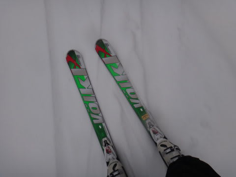
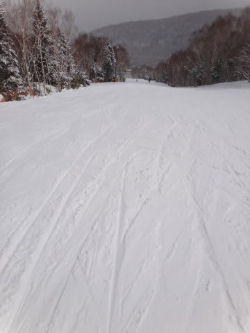

# 4月21日，日曜日．奇跡の一日の焼額山コンディション詳細！

📅 投稿日時: 2013-04-23 00:05:42

🏷️ カテゴリ: [2013スキー滑走日記](c91dbe557f9a69230b1600e48622fdd61.md)

って感じで．

昨日も速報バージョンになりましたが．

日曜のゲレンデ状況の詳細をば…

…日曜日．

朝，起きて，部屋から外を見たところ．

「何じゃこりゃぁ」

…こ，この時期には信じられない積雪量なんですが．

えーっと．

今は，4月下旬ですよね？

神様が，2月と4月を間違えたのでは？？

…とりあえず．

これは．絶対に早朝に行かなくては！

早朝に行かないと，もったいないお化けが団体で出ちゃう！！！

…と，一目散にゲレンデへ．

降ってますね～積もってますね～

山頂の気温は…

マイナス2度．冷え込みは昨日ほどではないけど…

ゲレンデに出ると…

oh！ぱふぱふ！

…積もってるよ～(喜)！

15cmほどかな？

それも，この時期のベタベタした雪じゃないよっ！

驚くほどさらさらした雪です！

いいの？この時期に，こんな雪が滑れちゃっていいの？？？

いやーーーー．雪って，こんなにやわらかかったんだっけ！？

やわらかくて軽いもんなんだったっけ？

…この2ヶ月，春の重い雪かアイスバーン的な硬い雪しか滑ってなかったので，

久しぶりのやわらかい雪面をすべると，もう，自分がむちゃくちゃ上手くなったんじゃないか

と思うほど，どうにでも滑れちゃいます．

おりゃりゃりゃーっ！

って感じで，思いっきり軸を傾けていけます．

うおおおおおぉー！

最高！

…早朝スキーの時間が終わっても．

気温は氷点下のままで．

雪質はまったく悪化しません．

…それどころか．

昼になっても，山頂の気温は0度程度までしか上がらず．

日差しも無いので，雪質は最高をキープしたまま．

人も少ないので，雪はずーーーーっときれいなフラットのままです．

もう，スキーってここまで傾けるもんだったんだ！

ここまでスピード出していいものだったんだ！

…って感じの雪が，昼になっても続きます．

時々日が差すものの．基本的に終日雪が降り続け…

昼を過ぎて午後になっても，雪質は朝からまったく変わらず．

風で雪が舞うくらいの，軽い雪が午後になっても続きます．

午後3時でこんな感じなんですが…

そして，リフトストップの最後の1本でも，雪はこんな感じで．

最高の一日を過ごすことができました．

日曜は，ゴンドラもコースもがらがらで．

ゴンドラなんか，他人と乗りあったのは一日で1回だけじゃなかろうか？

もう，ほとんど待ち0で，がんがんゴンドラに乗れました．

いやーーーーーー．

幸せだった…

どうでもいいけど，3月に入ってから異常に気温が高い日が続き．

ほとんどまともな雪で滑ってなくて．

もう今シーズンは，いい雪ですべることはないなぁ…と，あきらめていたころ．

まさか．

まさか，この時期に，こんな雪で滑れるとは…

あぁ．

これは．

私の日ごろの行いが，神レベルに良かったからに違いない…

日曜日に滑った方，私の日ごろの行いに感謝してください(嘘）．

## 💬 コメント一覧

### 💬 コメント by (いか)
**タイトル**: Unknown
**投稿日**: 2013-04-23 01:00:23

うひょーっ、って感じですね!!

私だったら一日中、大回りしてそう…(笑)

もう今週末はGW前半です…、シーズン終わっちゃいますね(T^T)

### 💬 コメント by (gokuraku skier)
**タイトル**: Unknown
**投稿日**: 2013-04-23 20:00:56

最高の週末になんで行けなかったかな～

このブログは見なかったことにしよう・・・・

### 💬 コメント by (Skier_S)
**タイトル**: 昨日コメント書いたのですが…
**投稿日**: 2013-04-24 22:22:32

昨日コメント書いたのですが，投稿失敗していたみたいです…(涙)

レスポンスおくれてすいません．

>いかさま

もう，3月よりずっといいコンディションで，

久しぶりにやわらかい雪で滑れました…

それも丸一日，夕方まで氷点下で，

土曜は4月としては良かった，という感じですが

日曜はシーズン全体を見た中でも良かった，

って感じです…

今週はもうGWですが，GW終わっても，

まだまだシーズンは続きますよ～！

>gokuraku skierさま

いやー．

予想では土曜日がいいコンディションだったのですが，

金曜から土曜にかけて，日曜の予想天気図が大きく変わり，

結果的に日曜が最高のコンディションになりました…

まだまだGWもあります！

祈れば，またいいコンディションになるかも！

(ならないでしょうけど…(涙))

