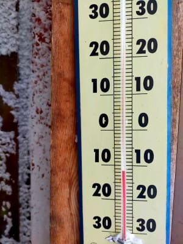
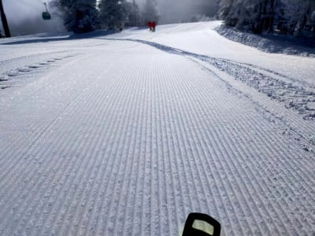
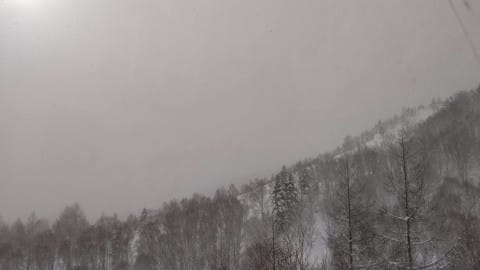
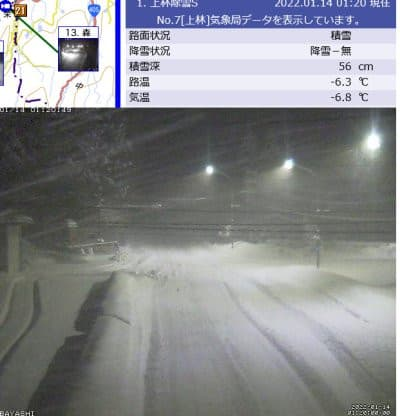
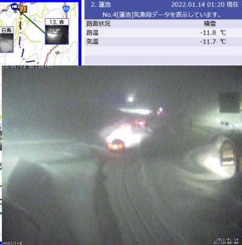

# 2022シーズンをともにする相棒紹介…ブーツ，そして小物たち

📅 投稿日時: 2022-01-14 02:00:41

🏷️ カテゴリ: [スキー雑談](c1f9d2cb7478308da16419928ea3945e9.md)

えー．

本日の志賀高原は．

予想通り，朝イチは-10℃をわずかに下回る

気温で…

あさイチには日も射すタイミングもあり…

そして昼前には天気が悪くなり，雲も

出てきた感じだったようで…

これって…

今日の天気，ほぼ私の予言通りだったようです！！

ふははは．志賀高原の天気を決めているのは私だ！！←違うから

そして，現在の志賀高原ですが．

降ってます…

積もってます！

麓の上林チェーンチェックでも，

すでにこんな激しい降りになり…

（[北信建設事務所道路気象状況カメラ](http://hokushin.pref-nagano-roadcamera.jp/)より，以下同じ）

蓮池では，除雪が間に合ってないのか

道に車が通れる幅だけ除雪されてて，

段差ができてる状態です．

この雪は，これからひたすら，明日も丸一日

降り続けるので．

予想通り，明日の朝までには膝～腰パフ，

そして終日雪が積もり続けるエンドレス

パウダーデーになりそうです！

…ってなことで，本題へ．

[以前の記事で，2022シーズンをともにする
スキー板の記事を書いた](e34f58bc6a14ae8586b59438ffdb8c746.md)のですが…

前の記事から時間が経ったけれど．

2022シーズンをともにする板以外の

道具について，今回は記事にして

みようかと思います…

まずは板に次ぐ大物，ブーツからですね．

○スキーブーツ

1. 　'21 REXXAM R-EVO 130M

昨シーズンインの時に，エキップさんで

作った初めてのブーツ．

フレックス130と柔らかめなので，

シーズンイン直後・終了直前の雪が

柔らかい時用に使う予定．

2. '21 HEAD RAPTOR WCR3

メインマシン．

こいつもGWの物欲選手権に敗れ

買ってしまったブーツで，昨シーズンは

5日ほどしか履いてないので，実質的に

今シーズンデビューですね…

フレックス140-150と過激なブーツ．

こんなブーツを履くようになるとは…

ちなみに，アキレス腱部分のビスが

1本だけならフレックス140，

2本だと150になり，

私は1本で利用しています…

ということで．

もう，エキップさんで仕上げたブーツ

以外で滑れなくなってきている

今日この頃．

フレックス130のREXXAMと，

フレックス140~150で強いHEADの，

エキップさんで仕上げたブーツ

2台体制で今シーズンは挑みます！

○小物

1．硬いニットキャップ＆ゴーグル

物欲選手権で負けた，ヘルメット…ならぬ，

硬いニットキャップとゴーグルが

今シーズンから新規参戦です！←いや，ヘルメットを被らない主義(?)だったので，

ヘルメットじゃなく硬いニットキャップと言い張っているが，無理がある

2．グローブ

古いグローブに穴が開いたので，グローブも

買い足しました．

でも，穴が開いた古いグローブも，テープを

巻いてしばらく使うだろうなぁ…

○ウェア，ストック

…昨シーズンと同じです．

あまりもの物欲選手権の大敗っぷりに，

ウェアにまでお金が回らなかった…

パンツは昨シーズン買ってるけど，

ジャケット4シーズン目…(涙)

そして，ストックは．

折れたり壊れたりしない限り買い

替えないので．

リングが削れたまま使い続けます…

ってなことで．

今シーズンは，物欲選手権に負けた

板2セット，ブーツ1セット，

そして硬いニットキャップとゴーグルが

追加されましたが…

それ以外は穴が開いたグローブが買い

足されただけで．

…あまり直接滑りに影響しない

ウェアやストックは後回しにされるのが

よく分かりますね…

こんな感じのマテリアルで，2022シーズンは

滑ります～！！

## 💬 コメント一覧

### 💬 コメント by (Hide)
**タイトル**: Unknown
**投稿日**: 2022-01-14 08:39:34

S 様

硬いニットキャップ →ウケました。

硬いニットキャップに慣れると、コレがないとなんだかパンツ履いてない（笑）で滑ってるような気になるのは私だけ？（ぱんつ履かずに滑った事はないですけどね・・・）

### 💬 コメント by (レインボー74)
**タイトル**: Unknown
**投稿日**: 2022-01-14 16:18:45

金曜日の妙高杉ノ原情報

ヤケビは強風で遅れそう。野沢は20mの強風予報でゴンドラヤバそう。

そこで風の影響の少ない杉ノ原を目指すことに。

4時間券シニア2900円は安い。一番上のリフトが運休なのが残念だけど、なんのなんの超ロングコース。

乳酸がたまりまくって、一気降りができない。どこもかもパウダーなんだけど、ヨダレが出まくるんだけど、ヘロヘロになりました。

次はもっと若返って行こっと！(無理ですよね。実は今日が74歳の誕生日なんです)

明日はヤケビか野沢か、悩ましすぎます。

ちなみに朝のオリンピックは、私が仕掛けた(嘘だけど)ゴキブリホイホイに、かなりの人がつかまったとか。

### 💬 コメント by (おおすぎ)
**タイトル**: Unknown
**投稿日**: 2022-01-14 17:44:18

流石Sさん、WRC2をさらりと履きこなしますね！

(ちなみにわたしのブーツは、弟分のWRC4です)

もう、固いブーツは疲れました(笑)

レグサムも、20年以上前から興味深くみていました、是非シーズン終了時に、比較レビューをお願いいたします🎵

### 💬 コメント by (アリス)
**タイトル**: 雪がたくさん
**投稿日**: 2022-01-14 20:20:36

S様

志賀高原天気予想またまたピタリ賞です♪

降雪と風はあったものの、7:30の各スキー場のHPの準備中表示を信用して出たものの、頑張ったのはヤケビでした♪雪不足から比べれば、ありがたいものだと心に言い聞かせて楽しませて貰いました♪

また、4日間同一場所に駐車したままの車の雪かきが妙に楽しくて・・・レーキで払い落とす雪の軽い事♪

やはり志賀高原は最高です♪

### 💬 コメント by (地元民)
**タイトル**: Unknown
**投稿日**: 2022-01-14 20:57:50

志賀高原に向かう一本木バイパス（片側二車線の292号線）は、圧雪な上、雪の壁になっています。めったにない景色ですよ。事故に気をつけてお越しください。

### 💬 コメント by (NONAME)
**タイトル**: Unknown
**投稿日**: 2022-01-14 23:06:17

フレックス130が柔らかめ？？？？？？？？？？？？？？？？？？？

### 💬 コメント by (Skier_S)
**タイトル**: 今週末もスキー日和
**投稿日**: 2022-01-14 23:52:43

＞Hideさま

硬いニットキャップです．

かなり硬めです．

まだこれを被らなくても，パンツ履いてないような気分になるほど

被りなれてません…（笑）

＞レインボー74さま

誕生日おめでとうございます！！！！

焼額のゴキブリホイホイ，レインボーさんが仕掛けたんですね！

大勢捕まったようです（笑）．

＞おおすぎさま

フレックス140も，慣れるとそれほど硬く感じないです…

むしろ，雪が締まっていればちょうどいいかも？

その代り，板もかなり強いものが欲しくなっていきます…

180cmのRC4RCが小回り板のように回ります．

＞アリスさま

天気自体は当てましたが…

でも，積雪量が3倍違いました（涙）

車の雪搔き大変だったのでは…

私も12月31，1月1日の2日で1m積もった時，

二晩分の雪をどかすのが大変でした

＞地元民さま

あら…中野の街中からもう凄いんですね！

気を付けて走ります…

＞NONAMEさま

いや…HEADの140に比べて，130は柔らかめということでした…

130は柔らかくないです（笑）．

