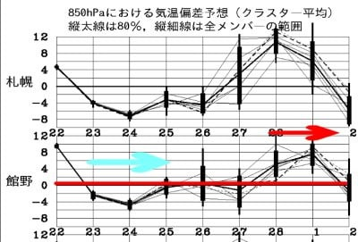

# 2021/2/22(火・祝)の志賀高原スキー場特派員レポート…積雪10～15cm，冷え冷えでコンディション良かったみたい…

📅 投稿日時: 2021-02-24 00:50:40

とりあえず．

今日は昼間で寝て，ちょっと体調が

回復しつつあるSkier_Sです．

なのに．

午後はいろいろあって，ほとんど仕事が

進まず(涙)

これならスキーに行った方がマシだった…

ってなことで．

本日もSkier_Sは自宅待機ですが．

特派員から送られてきた志賀高原スキー場の

レポートをお送りします～！

えー．

まず．

今日は予想通り，朝から雪降りのスタート！

…で．

あさイチの気温は-8℃と，

ここは予想よりちょい高めでしたが…

積雪量は概ね予想通りで，

朝までの積雪は非圧雪部分で10～20cm，

圧雪コースは圧雪の上に5cmほどの積雪で

スタートだったようです…！

でも，

新雪が重かったのもあり，風で飛ばされたり

圧雪するとぺちゃんこになっちゃう雪じゃなく，

前日までの高温で融けた雪はしっかりと

重さのある新雪で隠れてくれて．

あさイチのバーンは，意外と良かった

みたいです…！

…新雪は結構重かったみたいですが…

ただ，午前中はいつも通り，

焼額のゴンドラはちょっと混んだみたいで．

コース上にもそこそこ人がいたみたいですが…

でも，土日とは違って，午後になると

結構空いてたみたいですね…

午前中は結構な勢いで雪が降って，

コース上も新雪が覆ってくれて．

昼間の気温も-8℃程度と，朝から

ほとんど気温が上がらず，昼間に

積もってくれたのは冷え冷え雪だったので．

バーンコンディションは，午後に向かって

結構良くなっていったようですね…！

午後は雲が薄くなり，日も射すタイミングも

あったようで．

昼間に積雪があったので，荒れるかと

思ったゲレンデも，人が少なかったからか

午後までフラットバーンをキープしてくれて．

日・月の高温で融けた雪もだんだん

隠れていってくれた上に，ゲレンデが

明るくなっていくという，

午後に向かってコンディションが

良くなっていった一日だったようで．

雪降りなので昼過ぎには切り上げよう…

と思っていた特派員たちも帰るに

帰れない一日になったようです…

これから明日24日はこの雪は

パラパラと降り続き．

25日は一旦止んだ後，

26日はまたちょっと天気が崩れそうですね…

まぁ，26日は雨にならず，降れば雪の

気温なので，安心して週末が迎えられ

そうですが…

週末が明けた，1日の月曜日．

うむむむ！？？

北海道付近まで0℃線が上がってるんですが…！

き，危険だ…

1日の地上天気図を見ると．

どかーん！！！

…ダメみたいですね(涙）

ということで．

なんとか週末の土日はもってくれそうですが．

その後，せっかく今回の雪で復活したゲレンデは．

また，液体が降ってくることで

ダメダメになりそう

です(泣）

しかし．

水色矢印で示す，この23，24日の平年比-4℃の

冷え冷え期間が終わった後．

今度は赤矢印で示した，28日以降の平年比

+6℃～8℃の異常高温が控えており．

…やっぱり今年の天気．

いろいろ冷えたり温まったり，極端

過ぎるんですけど…(泣）

## 💬 コメント一覧

### 💬 コメント by (レインボー73)
**タイトル**: Unknown
**投稿日**: 2021-02-24 15:11:33

水曜日の志賀高原情報

おやすみです。ごめんなさい。

昨日まで51日連続出勤でしたが、すっかりエス化教祖様に洗脳させられた私めは、腰痛発症なのに昨日強行出場してしまいました。衣笠選手は偉大ですね。私が横綱ならすぐに休場してたのに。

40代後半、25年ぐらい前に腰痛に悩まされた私は、プール歩行と慣れないクロールで背筋を付けるのが近道と、おばちゃん連中がスイスイ泳ぐ横で耐え忍びました。おかげで以来腰痛知らずだったのですが。

腰痛持ちのかたの参考になればとおもいます。

志賀高原に槍やロケットが落ちるなら、今のうちにどうぞ！

### 💬 コメント by (かず)
**タイトル**: Unknown
**投稿日**: 2021-02-24 23:15:27

若さん大丈夫ですか？しばらく雪降らないのでゆっくり休養してください！

### 💬 コメント by (新米パパ)
**タイトル**: Unknown
**投稿日**: 2021-02-25 03:43:02

S様、体調はどうですか？

自愛なさって下さいね。

２４日焼額山、最高でした。

柔らかい雪が20センチはのったんじゃないかと。

昼まで積雪も続きました。

2ゴンからのコースの方が斜面は荒れづらいんですね。

こんな素晴らしい雪質の焼額山に来れて、ふと

"ニセコはもっとすごいの？これ以上ってことはあるの？

お金と時間かけて行くほど？"と思ってしまいました。

どなたかいかれた方の意見をきいてみたいな。

### 💬 コメント by (Skier_S)
**タイトル**: 今週末まで雪は良さそう
**投稿日**: 2021-02-25 03:47:57

＞レインボー73さま

あら！腰は大事にしてください…！

51日連勤お疲れ様でした．

しっかり休んで，早期の快復をはかってください…

出も残念ながら，これからしばらく志賀高原はいい雪が続き，

槍やロケットは落ちなさそうです(笑)．

＞かずさま

私も，レインボーさんのレポートが無いと寂しいです…

おそらく，他にもレインボーさんを心配するファンの方が多いのでは？

と思ってます…

### 💬 コメント by (Skier_S)
**タイトル**: ＞新米パパさま
**投稿日**: 2021-02-26 00:04:44

コメントが入れ違いになったようですね…！

回答遅れてすみません．

24日，志賀で滑ってらしたのですね．

コンディション良かったようでうらやましいです…

ニセコは標高が1000m程度と志賀よりずっと低いので，

トップシーズンはニセコもいいですが，3月を過ぎてくると志賀の方が

雪が良いですよ！

ニセコは今は宿もリフト券も高いですから…

でも，規模も大きいし，山頂付近の森林限界を超えた広々した感じや，

パウダーが積もった日のオフピステなど，一度は行っておく価値があるスキー場

だとは思いますよ！

