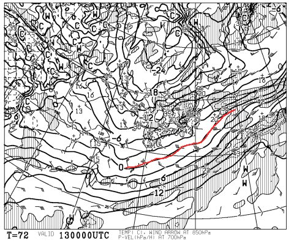

# 今週末の志賀高原の天気…というより，明日からの志賀高原の天気は？

📅 投稿日時: 2014-12-11 01:19:08

ということで．

先週は，週末直前にどっさり降ってくれて．

いい感じで天然雪で滑れたわけですが．

さて．今週末の志賀高原も，冷え冷えパウダーで

滑れるのかいな？

今週末の天気や，いかに？？

…と，気になるわけですが．

…その前に．

なんだか．

明日，11日がですね～

やっぱり，やばそうです．

11日の，朝9時の850hpa気温図を見ると…

うーーーーむ．

0度線が，本州よりかなり北側に上がってるんですが…

というより．

赤矢印で示すように，すごい南風で，

あったかい空気が志賀高原に入りまくり，

0度線がすごい押し上げられてるんですが．

…で．

気温が上がるだけじゃなく…

見事に日本に降水域がかかってます…（泣）．

これは．

志賀高原でも．

…雨，だな…

ウェザーニューズのスキーchで，「雪」と予想されていても．

雨です．

これは，雨です（涙）．

南からの暖かい空気が低気圧に向かって吹き込んでて．

志賀高原にも暖かい雨を降らせてしまいます…（涙）．

でも．まぁ．

11日夜9時の850hpa気温図はこんな感じで，

寒冷前線が通過した後に風も北風になり，

寒気が下りはじめて．

0度線はぎりぎり信州まで南下．

そして，地上天気図を見ると…

こんな感じで，水色に塗った降水域も

志賀高原にかかっているので．

ふむ．

11日夕方からは，雨は雪に変わってくれそうですね．

んで．

翌12日は，そこそこの冷え．

志賀高原は，雪が降ったりやんだりで，10㎝程度

降雪があるかな…

ドサドサ積もる感じじゃないですが．

うーむ．

でも，夜も一晩降り続きそうだから，

土曜の朝は，雨で凍ったアイスバーンが

雪で隠れてくれそうかな～．

で．13，14日の土日は．

これは，冷えますよ～！！

こんな感じで．平年比8度ほど低い2日間になります．

激さむですっ！！

13日土曜朝9時の850hpa気温図はこんな感じで，

0度線は本州より南まで下がってます．

志賀高原の朝は，マイナス10℃を下回りそう！

そこそこの雪になる目安，500hpaの-30℃の寒気も，

信州近くまで下がってきてるし．

地上天気図は，見事な縦じまの冬型だし．

土曜は終日雪が降ったりやんだり，時折強く降るという，

先週土曜と同じパターンかな～．

そして，日曜も…

うむ．850hpaの0度線は，1月や2月のトップシーズン並みの

南下っぷりですね．

そして，地上天気図も…

冬型が続きます．

…ただ．日曜日．

風向きがすごい微妙…

もう少し西に回ると晴れるし，北に回ると雪になる，

ぎりぎりのところ．

うーむ．

今のところ，雪になる可能性が高いかな？？

ってことで．

まとめると．

土曜日：朝は木曜日の雨で凍ったアイスバーンの下地に，

　10cmほどの新雪が積もって圧雪されて．

　その上にさらに冷え冷えの数cmの新雪が被さったコンディション．

　終日雪が降ったりやんだり，時折強く降る．

　寒いよ！

　午前中は，天気が悪いけどゲレンデコンディションは

　柔らかくいい感じでしょう．

　でも，夕方になると，急斜面は下地の硬い

　アイスバーンがコンニチハしてくるかな…

　でも，基本的に新雪が降り積もるので，

　夕方までおおむね柔らかい雪に覆われるかな．

　でも，柔らかい雪が積もった状態だと，夕方は

　ボコボコに荒れちゃいますが…

日曜：この日も，昨晩から続いて，朝から雪降り．

　土曜の夜からの積雪は，10～20cmほどあるかな？

　柔らかいパウダーの新雪が圧雪された，いいコンディション．

　昼頃には，太陽は出ないけど，雪が降ったりやんだりで，

　雪は弱まる方向．

　風向きによっては，時折うっすら晴れ間もあるかも．

　この日も終日柔らかい冷え冷えの最高の雪質を

　楽しめるでしょう！

　…この日も，寒いよ！

って感じかな～．

日曜はまだ不確定要素もあるので，

また直前に追加予想します…

とりあえず．

今週末も，雪には恵まれそうだなっ！

## 💬 コメント一覧

### 💬 コメント by (フナ)
**タイトル**: 雨
**投稿日**: 2014-12-11 12:48:46

先週から順調にきていたのに！

今日の雨は残念(涙)

今週末は長野には行けないので

地元のイエティか、年末に備えて寝溜めか(早)

木曜の夜以降のコンディション回復するといいですね！

### 💬 コメント by (Sker_S)
**タイトル**: ふなさま
**投稿日**: 2014-12-12 02:02:36

やっぱり，今日の志賀は雨だったようで…

それほどひどい降りじゃなかったのが救いですが…

まぁ，この週末．

土日はむちゃくちゃ降りますよ．

ええ．むちゃくちゃ．

来週も積もるので，来週には志賀もほぼ

前面オープンかな～？？

