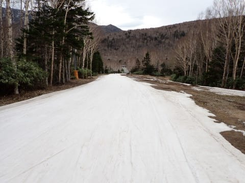

# 2024/5/6(月・祝)，GW最終日の志賀高原焼額山スキー場速報レポート！…曇り一時ポツポツ雨．営業は4ロマ1本で下半分は廊下．2024シーズン営業ラストデー！

📅 投稿日時: 2024-05-07 00:57:38

ってな感じで．

GW最終日の本日．

我がホームゲレンデの焼額山も

営業を終了してしまいました…（涙）

でも，よくGW最終日まで雪がもったなぁ…

とりあえず，営業最終日の本日，

日帰りで焼額山へ今シーズンのラストランに

行ってきたので，速報レポート！

まず．

先日の5/5でゴンドラが終わったので．

ラストデーの本日5/6の営業は第4ロマンス

リフトのみ．

ちなみにGW最終日の本日は，風が強く，

奥志賀は営業最終日の予定だったけど

営業できずにシーズン終了，

渋峠も終日運休，

横手も第2＆3リフト運休（第1，4リフトは営業）

という中，なんとか焼額第4ロマンスは

予定通り早朝から営業でした～！

で，

朝6時から早朝営業してたわけですが，

4ロマ1本の早朝のために4000円は

払えないので，朝8時からの参戦です…

朝8時の駐車場で気温は15℃を

越えていたけど，曇り空だったからか．

ゲレンデの雪はどっしりとした湿った

雪ではあるものの，思ったほどザブザブ

ではなく．

人工雪の下地のしっかりしたところも

あり，意外と滑りやすいし板もそこまで

滑りが悪くない感じ．

何よりも，GW最後までサウス上部が

これだけの幅で雪が残っているのが

すごい…

下半分の緩斜面も，最初はそこそこの

広さがあるけど…

後半は狭く，10月のイエティのような

狭いコースになっていて…

リフト上から見ると，まさにこんな

廊下状．

そして，ヤバいところ1か所は

人力で必死に土が出ているところを

埋めてました…

リフト乗り場も，何とか今日まで

ギリギリ雪をもたせた感じ．

…そして，今日のリフトは当然のごとく

ガラガラでした．

で．

午前10時ごろから30分ほどぽつぽつと，

時折パラパラと雨がぱらつくタイミングも

あり…

これでさらに人が減ったかも．

でも，雨はそこまで強くなく．

30分もたたずに止んだので，

ゲレンデへの影響はほぼありません

でしたが…

ただ．

気温が高かったので，やっぱり雪が

解けて．

午後1時ごろになると…

コース真ん中に，ところどころ雪が

薄いところが出てきました（涙）

うーん．

本日の営業時間は午後2時まで．

残り1時間となった午後1時ごろで，

そろそろ朝はきれいに整備されていた

下半分の緩斜面も，ところどころ

雪が薄くなってきました…（泣）

朝に人力で雪を入れて土を隠していた

ところも，また土が出てきてます…

でもまぁ，営業最後の残り1時間．

良くここまで雪をもたせました．

ってなことで．

下半分は10月の雨が降った後の

イエティみたいな感じでしたが．

上半分は営業終了時でもこんな感じで…

いやー．

このあたり，ホントに半端なく人工雪を

打ったんだな…

という感じで．

本日の14時，約5か月に渡った焼額山の

2024シーズンの営業が終わり．

後ろに誰も滑っていない，今シーズン

最後の焼額山のお客として，

名残を惜しみながら焼額の

シーズンラストランを滑り終えたの

でした…

雪不足＆異常高温の4月の中，

予定通りのGW最終日までコースを

維持し続けた焼額のゲレンデ職人の

皆さんに感謝！！

いや．

3月下旬までのものすごい人工降雪と，

4月以降のめちゃくちゃ人手をかけた

雪出し・雪付けがあったからで．

今シーズンのゲレンデ維持のヤケビ

スタッフの皆さんの尽力は感動レベル

でした…

ヤケビスタッフの皆さん，

お世話になりました～！！！

また来シーズン！！
