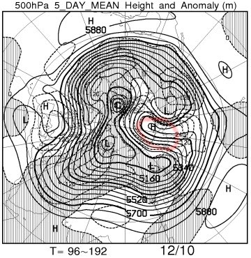

# 今週こそ！12月10，11日の週末に，スキー場に雪は積もるのか？を予想してみたが…

📅 投稿日時: 2016-12-07 01:47:46

本日．

朝からスキー場は雪になってきたようですね…

…とはいえ．

あんまりドサドサ積もっているわけでは無く．

まだ，白馬山麓のスキー場はオープンめどが

立ってないようで…

どうしたことだ…（泣）．

ということで．

どうしたわけか．

激烈雪不足の昨シーズンよりスキー場の

シーズンインが遅れてしまっている，

今シーズンですが（涙）．

はたして．

今度こそ．

今週末までに雪が積もるのか？？

今週末からゲレンデ状況が改善しそうなのか？

…天気図から読み解いてみましょうか…

えー．

まずは7日，水曜の850hpa図を見ると…

をを！！！

結構冷えるよ！

赤くマークした0℃線は太平洋岸，

信州には水色でマークした-6℃線がかかるので…

朝の志賀高原，-8℃以下，山頂だと-10℃近くまで

下がりそうな朝です！

で．水曜の地上天気図は…

…

…

…

…

ダメだ．

冷えるけど，冬型の気圧配置になっておらず．

これは，降りません．

積もりません．

残念ながら，積もったとしてもうっすらと，という

降水量です（涙）．

そして．

8日，木曜日の850hpa気温を見てみると…

うむ．

この日も冷える．

7日に引き続き，

赤くマークした0℃線は太平洋側．

信州には-6℃線が近づいているレベルなので．

この日も，降ればかなりいい雪質のパウダーになる

気温なのですが…

地上天気図では…

水色に塗った降水域が日本海側に掛かっており．

ちょっと積もりそうな気配を感じますが…

…

…だけど．

残念なことに．

真西の風なので，志賀高原の積雪はほとんど

期待できません（泣）．

7，8日は，志賀では人工降雪機に

頑張っていただく天気ですね

白馬，かぐらはちょっと積もるかも…

で．

次は9日，金曜を見ると．

うーむ．

7，8日よりは，赤くマークした0℃線は北に

上がっちゃうけど．

でも，信州近辺にとどまってくれるので．

気温はそれほど上がらずに済みます．

降れば雪です．

…が．

この日も，地上天気図では．

水色で塗った降水域は志賀に掛かっていないので．

…ダメだ．

志賀は降らなさそう（泣）．

この日も，人工降雪機に頑張ってもらわねば

ならない感じ…

うーーーむ．

日本に寒気が持続する気圧配置をもたらす，

ブロッキングHが出てきたおかげで…

（赤く囲ったのがブロッキングH)

今週は，こんな感じで．

12日までほぼ一週間ぶっ続けで，

平年より気温が低い日がづつくという．

大変珍しい冷え冷えウィークというのに．

…だのに．

なぜ，雪がドサドサ降らなさそうな

天気なの…？（激泣）．

10，11日の土日もこんな感じで．

信州には引き続き，水色でマークした-6℃線が

かかっているので．

志賀高原はかなり冷え込みそうなんですが．

だのに．

地上天気図を見ると…

…どちらも，降水域を示す網掛けは，

信州に掛かっておらず．

…土日とも，全く雪は積もらなさそう…（涙）

せめてもの救いは，思いっきり冷えるので．

この一週間，人工降雪機がガンガン動かせそう…

ってくらいでしょうか．

とりあえず．

まとめると．

水曜：冷える．午後にうっすら雪が降るか？

　昼間も冷え冷えで人工降雪機が動かせるので，

　人工降雪機がフルに頑張る．

木曜：運が良ければ，前日夜からこの日の朝にかけて，

　天然雪が10cmくらい降ってくれるかも…

　でも，志賀高原は西風なので降らない．むしろ晴れる．

　終日冷え冷え．一日中人工降雪機がんばれ！

金曜：曇り～積もらない程度の小雪がぱらつく天気．

　水・木より気温は上がるものの，昼間も人工降雪機が

　動かせそう．行け！人工降雪機！君だけが頼りだ！

土日：すごい冷えるけど，おそらく積雪0．

　雲が多いものの，時折日も射すかな…

…という感じなので．

人工降雪機は大活躍しそうな気温ですが．

天然雪がどっさりは期待薄です（泣）．

なぜ…

なぜ，冷えると降らないの？？（涙）．

昨シーズンと同じ，冷えると降らず．

気温が上がると液体が降るという

パターンに陥っている気がするんですが…（激涙）．

とりあえず．

この一週間は，気温がガバッと上がって，

雪が融けるということはなさそうなので．

休むことなく稼働できそうな人工降雪機に

最大限のエールを送るのだっ！！！←虚しい…虚しすぎる
