# 3月31日（土）の志賀高原は…3月ラスト！ポカポカ陽気の春スキーだけど，雪は張り付くほどではなく…ガラガラだったよ！

📅 投稿日時: 2018-03-31 22:26:32

ってなわけで．

週末定番，今日も志賀高原に来ているわけですが．

…良い子は睡眠時間1時間以下でスキーに

出かけることは止めましょう．

今日はさすがに疲れた．

死ぬかと思いました…

とりあえず．

朝，いつもの志賀高原の登り路を

上がってくるわけですが…

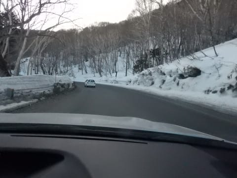

…道路に雪，ないよ．

トンネルの中の凍結も，今日は全くなく．

これ，夏タイヤで志賀に来れちゃうんですけど…？？←良い子はホントに夏タイヤで来ないように．何があるかわからないので…

まだ3月というのに，道路に雪がないってのは…

超危険…

ってな感じでやってきた，いつも通りの

焼額第1ゴンドラ．

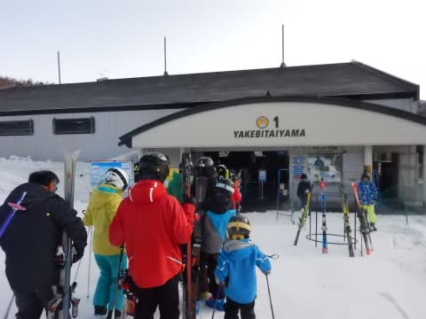

…ですが…

あれ？？？？

なぬ！？？？早朝営業だと？？？

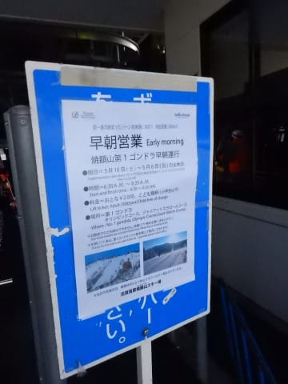

いや…

今日，早朝に来るつもりは毛頭なかったんですよ．

ホントに．

ただ，今日は複数人で車に乗りあってきて．

マージンを見込んで早めに出発したんですが．

ほぼ完徹で，死にそうなほど眠かったので．

途中で運転を代わってもらい，3時間ほど死んだように

寝ているうちに．

あれ？？

6時前に志賀高原のふもとに到着してるじゃないですか！！！

「こ，これ…早朝行けるよね？？」

と，6時半スタートの早朝に出動したのでした…

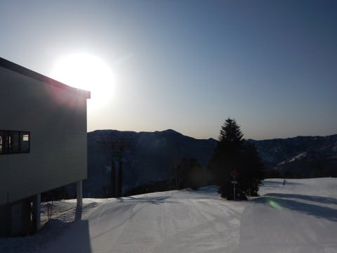

いや，ほぼ徹夜の朝に，まさか早朝で滑るとは…！！

リアルに自分でもかなり想定外だった

早朝の山頂の気温は-5度と，まぁまぁの

冷え込みですね～．

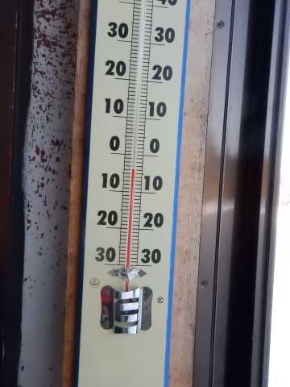

そして．

早朝のゲレンデは…

そうです！

お約束のシマシマっ！！

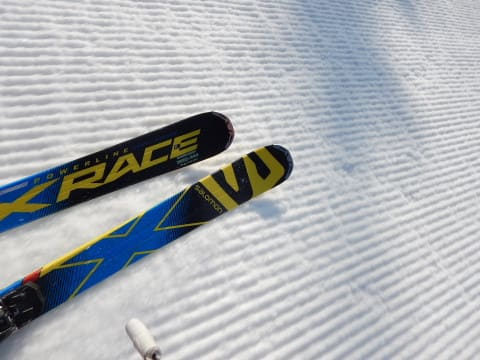

朝日を浴びたゲレンデは，シマシマ！！

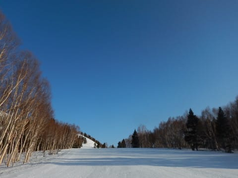

朝の1時間は，結構振動がびりびり来る感じの，

かなり締まったシマシマ！！

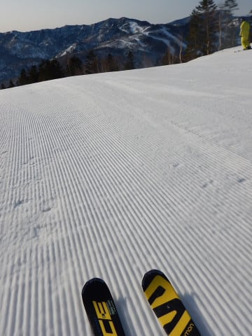

8時近くになると，表面がかすかに緩み，

エッジが気持ちよく効く感じの最高シマシマに…

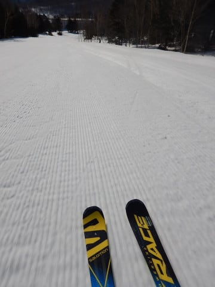

…良かった．

早朝に来てよかった…

睡眠時間1時間で死にそうだけど

そして，通常営業開始の8時半ごろには，

太陽も高く上り…

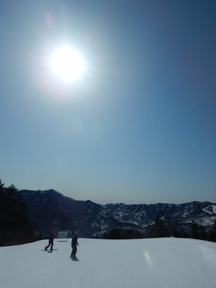

気温も0℃近くにまであがっちゃいました（涙）

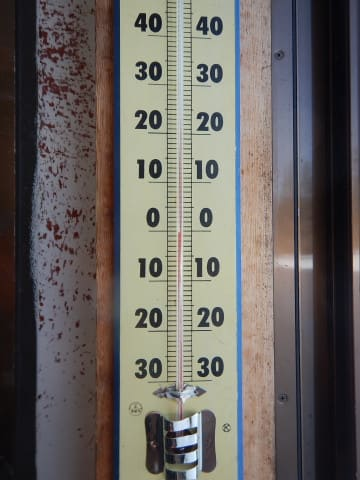

でも，ゲレンデの人は少なく，朝のうちはフラット！

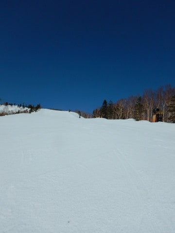

この人のいない朝のうちに，フラットバーンを攻めるのだっ！！

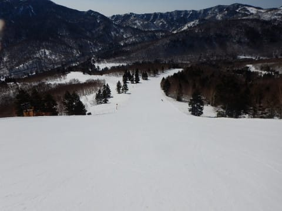

…ってな感じで．

意外と気持ちよいバーンが10時過ぎくらいまで続き．

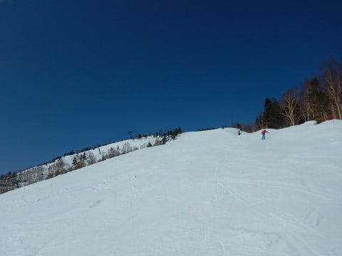

10時過ぎには，ちょっとしっとりした雪に

なってきましたか…

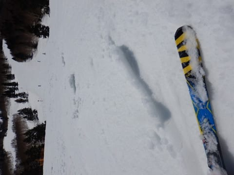

でも，今日は春休みにもかかわらず．

スキー場は全然混まなくて．

ゴンドラ待ちもせいぜいこの程度で，ガラガラ！

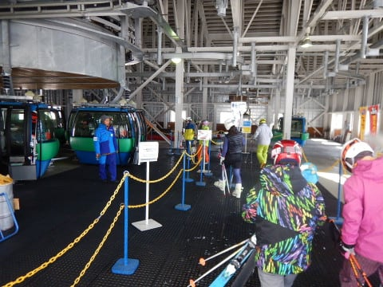

だもんで．

雪が緩み始めたけど．

昼近くまでバーンは荒れず，フラットをキープ！

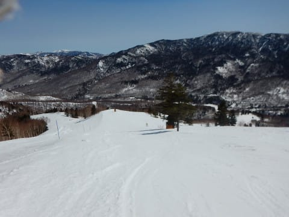

…でも．

さすがにすっきり晴天の本日．

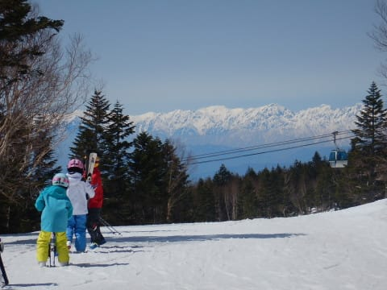

日差しも強く…

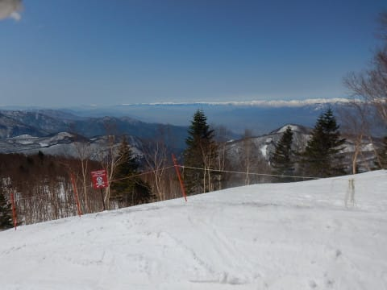

昼間の気温は+5℃を超えてきたので…

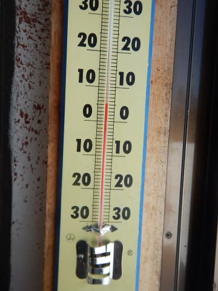

さすがに昼を過ぎると．

ゲレンデも荒れ始めて来ました（涙）

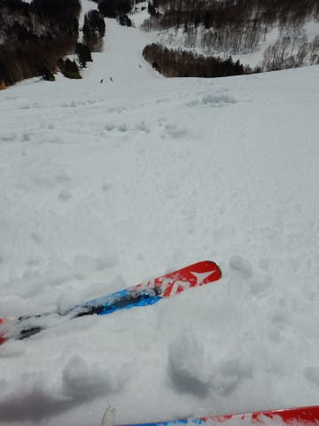

でも，この晴天で昼近くまでフラットなバーンが

もっただけ良しとしましょう…←なぜいつも上から目線？

そして．

昼を過ぎると．

日当たりのよいパノラマコースの一部．

雪に汚れが浮いて来たり…

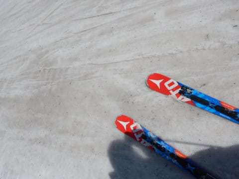

オリンピックコースは…

え？ブッシュ？？

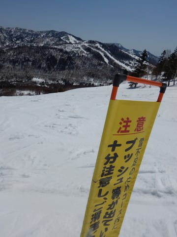

コース途中に注意を促すポールが

立ってますが．

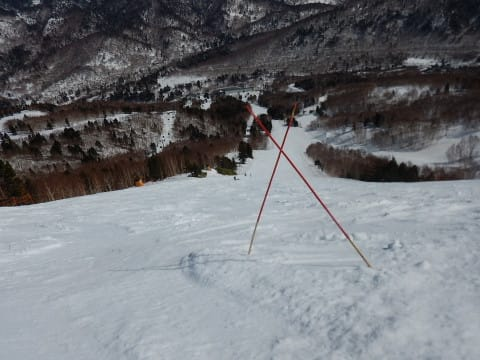

この下には…

石？？？

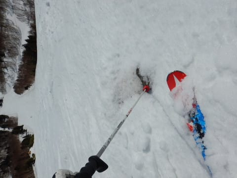

そして，ほんのちょっとだけですが．

確かにブッシュが出てる…（涙）

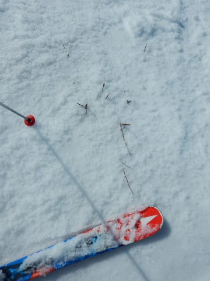

うーむ．

オリンピックコース，あと1-2週間で

終わりかな…

でも．

ブッシュや石が出ているのは一か所だけで．

オリンピックコース，まだまだ滑れますよ～！

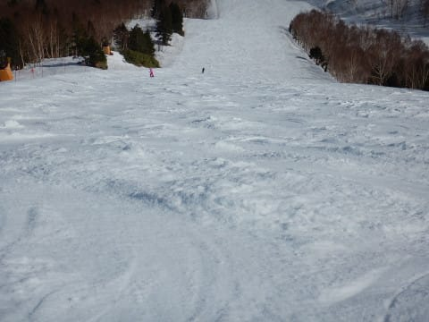

って感じで．

午後は雪が一気に緩んできたので．

コースは荒れ荒れになっていきます…

サウスコースは2時過ぎにはもうこんな感じで．

GSコースも3時過ぎには…（涙）

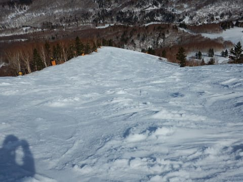

ほぼ徹夜でスキーに来て．

6:30の早朝から昼休みも取らずに

滑りつづけている人は．

午後3時ごろのこのゲレンデ状況で，ヘロヘロに

なります…←良い子はマネしないように！！

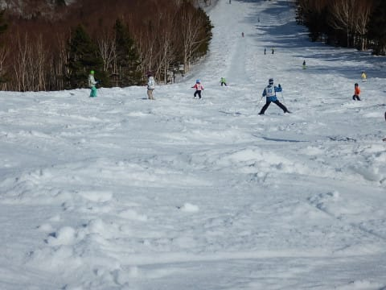

でも．

雪は張り付く雪になるほどではなく．

そこそこ滑る雪だったので，まだ良かったかな…．

で．

16:15のゴンドラ終了後，

16:30まで営業している第2高速の

唐松コースに移動して．

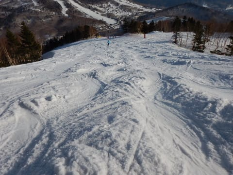

もう，眠くて死にそうで，体力も

尽きかけているラストの一本．

めちゃくちゃぼこぼこの斜面を

最後の力を振り絞り（？）

営業終了まで滑り続けたのでした…

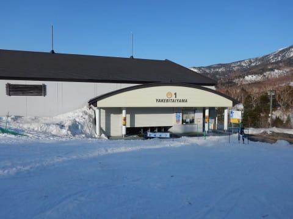

いや．

さすがに今日はヘロヘロに疲れました．

死ぬかと思った…！！←なぜそこまでしてラストまで滑り続ける…？？

これで今日ナイターやってたら，死んでた．

今シーズンのナイター営業が先週で終わっていて，

よかった…←今日ナイター営業してたら，この状況で行ってたのか！？？？

## 💬 コメント一覧

### 💬 コメント by (Ｋ)
**タイトル**: 20000ｍ
**投稿日**: 2018-03-31 23:20:27

お世話になっております。

先週、ファミにて20000ｍチャレンジさせて頂きましたＫでございます。いつも20000ｍクラブな方々には、勇気を頂いております。ありがとうございます。

さて当日は、教えを守り、また、午後には緩んできましたが、雪面状況にも恵まれました。

リフトから降りれば、谷へ吸い込まれ、気が付けばゲートの繰り返し。アッという間の、何か空白的で、不思議な1日でした。

いつもは1日リフト25本程度の搭乗です。

今後とも、よろしくお願い致します。

ありがとうございました。

### 💬 コメント by (はなげ親分)
**タイトル**: お疲れ様です
**投稿日**: 2018-04-01 12:19:16

いや～

なかなか気合の要るラストだったようで・・・

私には最後まで滑りきる根性がありません（笑）

で、ナイターが営業していたら滑っていたほうに

３０００点！

### 💬 コメント by (ほっぽ)
**タイトル**: 昨日はありがとうございました
**投稿日**: 2018-04-01 13:35:28

Ｓさん

昨日は３／４以来、久しぶりにお会い出来ました。

数本ご一緒して頂きありがとうございました。

ＧＳコース、気づけば斜面１枚分離されているという体たらく、常に全開で付いていく必要がありました。

昼前にヤケビ脱出して旅に出てきました。今日で終了する東館山、西館山まで遠征し、寺小屋滑って戻りました。

最後にお会いできなかったのが残念でした。

次回は４／８日帰り参戦します。またお会いできたらよろしくお願いします。

こちら、年数回の中級オジサンスキーヤー同伴です。(^^;

滑走レポートを上げておきました。

http://www2.tokai.or.jp/nana_hoppo/

### 💬 コメント by (しんちゃん)
**タイトル**: お疲れ様でした
**投稿日**: 2018-04-01 23:47:11

この週末お疲れ様でした。

ほんとにヘロヘロでしたね(^^;

今週末は、チウホテルのビーフシチューとジャイアントのアップルパイを制覇できてとても充実してました。

日曜のランチで高天ヶ原のピザを頂き、そのまま帰路につきました。何とか無事にお家にたどり着いています。

Ｓさん、お体お大事に。どこかでしっかり睡眠とってくださいね。<(_ _)>

### 💬 コメント by (Skier_S)
**タイトル**: 今日はひどい雪だった…（涙）
**投稿日**: 2018-04-02 02:34:26

＞Kさま

先週の20000mチャレンジ，ファミリーで

滑ってる時にKonSukeさんに教えてもらって，

密かに応援してましたよ～！

普段リフト25本くらいで，いきなり20000mチャレンジは

すごいですね…

ゴールド達成，おめでとうございます！！

私は春はファミリーで滑っていることが多いと

思いますので，見かけたら声をかけてください～！

＞はなげ親分さま

土曜ラストはかなり厳しいコンディションでした…

しかし，土曜にナイターやってたらヤバかったと

私も自分で思ってます（笑）

＞ほっぽさま

土曜はお世話になりました～！

私も日曜は西館＆ジャイアント方面に

行ってきましたが，西館はすごかったですね…

来週は日曜日帰りですか．

また志賀でお会いしましょう！

＞しんちゃんさま

土日連戦，お疲れ様でした～！

ジャイアントのアスペンのアップルパイに

惹かれ，今日は私もアップルパイ食べに行って

来ました～！

もう，ジャイアントまで滑れるのは今日が

最後でしたから…

久しぶりにレストランで昼ごはん食べた気がします（笑）

ではまた志賀高原で！

