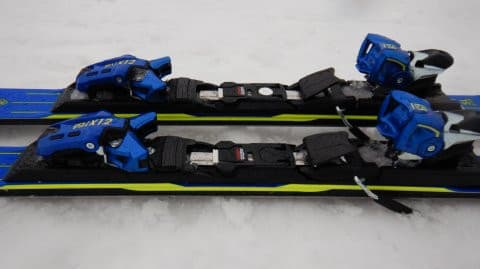

# 2021シーズンモデルのスキー板，試乗レポート…SALOMON S/RACE RUSH SL P80+X12LAB

📅 投稿日時: 2020-05-06 01:20:45

えー．

このGW，志賀高原も結構気温が上がったようですが．

…でも，まだライブカメラで見ると，

一の瀬も高天ヶ原もまだまだ雪が残っていて．

あれだけ少雪と言われた今シーズン，

GWは例年並みか，それ以上に雪が残りましたね…

…やっぱり，奇跡の4月はすごかったんだなぁ…

GWに滑れなかったのが残念…（涙）

で．

非常事態宣言が5月末まで延長されて，

GW明けの横手・渋の営業はきびしいかと

思ってましたが…

え！！？

横手山，まだ5月7日以降，

営業再開の可能性があるの…？？

（[横手山FB](https://www.facebook.com/yokoteyama2305/posts/2532610013505559?__tn__=-R)より）

…まぁ，関東から行くのは避けねばならぬ状況は

つづくので，私は行けなさそうですが（涙）

とりあえず，GW明けに営業検討できるほど，

雪がしっかり残ってくれたのは，

6月以降の月山に期待が持てて，

私としては嬉しい限りだな！！！

…ってなことで，本題へ．

2021シーズンモデルのスキー板試乗レポート，

本日はサロモン編．昨日の板のビンディング違いです．

では，どうぞ～！

○SALOMON S/RACE RUSH SL P80+X12LAB 165cm

基礎小回り，SL競技用セカンドモデル

先日，[この板のTLビンディング版の試乗レポート](e49a6b6149b71b4da7a044203f20f28c9.md)を

書きましたが．

今回は，全く同じ板でビンディングだけが違うモデルに

なります．

こちらは，トゥピースとヒールピースが

金属プレートでガッチリ結合された，

フレックスが強くなるX12LABビンディング

（ATOMICのVARビンディングと同じもの）

が着いている板です…

（今回のX12LABビンディング）

参考に，TLビンディングはこちら．

LABビンディングは，ブーツソールサイズ調整に

ドライバーが必要ですが，こちらは

ワンタッチでブーツソールサイズが調整できる

ようになってます…

板が全く同じで，ビンディングが違うだけだから，

それほど変わらないだろう…とお思いでしょうが．

これがどうしたことか，結構印象が変わります！

滑ってみたところ…

張りはかなり強いのに，谷回りですっと

たわみが出ます．

たわんだ分，板にしっかり強い圧が溜まる

感じで，切り替えで圧が解放されて

すっと板が戻ってくる，速い返りが

あります．

そして，たわんでいる分，山回りで

いい感じでくるっと小さめの半径で

切れて回ってきます．

いい感じで圧が溜まってくれて，

スピードを出して行っても，

強い圧に比例したたわみが出ていく感じで，

板が窒息する感じが無く，どこまでも

スピードを上げていけそうな余裕と

安定感があります．

張りが強いので，強い圧をかけなければ，

板が勝手に回ってしまうこともなく，

縦目に落としていくこともできます．

どれだけスピードを上げても板が

負けることなく，スピードに

比例した圧が板にしっかり溜まり，

いいばね感でかえってきます．

たわみの出方もいいし，

返りの出方もいい．

谷回りの捉え方もいい感じだし，

山回りで板が回ってくる感じも

圧の強弱で上手くコントロールできる感じ．

板は，ビンディングがどっしり

重いってのもあり，履いた感じも

重く感じますが，

逆に言えば足場にしっかりした

安定感があります．

春雪の多少の凸凹はものともせず，

荒れた雪を蹴散らし小さく回れます．

意外なことに，重いけど思い通りに

動かせて，いろんな小技が使えます．

…ただ，ちょいと力は必要としますが…

でも，ズラシのコントロール性は

悪くないです．

…これは．

かなりスピードに強いし，そこそこの

コントロール性はあるし…

結構いい板なのでは！？？

かなり緩んだ春雪で試乗しただけなので，

トップシーズンの雪や硬い雪でどうなるか

ちょっと気になりますが…

結構気に入りました！

## 💬 コメント一覧

### 💬 コメント by (しんちゃん)
**タイトル**: Unknown
**投稿日**: 2020-05-06 10:51:59

ビンディング変わるだけで、板が同じなのに、バタつきが抑えられたり安定感が増したり、性能が変わるんですね。

味付けが変わる程度かと思ってました。

コロナ渦で、ヨーロッパからオーダー数の板が入ってくるのか心配な噂もある中で、今後も試乗レポート楽しみにしておりま～す😄👍

### 💬 コメント by (いか)
**タイトル**: Unknown
**投稿日**: 2020-05-06 17:59:50

P80+VAR12の組み合わせのRUSH SLは、SXからのスイッチでもほぼ違和感なく乗れますね！私は谷回りでトップ側がたわむ乗り味が好きなようなので、この板かロシピンクがそれに合致している印象です。持ち主としては、ヘタリに強いのかどうかが気になっています、、、

サロモンの板は、最近ユーザーが増えてきた気がしますが、RUSH P80+VAR12の組み合わせで乗っている人が少なくて、布教活動を実施中です笑

### 💬 コメント by (Skier_S)
**タイトル**: ビンディング違いはかなりの差を生みます…
**投稿日**: 2020-05-07 01:46:56

＞しんちゃんさま

プレート違いは結構効きますが，ビンディングもVARビンディングと

TLビンディングはトゥピースとヒールピース間の固定の仕方が違うので，

かなり効きます…

実は私の普段履きのSXも，ビンディングが選べたのですが，

TLビンディングのSXは全く別物です（笑）．

＞いかさま

私も，RUSH SL X12LABの組み合わせは，SXの後継としてありだと

思いました…

でも，RUSH SL，もう少し売れてもいい気がしますが，

そんなに履いている人多くありませんよね．

