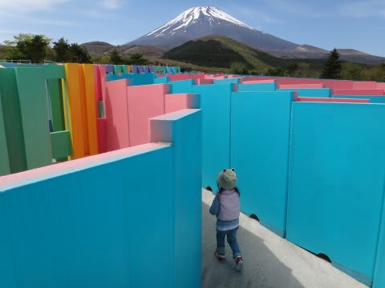
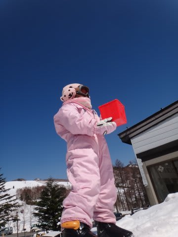
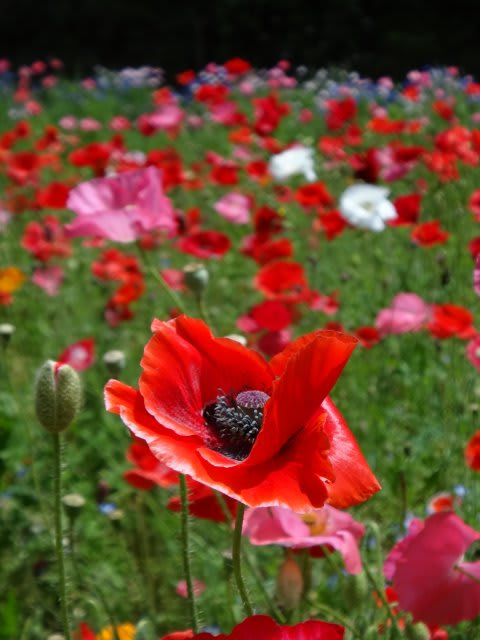
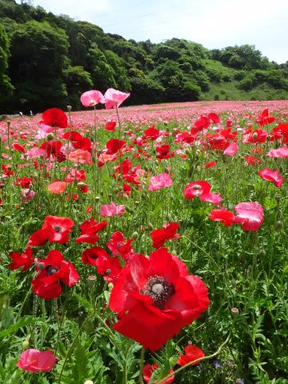
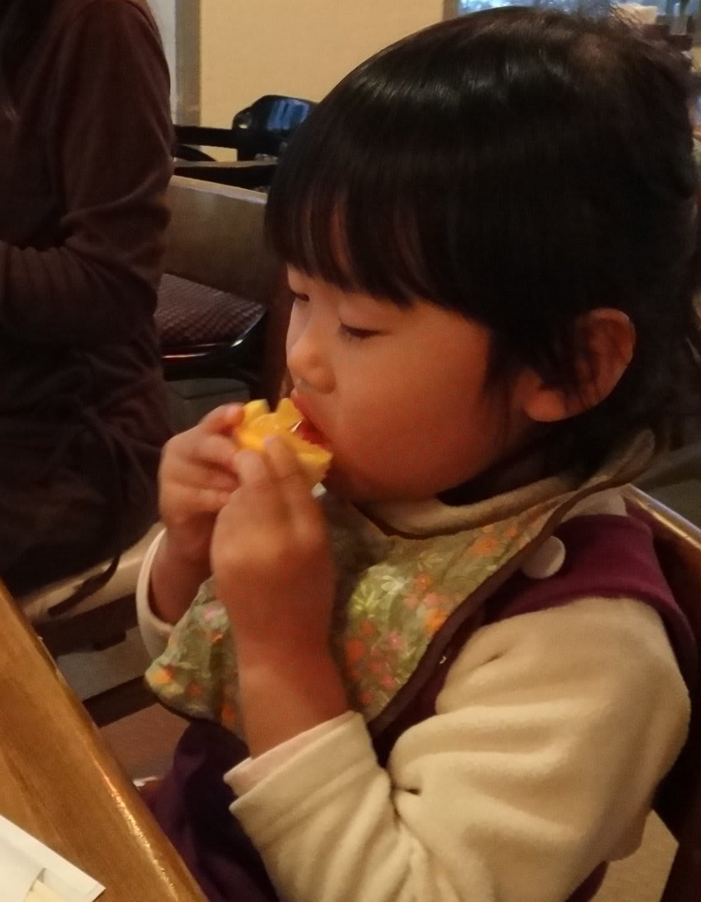
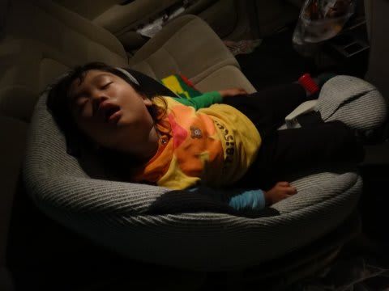
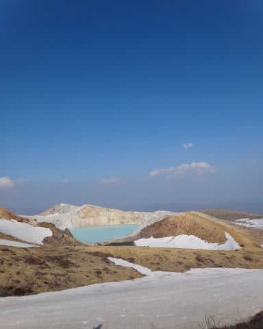

# スキーヤー用デジカメ　SONY TX10　インプレッション　その2

📅 投稿日時: 2011-06-01 02:11:03

で．

[ここ](e031365507b66f6126431a5fb1065d1cf.md)に書いたように．

SONYのCybershot TX10を買ったわけですが．

今回は，静止画についてのインプレッションをば．

静止画は…

基本的に，何も考えなくてもいいカメラですね～．

シャッターを押せば，どんなシチュエーションでもそこそこ写ります．

なんていうか…

カメラというより，「自動絵作り画像処理マシン」ですな．これは．

最近のデジカメ，撮影条件認識が進んで，風景なのか

人物なのか，晴れてるか曇ってるか，動きが早いものか

止まっているものか…

などを判別して，シャッタースピードやISO感度をはじめ，

撮影後の彩度・色調を調整するのは当たり前になってきましたけど．

＃これなんか，明らかに空の彩度が上がってますね…

このカメラのプレミアムおまかせモードでは．

暗いところでは短時間で複数枚撮影した画像を重ね合わせ処理して，

ノイズやブレを除去するとか．

露出の違う数枚の写真を重ね合わせてダイナミックレンジを

拡大するとか…

そーゆーのも自動で判別してやってくれます．

複数枚撮影した画像を重ね合わせて，背景ぼかしも作ってくれます．

背景ぼかしが入らないとこんな感じ．

うーん．

絞りの調整じゃなく，重ね合わせでこんな絵を作ってしまうとは．

露出が外れた写真とか，適切に露出が判断できない

シチュエーションとかは無いですね．くやしいくらい．

これまで使っていたカメラではかなり出番が多かった

露出補正のお世話になることはないですね～．

あと，ISO1600までは問題なく実用域．

これがISO1600の画像です．

ちょっとでかいけど，当倍でクロップ．

いやーーー．3年前のデジカメから比べると，

高感度の実用性が天地の差ですね．

プレミアムおまかせモードではISO800まで．

スポーツモードなど，シャッタースピードの速い

モードにするとISO1600まであがります．

でも．

動きが早いものでなければ．

暗い場合には自動的に「手ブレ夜景モード」になるので，

シャッタースピード1/4秒とかでも，手ブレ無く

ばっちり止まった写真が撮れます…

信じられないんですが，これ，シャッタースピード1/4秒です．

豆電球一個の車内灯だけでこれだけ写るんですから…すごい．

とりあえず．

裏面入射CMOSで，そこそこの高感度を稼ぎつつ．

さらに連射の手持ち夜景モードで，より暗いところに

強くなり．

で，何も考えなくても，撮影条件にあったそこそこの絵を

カメラが必死に作ってくれるという．

普通に撮る分には，失敗写真になることがほとんどないという，

よくできたカメラではないでしょうか…

