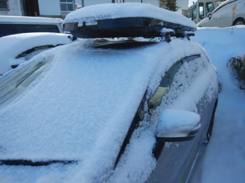

# 2020/3/15(日)の志賀高原スキー場，詳細レポート！…晴天冷え冷え，トップシーズン並みのコンディション！土曜とえらい違うよ！

📅 投稿日時: 2020-03-17 02:06:50

えー．

特派員からの情報によれば．

本日の志賀高原．

昼間にかなり積もったようですね…！！

（[焼額山Facebook](https://ja-jp.facebook.com/yakebitaiyama/videos/vb.116999658395389/1461311150706688/?type=3&theater)より）

ただし．

昼間は予想通りの吹雪で．

奥志賀ゴンドラは止まり，

焼額ゴンドラは減速で，

かなり滑るにはつらい状態

だったようですが…

でも．

夜1時前の状態で，麓の上林で

これだけ積もっているくらいなので．

明日の朝はきっと最高のコンディション

なんだろうなぁ…

（[北信建設事務所道路気象情報ページ](http://hokushin.pref-nagano-roadcamera.jp/)より）

明日，仕事休んで滑りに行きたい…（涙）

ってなところで．

本日は，昨日速報レポートした日曜の志賀高原，

詳細レポートです！

今，昨日の記事を見返すと，昨日の記事でも十分な

詳細レポートのように感じますが…

昨日の記事より濃密なレポートへ，Go!!

…ってなわけで．

昨晩に降った冷え冷え雪が，うっすらと

2-3cmほど積もっている状態でスタートした，

日曜の朝．

いつも通り，営業開始前の焼額第1ゴンドラへ向かうと…

第1ゴンドラ機械トラブルにより営業開始時間未定

との案内が…！

なに～！！

なんですと！？？

イチゴンが動かない？？

「ちょっと機械トラブルで，いつ動き出すか

　分かりません…」

なんということだ…っ！

今から第2ゴンドラに移動しても，

第2ゴンドラ営業開始には間に合わないんですがっ！！

こんないいコンディションなのに，

営業開始のピカピカファーストトラックに

出遅れるとはっ！！

…とりあえず．

急ぎ第2ゴンドラに移動して…

なんとか営業開始直後，

第2ゴンドラに乗って山頂に

行きますが…

山頂の気温は-5℃と，

ちょいと予想よりは高めですね…

朝からすっきり晴れではなかったので，

放射冷却が効かず，それほど冷えなかった

ようです…←予想を外した言い訳

あさイチのゲレンデは，しっかり締まった

圧雪の上に，2-3cmの激軽ふわふわの

新雪が乗った，かなり快感度が高い

状況で…

誰も滑ってないコースは，

全く跡がついていないピカピカ

フレッシュバーン！！

圧雪車のシマシマ跡すらついてない，

完全なフレッシュバーンに．

シュプールを付けていく，

この罪悪感と言ったら…

…このきれいなフレッシュバーンを

2本，3本と滑りたいところだけど．

ただでさえ，乗車定員を3人に限定して

輸送力が落ちている第2ゴンドラ．

さらに，1ゴンが動かないとなると．

第2ゴンドラに人が集中して，

激混みになるのは明白．

ホームゲレンデが焼額の私ですが．

わが住家の1ゴンが動いてないから，←だから，1ゴンに住んでるんじゃないでしょ

今日は浮気していいよね…

と．

焼額に滑り降りず．

そのまままっすぐ，奥志賀ゴンドラへ

滑り込みました…

あさイチの奥志賀ゴンドラはガラガラ

でしたが．

おそらく，奥志賀ゴンドラもすぐ混み始める

だろうと思い．

ゴンドラ側，ダウンヒルコースには下りず…

リフト側のエキスパートコースへ！

エキスパートコースは…

しっかり締まった感じだけど，

エッジがちゃんと効く感じの，

いい感じの雪質で…

そして，人がいない完全フラット！！！

…これは．

これは…

たまらん最高コンディションではないですか…っ！！！

うはーーー！！

こんな晴天で．

モサモサでもガチガチでもない，

いい感じで締まった冷え冷え雪で．

さらにガラガラという，

超最高コンディションなんですけど！！

下半分の緩斜面も，うっすらコートされた

超軽いふわふわパウダーを蹴散らしながら

滑れる，快楽コンディションで…

ぐほう！！

最高っ！！

昨日はカリカリ＆もさもさミックスの

手ごわい雪質だったのに．

一日で最高雪質になってくれましたよ！

あぁ…

やはり，私の日ごろの行いが良いから，

バーンコンディションがよくなって

くれたんだな…！！←昨日コンディションが悪かったけど，それはあなたのせいじゃないの？？

と．

気持ちよくいい感じのバーンをグルグル

滑ってましたが…

だんだん人が増えてきて．

朝10時過ぎには，ちょいとリフト

待ちも増えてきました…（ちょい涙）

そして．

10時半過ぎには，焼額第1ゴンドラが

動き出したようなので…

ちょいと人口密度が上がってきた

奥志賀を脱出し．

帰ってきました，

わが住み家，焼額第1ゴンドラ！←だから住んでないってば

戻ってきたのは昼近かったので，

午前中の混雑は終わり，4人乗り

制限にもかかわらず．

1ゴンの待ち時間はそれほどない状態で．

そして，ゲレンデも…

ガラガラっ！！！！

すっきり晴天のゲレンデなのに．

気温は昼間の最高でも，-5℃を下回る

冷え冷えですよ！

だもんで．

晴れてるのに，雪は全く緩まず．

いい感じの雪質をキープしてますよ！！

ちょっと急なところは，下地の

硬めのところが出てる部分もあった

ものの…

でも．

晴天で，ガラガラで．

こんないいコンディションなのに．

なぜ，完全に貸し切り状態で滑れるのか？？

いや…

最高．

今日は午後になっても最高だわ…（感動）

さすがに夕方になってくると．

急な部分は，ちょっと凸凹してきた

ところもあったものの．

コース全体的にわりと締まった雪

だったので．

リフト営業終了時間になっても，

バーンはそれほど荒れることもなく…

今日もたっぷり，営業終了まで

滑り倒したのでした…

いやーーー．

良かった．

今日は良かった…

金曜の予想で，

　結構いいコンディションの一日に

　なりそう…！！

という予想通りの一日になりましたね～．

すごいぞ，私の予想！（自画自賛）

そして．

明日の17日火曜も，最高の一日に

なるんだろうなぁ…

そのまま，今週末まで最高のままで

いてほしいんだけど．

19日の高温＆強風が心配…

## 💬 コメント一覧

### 💬 コメント by (ほっぽ)
**タイトル**: 3/15
**投稿日**: 2020-03-17 06:52:48

Ｓさん

日曜日は奥ゴン山頂でご挨拶のみで失礼しました。

私は１ゴン運休にモロハマってしまって、やや不完全燃焼の１日でしたが、

日曜日の雪質は良かったですね。

志賀高原全山滑れるのも週末はあと２回。

今週末は土日と志賀高原に参戦します。

http://www2.tokai.or.jp/nana_hoppo/

### 💬 コメント by (レインボー)
**タイトル**: Unknown
**投稿日**: 2020-03-17 13:01:24

志賀高原情報

シーズンベスト。オリンピック積雪35。夕方圧雪に10(せんち。朝一最高。朝ニはもこもこだけど快適。ＧＳも、パノラマも、カラマツも、そしてメインのエキスパートも。

明日も良さそうです。あさってには緩みそう。

それからゴンドラの定員ですが、3連休までは制限を続けるようです。

### 💬 コメント by (レインボー)
**タイトル**: Unknown
**投稿日**: 2020-03-17 15:27:23

どの非圧雪も、コブが埋まって安全快適。

昼過ぎの友人情報では、タンネ、高天ともふかふか。東館は重々。寺子屋も真中コースはふかふか。うらやましかー。

### 💬 コメント by (ももも)
**タイトル**: Unknown
**投稿日**: 2020-03-17 16:54:03

S様

いつも正確なお天気予報ありがとうございます。昨日の吹雪予報も当たってましたね。今年初(最後にはならないで！)のパウダーを満喫しました。

土曜は悪天候の中で息子(68本)、日曜は青空のもと娘と私(60＋ナイター12本)で20000mを達成しました。これで家族揃ってステッカーがはれます。KonSuke様が見ていてくれたおかげです。ありがとうございました。

レインボー様…いつもレインボーさんのコメントも楽しみにしています!　おやつの時間にチェックして美味しさ倍増です

### 💬 コメント by (かず)
**タイトル**: Unknown
**投稿日**: 2020-03-17 19:29:28

明日板つかみなさそうなので予備日の明日も笑 朝一ヤケビ圧雪楽しみマス！ 本日奥志賀45分前に並びポールポジションゲット！しかし予想どうり15分早いヤケビからスキーヤーに上がられ熊ft無くなりました……遅れがあれば自分もするので仕方ないですが定時でこれは厳しいのでクレーム 

 来年は対応すると言ってましたけど  非圧雪は底つき無く快適でしたが11時には終了！って感じでドコモボコボコ

### 💬 コメント by (レインボー)
**タイトル**: Unknown
**投稿日**: 2020-03-17 20:03:44

ももも様、凄すぎです。皆様、これで冥府魔道に突き進むことになりますよ。あんな人たちの仲間入りとは。

最高です！ファミリーでの達成は、私の奥志賀と違って、スキー技術が必要ですから。感服します。(特にその精神力に！)

かずさん、今日はヤケビ第二が8時18分スタート。いつもは1ゴンが早いのに、なぜかオリンピックは一筋だけ。聞けは最速最うまのＫ藤ご夫妻は1ゴン下の非圧雪を楽しんだとか。

このオリンピックが恍惚の一本。

今日来られなかった皆様、ご愁傷さまです。

申し訳ないけど、それほどよかったんです。ごめんなさい。

かずさんの志賀高原参加の決断、よかったですね。

### 💬 コメント by (かず)
**タイトル**: Unknown
**投稿日**: 2020-03-17 20:32:02

本日はどちらに行くか悩みました  夜降らなかったので無難に奥志賀にしました  自分は4月末頃まで来る予定ですが  この先は気温、雨でパスすることが多いので 今シーズンは明日でお会いできるの最後かもしれません

### 💬 コメント by (ももも)
**タイトル**: Unknown
**投稿日**: 2020-03-17 21:58:21

レインボー様

ステッカー貼ってる方を初めて見かけたのがレインボーさんでした。それから大ファンなんです！　私もまさか1シーズンに2回も20000mをするとは思いませんでした。まさにクレイジーです。　特に2回目は体調とブーツの不良に悩まされ最悪のコンディション。

〈ここからはパパさんスキーヤーは目を閉じて!!〉

主人と代わりたかったのですが、娘は「パパとはイヤだ!」と…最近はいつもこの調子^^;

でも、普段は1ゴン20分とかで滑る私と娘。ホントはノーマルスキーヤーなんですよ〜

### 💬 コメント by (ゆーき)
**タイトル**: Unknown
**投稿日**: 2020-03-17 23:50:42

たまたまで西館以外は、ゲレンデも最高レベルでしたね。あのあと、サンバレーからは、ちょっと焼額山には戻れず、タンネラストで、終わりました。タンネのあと、一ノ瀬一本いこうとしたら、なぜかタンネも一ノ瀬も終了が1630で同じという想定外、、、また今週末行くので、会ったら無視しないでくださいねー

### 💬 コメント by (Skier_S)
**タイトル**: 18日はいいけど，19から20日は強風荒れ荒れ
**投稿日**: 2020-03-18 02:04:42

＞ほっぽさま

私は日曜の戦略は大当たりで，混雑に巻き込まれず過ごせました…

焼額は，今週末で白樺，SGSと第3高速が終了らしいので，

実質全山滑れるのは，この3連休で終わりな気分です…

＞レインボーさま

今シーズンベストですか…

私の予言通りになりましたね(笑)．

こんな日に滑れる方がうらやましい！

今週末までもたないんですよね…このコンディションが（涙）

＞もももさま

KonSukeさん公認20000m達成おめでとうございます！

娘さんも公認20000mですか…

凄すぎる…

しかし，まさか2度目のチャレンジをするとは思ってませんでした(笑)．

で．

レインボーさんのファンだったのですね！

どこまでもパワフルなレインボーさんを尊敬する人は，

結構多いんじゃないかと思ってます…

＞かずさま

今日は最高だったのではないでしょうか…

16，17，18日と滞在は，最高のパターンですよね．

ちなみに，平日も焼額が8:15オープンだったんですか？？

8:15オープンは土日だけと思ってましたが…

＞ゆーきさま

日曜はいい感じでしたね～！！

また今週末も焼額滑ってますが，私は滑っていると周囲に気づかないようなので，

気づかずスルーされたら声をかけてください(笑)．

